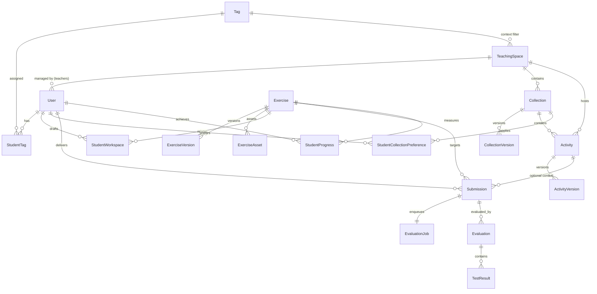

# Radiografía Técnica Completa del Estado Actual de Benigascode

> **Documento de Estado del Sistema y Especificación Técnica**  
> **Versión del Sistema:** `0.2.0-SNAPSHOT` (Post-V20 Flyway Migration)  
> **Fecha de Actualización:** Septiembre 2026  
> **Entorno de Verificación:** Local Docker Compose Development (`benigascode-dev-net`)  
> **Regla Operativa:** Restricción estricta de despliegue en producción activa. Entorno de desarrollo local 100% operativo y verificado.

---

## Resumen de Dimensiones del Sistema

| Métrica / Dimensión | Valor Actual | Detalle Técnico |
| :--- | :---: | :--- |
| **Líneas de Código Java (Backend)** | **15.533** | Spring Boot 3.3.4, Java 21 LTS, Arquitectura Modular |
| **Líneas de Código TypeScript/TSX (Frontend)** | **16.611** | React 18, Vite 5, Monaco Editor, Lucide Icons |
| **Líneas de Código Python (Runner)** | **1.409** | Demonio asíncrono, Docker Engine SDK, AST parser |
| **Líneas de Migración SQL (Flyway)** | **1.007** | 20 migraciones versionadas correlativas (`V1` a `V20`) |
| **Tablas en Base de Datos** | **30** | PostgreSQL 18.1 Alpine (entidades, join tables y sesiones) |
| **Entidades de Dominio JPA** | **27** | Mapeo relacional estructurado en 8 módulos de negocio |
| **Servicios de Negocio Spring** | **23** | Servicios `@Service` con inyección de dependencias |
| **Controladores REST API** | **18** | Endpoints versionados bajo `/api/v1/` y `/api/` |
| **Vistas SPA (Frontend Pages)** | **23** | Rutas protegidas por rol (`Role.STUDENT`, `Role.TEACHER`) |
| **Componentes UI Clave** | **6** | `StudentCollectionCard`, `TagBadge`, `TagColorPicker`, `CodeEditor`, `Navbar`, `SortableHeader` |
| **Runtimes de Ejecución Segura** | **2** | Java 26 Early Access (`preview`) + Python 3.14 |
| **Contenedores Docker Activos** | **4** | `backend-dev`, `frontend-dev`, `runner-dev`, `postgres-dev` |

---

## Top 6 Hallazgos Técnicos y Pilares de la Arquitectura

1. **Soporte Políglota End-to-End (Java 26 Preview y Python 3.14):**
   La plataforma ha evolucionado de un runner monovariante a un motor políglota desacoplado. Admite ejecución y compilación de Java 26 moderno con características preview (`--enable-preview --release 26`) y ejecución de Python 3.14 en entornos herméticos. La selección de lenguaje es automática mediante detección heurística (`LanguageDetector.java`, `languageDetector.ts`, `daemon.py`) o gobernada por la preferencia explícita del alumno (`student_collection_preferences`).

2. **Espacios Docentes Contextuales y Privacidad Estricta de Etiquetas:**
   La migración de la jerarquía rígida de cursos y grupos a **Espacios Docentes (`TeachingSpace`)** y **Etiquetas de Contexto (`Tag`)** permite un enrolamiento flexible y dinámico: los alumnos pertenecen a un espacio según la intersección de sus etiquetas individuales con los contextos del espacio. Para preservar la privacidad pedagógica, **las etiquetas asociadas a alumnos y espacios son estrictamente invisibles para los estudiantes**, filtrándose tanto en la API REST de backend como en la interfaz React.

3. **Modelo de Contenidos Autónomo con Plantillas por Ejercicio:**
   A partir de la migración `V19`, las colecciones quedan libres de código inicial o plantillas de arranque. Cada ejercicio gestiona de forma autónoma sus plantillas por lenguaje (`starter_templates` en `ExerciseVersion`), admitiendo plantillas concurrentes (ej. Java y Python). El editor de código frontend carga dinámicamente la plantilla adecuada según la preferencia del alumno o el lenguaje seleccionado.

4. **Aislamiento Radical del Runner Sandbox (Defensa en Profundidad):**
   Los contenedores efímeros creados por `sandbox.py` implementan políticas estrictas de contención:
   - Aislamiento de red total (`network_mode: "none"`).
   - Sistema de archivos raíz inmutable de solo lectura (`read_only: True`) con `/tmp` montado en memoria mediante `tmpfs` limitado a 64 MB con banderas `noexec,nosuid`.
   - Eliminación total de capacidades del kernel Linux (`cap_drop: ["ALL"]`) y restricción de privilegios (`no-new-privileges: true`).
   - Ejecución bajo usuario sin privilegios `runner:runner` (UID 1001).
   - Prevención de ataques de bifurcación (`pids_limit: 64`), cuota de CPU fijada y memoria RAM acotada sin espacio de intercambio (swap).

5. **Privacidad en Entregas y Sanitización de Resultados de Evaluación (V20):**
   Las entregas oficiales (`DELIVERY`) sanitizan los resultados detallados de cada test (`test_results`), purgando `stdout`, `stderr` y salidas intermedias de la base de datos (migración `V20` y lógica en `EvaluationService`). El alumno visualiza exclusivamente el veredicto consolidado (puntuación, tests superados vs. totales y mensajes del compilador en caso de error), impidiendo la filtración de casos de prueba privados. Las pruebas de borrador (`TEST`) retienen salidas temporalmente en memoria para facilitar la depuración inmediata.

6. **Experiencia de Usuario Coherente y Navegación por Histórico de Entregas:**
   La vista de resolución de ejercicios (`ExerciseView.tsx`) integra un panel izquierdo dividido en dos pestañas: `[ 📄 Enunciado ]` y `[ 📋 Entregas (N) ]`, permitiendo al estudiante consultar todos sus envíos previos, inspeccionar su código anterior y cargarlo en el editor. Debajo del editor, los resultados de pruebas y de entregas oficiales mantienen exclusividad mutua estricta. Asimismo, las tarjetas de colecciones en el portal del alumno quedan unificadas mediante el componente `StudentCollectionCard.tsx`, mostrando la barra de progreso únicamente cuando el alumno ha iniciado la colección.

---

## 1. Resumen y Visión del Sistema

**Benigascode** es una plataforma educativa web de vanguardia para el aprendizaje activo, la práctica guiada y la evaluación automatizada de programación. Concebida originalmente para la enseñanza de Java moderno (Java 26 con características experimentales *preview*), la plataforma se ha consolidado como un entorno **políglota**, incorporando soporte completo para Python 3.14.

### Capacidades para los Alumnos:
- **Exploración de Espacios y Colecciones**: Navegación por espacios docentes y colecciones públicas o asignadas. Visualización de progreso porcentual mediante tarjetas unificadas con cálculo automático de ejercicios completados e intentados.
- **Entorno de Programación Integrado**: Editor de código basado en Monaco (el motor de VS Code) con resaltado sintáctico, atajos de teclado, selección de lenguaje y carga automática de plantillas oficiales.
- **Histórico de Envíos en Tiempo Real**: Acceso directo al histórico de entregas desde la propia página del ejercicio (`ExerciseView`), con capacidad de recargar códigos anteriores y comparar puntuaciones obtenidas.
- **Borradores Persistentes (*Workspaces*)**: Guardado continuo de borradores sin penalización de intentos ni consumo de cuotas oficiales.
- **Evaluación Dual**:
  - *Pruebas de Borrador (TEST)*: Ejecución instantánea contra casos de prueba públicos con visualización de salidas para depuración guiada.
  - *Entregas Oficiales (DELIVERY)*: Evaluación exhaustiva contra baterías completas de pruebas públicas y privadas, con registro oficial de puntuación y progreso pedagógico.

### Capacidades para los Profesores:
- **Espacios Docentes Contextuales**: Agrupación pedagógica de alumnos mediante etiquetas dinámicas (`Tag`), facilitando la asignación modular de colecciones y actividades sin crear grupos rígidos redundantes.
- **Gestión Visual de Etiquetas**: Asignación de etiquetas a estudiantes con paleta cromática de 12 colores distintivos (`TagColorUtil`, `TagColorPicker`, `TagBadge`).
- **Control de Contenidos y Versionado Inmutable**: Creación y edición de colecciones y ejercicios con versionado inmutable (`ExerciseVersion`, `CollectionVersion`).
- **Sincronización Multimodal de Catálogo**: Sincronización continua de contenidos contra repositorios Git remotos (mediante HTTPS con PAT, SSH con par de claves autogeneradas o Webhooks de GitHub), además de importación/exportación de paquetes ZIP con resolución de conflictos (`OVERWRITE`, `SKIP`, `NEW_SLUG`).
- **Supervisión y Analítica**: Cuadros de mando con métricas de progreso de alumnos, inspección de entregas individuales, exportación de calificaciones en formato CSV y capacidad de reevaluación masiva de entregas.
- **Gobernanza y Autorizaciones**: Sistema de lista blanca de profesores autorizados vía GitHub OAuth y emisión de códigos de invitación con cuotas y expiración.

---

## 2. Estructura del Repositorio

El repositorio sigue una arquitectura de monorrepositorio modular con separación estricta de responsabilidades:

```text
benigascode/
├── backend/                             # API REST y lógica de negocio (Spring Boot 3.3.4, Java 21)
│   ├── src/
│   │   ├── main/
│   │   │   ├── java/com/benigascode/
│   │   │   │   ├── activities/          # Actividades docentes, asignaciones y temporalización
│   │   │   │   ├── audit/               # Auditoría y registro de eventos del sistema
│   │   │   │   ├── common/              # Seguridad, excepciones, CORS, utilidades (LanguageDetector)
│   │   │   │   ├── content/             # Catálogo: ejercicios, colecciones, assets, Git sync y OAuth
│   │   │   │   ├── evaluation/          # Cola de evaluación, despacho al runner y sanitización
│   │   │   │   ├── export/              # Generación de reportes y exportación CSV
│   │   │   │   ├── identity/            # Usuarios, roles, profesores autorizados e invitaciones
│   │   │   │   ├── learning/            # Espacios docentes, etiquetas, contextos y colores
│   │   │   │   └── submissions/         # Entregas, historial, borradores (workspaces) y progreso
│   │   │   └── resources/
│   │   │       ├── db/migration/        # Migraciones Flyway V1 a V20
│   │   │       └── application.yml      # Configuración de perfiles (dev, prod)
│   │   └── test/                        # Batería de pruebas unitarias y de integración
│   ├── Dockerfile                       # Construcción multi-stage de la imagen Spring Boot
│   └── pom.xml                          # Maven POM con dependencias del backend
├── frontend/                            # Interfaz de usuario SPA (React 18, Vite 5, TypeScript)
│   ├── src/
│   │   ├── components/                  # Componentes reutilizables (StudentCollectionCard, TagBadge, etc.)
│   │   ├── pages/                       # Vistas de Alumno, Profesor y Autenticación (23 vistas)
│   │   ├── services/                    # Cliente HTTP Axios (api.ts) con gestión de credenciales y CSRF
│   │   ├── types/                       # Interfaces TypeScript compartidas
│   │   ├── utils/                       # Utilidades (tagColors, languageDetector, markdown)
│   │   ├── App.tsx                      # Enrutamiento central y control de acceso por roles
│   │   ├── main.tsx                     # Bootstrap de React DOM
│   │   └── index.css                    # Estilos globales y utilidades de diseño
│   ├── Dockerfile                       # Construcción de assets estáticos optimizados
│   ├── package.json                     # Dependencias NPM del frontend
│   └── vite.config.ts                   # Configuración del empaquetador Vite
├── runner/                              # Demonio de ejecución segura de código de estudiantes
│   ├── runtimes/
│   │   ├── java26/                      # Runtime Java 26 Early Access con soporte preview
│   │   │   └── Dockerfile.runtime
│   │   └── python3/                     # Runtime Python 3.14 sobre base Alpine Linux
│   │       └── Dockerfile.runtime
│   ├── src/
│   │   ├── evaluators/
│   │   │   ├── comparators.py           # Comparadores de salida con normalización y tolerancia
│   │   │   ├── java_evaluator.py        # Compilación y ejecución de código Java 26
│   │   │   └── python_evaluator.py      # Análisis AST y ejecución de scripts Python 3.14
│   │   ├── daemon.py                    # Bucle principal de sondeo, heartbeats y reporte
│   │   └── sandbox.py                   # Orquestación de contenedores Docker efímeros de alta seguridad
│   ├── tests/                           # Suite de pruebas del evaluador y del sandbox
│   ├── Dockerfile                       # Imagen del demonio Python con socket Docker montado
│   └── requirements.txt                 # Dependencias Python (docker, requests)
├── deployment/                          # Infraestructura de despliegue local y producción
│   ├── caddy/
│   │   └── Caddyfile                    # Proxy inverso Caddy con enrutamiento de API y estáticos
│   ├── docker-compose.dev.yml           # Orquestación local para desarrollo
│   └── docker-compose.prod.yml          # Orquestación para despliegue en servidor de producción
└── docs/                                # Documentación de arquitectura, decisiones y especificaciones
    └── CURRENT_STATE.md                 # Este informe técnico
```

---

## 3. Arquitectura Global y Desacoplamiento

### 3.1 Diagrama de Interacción del Sistema

```mermaid
graph TD
    Client[Navegador del Usuario (Alumno / Profesor)]
    
    subgraph "Reverse Proxy Layer"
        Caddy[Caddy Reverse Proxy :80 / :443]
    end
    
    subgraph "Application Core (Local Docker Network)"
        SPA[Frontend SPA - React / Vite Assets]
        Backend[Backend REST API - Spring Boot 3 / Java 21 :8080]
        DB[(PostgreSQL 18.1 :5432)]
    end
    
    subgraph "Execution Layer (Runner Daemon)"
        Runner[Runner Daemon - Python 3.12/3.14 :daemon.py]
        DockerDaemon[(Docker Engine Daemon /var/run/docker.sock)]
        
        subgraph "Ephemeral Sandboxes (No Network / Read-Only)"
            BoxJava[Sandbox Java 26 - javac / java --preview]
            BoxPython[Sandbox Python 3.14 - ast / python3.14]
        end
    end

    Client -->|HTTP / HTTPS| Caddy
    Caddy -->|Rutas SPA /*| SPA
    Caddy -->|API REST /api/v1/*| Backend
    Backend -->|Persistencia JPA / Hibernate| DB
    
    Runner -->|1. POST /jobs/claim Polling con X-Runner-Token| Backend
    Runner -->|2. POST /jobs/:id/heartbeat cada 5s| Backend
    Runner -->|3. Orquesta contenedores efímeros| DockerDaemon
    DockerDaemon -.->|Instancia sin red, noexec, UID 1001| BoxJava
    DockerDaemon -.->|Instancia sin red, noexec, UID 1001| BoxPython
    Runner -->|4. POST /jobs/:id/result| Backend
```

### 3.2 Desacoplamiento de Componentes

1. **Frontend / Backend**: Comunicación estrictamente REST/JSON. La sesión se gestiona mediante cookies HTTP `JSESSIONID` (`HttpOnly`, `SameSite=Lax`) administradas por Spring Security. El frontend desconoce la infraestructura de base de datos y la arquitectura del runner.
2. **Backend / Runner**: Totalmente asíncrono y desacoplado mediante patrón *Pull/Polling*. El backend nunca realiza conexiones directas salientes hacia el runner; es el demonio del runner quien sondea la cola de trabajos pendientes mediante `POST /api/v1/runner/jobs/claim` utilizando una cabecera de autenticación compartida (`X-Runner-Token`).
3. **Runner / Sandboxes**: El runner interactúa con el Docker Socket del host para crear contenedores efímeros aislados que no comparten memoria, red ni permisos con el host ni con el demonio del runner.

---

## 4. Tecnologías y Stack Técnico

### Backend
- **Lenguaje:** Java 21 LTS (Oracle OpenJDK 21)
- **Framework:** Spring Boot 3.3.4
- **Seguridad:** Spring Security 6.x (Autenticación por sesiones HTTP, hash BCrypt para credenciales locales, OAuth2 Client para GitHub)
- **Persistencia:** Spring Data JPA con Hibernate 6.5
- **Migraciones de BD:** Flyway 10.x con soporte de scripts SQL versionados
- **Gestión Git:** Eclipse JGit 6.9.0 para clonado, fetch, checkout y push de repositorios
- **Procesamiento de Contenido:** SnakeYAML, Jackson Databind, Apache Commons Compress
- **Exportación:** OpenCSV para reportes analíticos

### Frontend
- **Librería UI:** React 18.3 con React DOM
- **Lenguaje:** TypeScript 5.5
- **Herramienta de Construcción:** Vite 5.4 con Fast Refresh
- **Enrutamiento:** React Router DOM v6 con guardas de autenticación y rol
- **Editor de Código:** `@monaco-editor/react` v4.6 con temas oscuro/claro y atajos de teclado
- **Iconografía:** Lucide React
- **Cliente HTTP:** Axios 1.7 con interceptores de cookies y cabeceras CSRF

### Base de Datos
- **Motor:** PostgreSQL 18.1 sobre imagen oficial Alpine Linux
- **Pooling de Conexiones:** HikariCP
- **Gestión de Sesiones:** `user_sessions` en PostgreSQL persistidas para tolerancia a reinicios

### Runner y Runtimes
- **Demonio Orquestador:** Python 3.12 / 3.14 con `docker-py` y `requests`
- **Runtime Java 26:** OpenJDK 26 Early Access con flags `--enable-preview --release 26`
- **Runtime Python 3.14:** Python 3.14.0a4 Alpine Linux con soporte nativo de AST
- **Comparadores de Salida:** Módulo `comparators.py` con normalización de espacios, tolerancia numérica de punto flotante e insensibilidad a mayúsculas opcional

---

## 5. Modelo de Datos y Esquema Relacional

El esquema relacional de Benigascode comprende **30 tablas** en PostgreSQL.

### 5.1 Catálogo de Tablas del Sistema

| # | Nombre de Tabla | Propósito Funcional | Módulo |
| :-: | :--- | :--- | :--- |
| 1 | `users` | Cuentas de usuario (alumnos y profesores), credenciales y rol | `identity` |
| 2 | `authorized_teachers` | Lista blanca de nombres de usuario de GitHub autorizados como docentes | `identity` |
| 3 | `invitation_codes` | Códigos de registro con cuota de uso y fecha de expiración | `identity` |
| 4 | `tags` | Etiquetas de contexto y categorización con código de color hexadecimal | `learning` |
| 5 | `student_tags` | Relación N:M de asignación de etiquetas a estudiantes | `learning` |
| 6 | `teaching_spaces` | Espacios docentes para agrupación pedagógica contextual | `learning` |
| 7 | `teaching_space_tags` | Etiquetas requeridas para el cálculo dinámico de pertenencia al espacio | `learning` |
| 8 | `teaching_space_teachers` | Profesores vinculados como administradores de un espacio docente | `learning` |
| 9 | `teaching_space_collections` | Colecciones asignadas y accesibles dentro de un espacio docente | `learning` |
| 10 | `collections` | Colecciones temáticas de ejercicios (públicas o restringidas) | `content` |
| 11 | `collection_versions` | Versiones inmutables de colecciones con ordenación de ejercicios | `content` |
| 12 | `exercises` | Definición base de ejercicios pedagógicos identificados por slug | `content` |
| 13 | `exercise_versions` | Versiones inmutables con enunciado, plantillas políglotas y tests | `content` |
| 14 | `exercise_assets` | Ficheros binarios (imágenes, diagramas) adjuntos a los ejercicios | `content` |
| 15 | `access_keys` | Claves de acceso para desbloqueo puntual de colecciones | `content` |
| 16 | `access_grants` | Registros de desbloqueo de colecciones por parte de alumnos | `content` |
| 17 | `git_repositories` | Repositorios Git remotos vinculados al catálogo | `content` |
| 18 | `content_syncs` | Registro histórico de ejecuciones de sincronización de catálogo | `content` |
| 19 | `activities` | Actividades evaluables vinculadas a colecciones y espacios | `activities` |
| 20 | `activity_versions` | Parámetros temporales (fechas apertura/cierre) y límite de intentos | `activities` |
| 21 | `student_workspaces` | Borradores de código persistentes por alumno y ejercicio con tracking de lenguaje | `submissions` |
| 22 | `student_collection_preferences` | Preferencia de lenguaje de programación (Java / Python) del alumno por colección | `submissions` |
| 23 | `attempt_ledger` | Registro de intentos oficiales consumidos por alumno y actividad | `submissions` |
| 24 | `submissions` | Entregas oficiales (`DELIVERY`) y pruebas de borrador (`TEST`) con metadatos de lenguaje | `submissions` |
| 25 | `evaluation_jobs` | Cola de trabajos de ejecución para el runner con estados de ciclo de vida | `evaluation` |
| 26 | `evaluations` | Veredictos consolidados de evaluación (puntuación, tiempo, memoria) | `evaluation` |
| 27 | `test_results` | Desglose por caso de prueba (purgado de salidas en entregas oficiales) | `evaluation` |
| 28 | `student_progress` | Métricas agregadas de rendimiento y estado de superación por ejercicio | `submissions` |
| 29 | `audit_events` | Registro inmutable de eventos de auditoría y seguridad | `audit` |
| 30 | `user_sessions` | Persistencia de sesiones Spring Security en PostgreSQL | `identity` |

### 5.2 Diagrama Entidad-Relación



---

## 6. Historial y Evolución de Migraciones Flyway (V1 a V20)

| Versión | Nombre del Script | Propósito y Modificaciones en Base de Datos |
| :---: | :--- | :--- |
| **V1** | `V1__init_schema.sql` | Creación del esquema base relacional (usuarios, roles, cursos, grupos, colecciones, ejercicios, entregas, evaluaciones). |
| **V2** | `V2__seed_dev_data.sql` | Inserción de datos iniciales para el entorno de desarrollo (usuarios profesor y alumno, colecciones básicas). |
| **V3** | `V3__alter_char_to_varchar.sql` | Conversión de identificadores `CHAR(36)` a `VARCHAR(36)` para compatibilidad estricta con UUIDs de Hibernate. |
| **V4** | `V4__fix_seed_password_hashes.sql` | Actualización de los hashes BCrypt del usuario semilla de desarrollo. |
| **V5** | `V5__create_git_repositories_table.sql` | Tabla `git_repositories` para soportar la sincronización de catálogos mediante repositorios Git remotos. |
| **V6** | `V6__add_templates_to_exercises_and_collections.sql` | Incorporación inicial de columnas de plantillas de arranque (`starter_code`) en ejercicios y colecciones. |
| **V7** | `V7__enhance_evaluation_and_submissions.sql` | Enriquecimiento del modelo de entregas con marcas de tiempo precisas, métricas de consumo de memoria y conteo de tests. |
| **V8** | `V8__alter_submissions_hash_to_varchar.sql` | Ampliación de columnas de hash criptográfico en la tabla `submissions`. |
| **V9** | `V9__create_exercise_assets_table.sql` | Tabla `exercise_assets` para el almacenamiento de archivos binarios asociados a los ejercicios. |
| **V10** | `V10__add_tags_progress_and_seed_data.sql` | Creación inicial de tablas de etiquetas y métricas de progreso unificado. |
| **V11** | `V11__add_invitations_student_tags_course_collections.sql` | Incorporación de la tabla `invitation_codes` y asignaciones de colecciones a cursos. |
| **V12** | `V12__unified_progress_and_course_collection_assignments.sql` | Unificación de métricas de progreso de alumnos en la tabla `student_progress`. |
| **V13** | `V13__populate_template_keys.sql` | Relleno y normalización de claves de plantillas existentes en el catálogo. |
| **V14** | `V14__add_authorized_teachers.sql` | Tabla `authorized_teachers` para el control de acceso de docentes mediante lista blanca de GitHub. |
| **V15** | `V15__seed_five_students.sql` | Semilla de 5 perfiles de estudiante representativos con asignación de etiquetas y entregas simuladas. |
| **V16** | `V16__migrate_to_tags_contexts_and_teaching_spaces.sql` | **Refactorización Mayor**: Reemplazo de la jerarquía rígida de cursos y grupos por Espacios Docentes (`teaching_spaces`), etiquetas de contexto y cálculo dinámico de pertenencia. |
| **V17** | `V17__add_color_to_tags.sql` | Incorporación de la columna `color` (código hexadecimal) en la tabla `tags` para renderizado cromático en el frontend. |
| **V18** | `V18__multi_language_tracking_and_preferences.sql` | Adición de columna `language` en `submissions`, `student_workspaces` y `student_progress`, y creación de la tabla `student_collection_preferences`. |
| **V19** | `V19__remove_collection_templates.sql` | Eliminación de `starter_code` en la tabla `collections`. Las plantillas pasan a ser competencia exclusiva de cada ejercicio por lenguaje. |
| **V20** | `V20__clear_test_results_output.sql` | Purgado de `stdout`, `stderr` y salidas en la tabla `test_results` para entregas oficiales históricas, garantizando la privacidad de los tests. |

---

## 7. Subsistema Académico: Espacios Docentes y Privacidad de Etiquetas

### 7.1 Filosofía del Modelo de Espacios Docentes

El modelo académico tradicional de Cursos y Grupos resultaba rígido e introducía duplicidad de asignaciones. Benigascode implementa un sistema ágil basado en:
1. **Etiquetas Individuales (`Tag` / `StudentTag`)**: Cada alumno puede poseer múltiples etiquetas asignadas por los profesores (ej. `1DAW`, `Grupo-A`, `Repetidor`, `Refuerzo`). Cada etiqueta cuenta con un color representativo de una paleta armónica de 12 colores gestionada mediante `TagColorUtil.java`.
2. **Espacios Docentes (`TeachingSpace`)**: Entorno de agregación que vincula a profesores responsables, un conjunto de colecciones asignadas y un conjunto de **etiquetas de contexto**.
3. **Pertenencia Dinámica por Intersección**: Un estudiante tiene acceso automático a un espacio docente si sus etiquetas asignadas intersecan con las etiquetas de contexto configuradas para dicho espacio.

### 7.2 Regla Estricta de Privacidad de Etiquetas

Para garantizar un entorno pedagógico seguro y libre de etiquetas estigmatizantes o de uso docente exclusivo:
- **Invisibilidad Absoluta para Alumnos**: En `TeachingSpaceService.java`, cuando un usuario con rol `Role.STUDENT` consulta los espacios docentes a los que pertenece (`getStudentSpaces()` o `getStudentSpace()`), la lista de etiquetas de contexto (`contextTags`) se retorna vacía (`emptyList()`) y el contador de alumnos inscritos (`studentCount`) se retorna a cero.
- **Frontend Protegido**: La vista del alumno `StudentSpaceDetailView.tsx` no renderiza componentes de etiquetas ni estadísticas globales del espacio.
- **Acceso Docente Completo**: Los profesores disponen de la vista `TeacherSpacesView.tsx` y `TeacherStudentsView.tsx`, donde pueden inspeccionar alumnos por etiqueta, asociar colores mediante `TagColorPicker` y simular pertenencias de contexto.

---

## 8. Subsistema de Contenido y Ejercicios Políglotas

### 8.1 Especificación de Ejercicios y Plantillas por Lenguaje

Los ejercicios se definen de manera declarativa y admiten ejecución en múltiples lenguajes:

```text
ejercicio-slug/
├── exercise.yml             # Metadatos del ejercicio, tags y límites de tiempo/memoria
├── statement.md             # Enunciado pedagógico formateado en Markdown
├── templates/               # Plantillas de inicio por lenguaje
│   ├── Main.java            # Plantilla inicial para Java
│   └── solution.py          # Plantilla inicial para Python
├── tests/
│   ├── public.json          # Casos de prueba públicos visibles para el alumno
│   └── private.json         # Casos de prueba privados de evaluación oficial
└── assets/                  # Imágenes y recursos adjuntos
```

A partir de la migración `V19`, las colecciones no imponen ninguna plantilla. La entidad `ExerciseVersion` almacena un mapa clave-valor serializado `starterTemplates`:

```json
{
  "java": "public class Main {\n    public static void main(String[] args) {\n        // Tu solución aquí\n    }\n}",
  "python": "def main():\n    # Tu solución aquí\n    pass\n\nif __name__ == '__main__':\n    main()"
}
```

### 8.2 Resolución de Plantilla y Preferencias del Alumno

Cuando un alumno accede a un ejercicio en `ExerciseView`:
1. Si el alumno tiene un borrador guardado en `student_workspaces` para ese ejercicio, se carga su código previo y el lenguaje detectado.
2. Si no existe borrador previo, se consulta la preferencia de lenguaje del alumno para esa colección en `student_collection_preferences` (`PUT /api/student/collections/{id}/preference`).
3. Si el ejercicio dispone de plantilla para el lenguaje preferido, se presenta dicha plantilla en el editor Monaco. Si no, se selecciona el primer lenguaje disponible en `starterTemplates`.
4. El selector de lenguaje en el frontend solo muestra las opciones correspondientes a las plantillas configuradas por el autor del ejercicio.

---

## 9. Motor de Evaluación y Seguridad del Runner

### 9.1 Demonio Asíncrono del Runner (`daemon.py`)

El servicio `runner` se ejecuta como un contenedor Docker independiente sin exponer puertos de escucha hacia la red. Su ciclo de trabajo consiste en:
1. **Sondeo (`Polling`)**: Cada 1 segundo emite una solicitud `POST /api/v1/runner/jobs/claim` al backend, autenticándose mediante la cabecera HTTP `X-Runner-Token: ${RUNNER_TOKEN}`.
2. **Heartbeat Concurrente**: Al recibir un trabajo, un hilo secundario en segundo plano (`threading.Thread`) emite llamadas periódicas a `POST /api/v1/runner/jobs/{id}/heartbeat` cada 5 segundos. Esto informa al backend de que la ejecución está en curso y evita que el supervisor de la cola (`EvaluationQueueSupervisor`) clasifique el trabajo como abandonado.
3. **Detección Automática de Lenguaje**: Si el trabajo no especifica explícitamente el lenguaje, `detect_language()` analiza el código fuente mediante expresiones regulares para distinguir entre Java y Python.
4. **Despacho al Evaluador Adecuado**:
   - `JavaEvaluator`: Para trabajos de Java.
   - `PythonEvaluator`: Para trabajos de Python.
5. **Reporte de Resultados**: Concluido el análisis, el demonio envía el resultado estructurado mediante `POST /api/v1/runner/jobs/{id}/result`.

### 9.2 Comparadores de Salida (`comparators.py`)

Para evaluar si la salida generada por el programa del alumno coincide con la salida esperada sin penalizar variaciones accidentales de espaciado o precisión:
- **`NormalizedWhitespaceComparator`**: Colapsa retornos de carro (`\r\n` a `\n`), suprime espacios en blanco redundantes al final de cada línea y elimina líneas en blanco finales.
- **`FloatToleranceComparator`**: Permite comparar valores numéricos con una tolerancia absoluta configurable (por defecto `1e-4`), evitando que discrepancias de redondeo en operaciones de punto flotante invaliden la respuesta.
- **`CaseInsensitiveComparator`**: Soporte para comparaciones textuales sin distinción entre mayúsculas y minúsculas cuando el ejercicio lo requiere.

### 9.3 Evaluador Java 26 (`java_evaluator.py`)

- **Contenedor Base:** `benigascode-runtime-java26:latest` (basado en OpenJDK 26 Alpine).
- **Fase de Compilación:**
  ```bash
  javac --enable-preview --release 26 -d /tmp/classes Main.java
  ```
- **Fase de Ejecución:**
  ```bash
  java --enable-preview -cp /tmp/classes Main
  ```
- Si la compilación falla, el trabajo retorna inmediatamente con estado `COMPILE_ERROR` y el volcado de la salida de error estándar del compilador.

### 9.4 Evaluador Python 3.14 (`python_evaluator.py`)

- **Contenedor Base:** `benigascode-runtime-python3:latest` (basado en Python 3.14 Alpine).
- **Validación Sintáctica Previa (AST):** Antes de invocar al contenedor Docker, el evaluador realiza un análisis sintáctico en memoria mediante `ast.parse(code)`. Si el código contiene errores de sintaxis, retorna instantáneamente `COMPILE_ERROR` sin consumir recursos de virtualización.
- **Ejecución Hermética:**
  ```bash
  python3.14 main.py
  ```

### 9.5 Configuración Estricta del Sandbox Docker (`sandbox.py`)

Cada prueba se ejecuta dentro de un contenedor Docker efímero con las siguientes restricciones operativas:

```python
container_config = {
    "image": runtime_image,
    "network_mode": "none",               # Aislamiento de red absoluto (sin acceso a LAN ni WAN)
    "read_only": True,                     # Sistema de archivos raíz de solo lectura
    "tmpfs": {
        "/tmp": "rw,noexec,nosuid,size=64m" # Memoria temporal acotada a 64MB y no ejecutable
    },
    "cap_drop": ["ALL"],                   # Eliminación total de privilegios del kernel
    "security_opt": [
        "no-new-privileges:true"           # Bloqueo de escalado de privilegios
    ],
    "user": "1001:1001",                   # Usuario runner no-root
    "pids_limit": 64,                      # Prevención de ataques de denegación por fork-bombs
    "mem_limit": "512m",                   # Límite estricto de memoria RAM
    "memswap_limit": "512m",               # Sin espacio de intercambio swap
    "cpu_quota": 100000,                   # Límite de 1 core de CPU
}
```

---

## 10. Entregas, Historial y Privacidad de la Evaluación

### 10.1 Tipos de Envío: `TEST` vs. `DELIVERY`

La plataforma diferencia explícitamente entre dos modalidades de ejecución:

| Característica | Pruebas de Borrador (`TEST` / `preview-run`) | Entregas Oficiales (`DELIVERY`) |
| :--- | :--- | :--- |
| **Objetivo** | Depuración interactiva durante el desarrollo | Calificación formal y registro de progreso |
| **Casos Ejecutados** | Casos de prueba públicos exclusivamente | Casos de prueba públicos Y privados |
| **Consumo de Intentos** | No consume intentos oficiales | Incrementa el contador en `attempt_ledger` |
| **Impacto en Progreso** | No modifica la nota en `student_progress` | Actualiza la mejor puntuación y estado de superación |
| **Persistencia de Salidas** | Se conservan salidas para feedback en pantalla | Salidas de tests purgadas y anonimizadas (`V20`) |
| **Límite de Ejecución** | Sujeto a rate limiting suave | Regulado por `max_attempts` de la actividad |

### 10.2 Privacidad de Casos de Prueba (Migración `V20`)

Para impedir que los alumnos extraigan los casos de prueba privados mediante ingeniería inversa o inspección de respuestas de la API:
1. En `EvaluationService.java`, cuando se procesa una entrega de tipo `DELIVERY`, las salidas individuales (`stdout`, `stderr`, `diff`) de los registros `test_results` se almacenan como `null`.
2. La migración `V20__clear_test_results_output.sql` aplicó este criterio retroactivamente sobre todas las entregas históricas.
3. El frontend muestra un resumen cuantitativo claro y suficiente: número de tests superados frente al total (ej. `12 / 12 superados`), puntuación porcentual y, en caso de fallo de compilación, el mensaje emitido por el compilador.

### 10.3 Interfaz de Resolución de Ejercicios (`ExerciseView.tsx`)

La vista de alumno ha sido rediseñada para maximizar la usabilidad pedagógica:
- **Panel Izquierdo con Pestañas**:
  - `[ 📄 Enunciado ]`: Renderizado del enunciado en Markdown enriquecido con soporte de tablas, bloques de código y assets adjuntos.
  - `[ 📋 Entregas (N) ]`: Lista cronológica de todas las entregas formales realizadas por el alumno en ese ejercicio, indicando la fecha y hora exacta, puntuación alcanzada y proporción de tests superados. Al hacer clic sobre cualquier entrega, el editor de código carga automáticamente la versión enviada y visualiza el veredicto histórico correspondiente.
- **Exclusividad Estricta en el Feedback**: Debajo del editor solo puede mostrarse un panel de evaluación a la vez. Las ejecuciones de prueba (`TEST`) y las entregas oficiales (`DELIVERY`) nunca se solapan. Al pulsar el botón "Guardar" borrador, el panel de resultados se oculta limpiamente.
- **Botón Guardar Inteligente**: El botón "Guardar" se deshabilita automáticamente si el código del editor no ha sufrido modificaciones desde la última ejecución o entrega, evitando escrituras redundantes.
- **Indicador de Estado en el Título**: Al lado del título del ejercicio se presenta un distintivo visual que refleja si el ejercicio ha sido resuelto exitosamente (icono de verificación verde) o intentado previamente.
- **Etiquetas Pedagógicas del Autor**: Se eliminaron etiquetas estáticas irrelevantes (como el texto de runtime previo) para mostrar exclusivamente las etiquetas asignadas por el profesor al ejercicio.

---

## 11. Coherencia en la Interfaz de Usuario: `StudentCollectionCard`

Para proporcionar una experiencia de usuario consistente e intuitiva, se ha creado el componente canónico **`StudentCollectionCard.tsx`**, alineado con el diseño de referencia de "Mis actividades":
- **Metadatos Clave**: Título de la colección, descripción, recuento total de ejercicios y estimación de tiempo de resolución.
- **Barra de Progreso Condicional (`CollectionProgressBar`)**: La barra de progreso porcentual **solo se renderiza si el estudiante ha iniciado la colección** (`isCollectionStarted = true`, es decir, ha completado o intentado al menos un ejercicio). Si la colección está sin empezar, la tarjeta muestra un diseño limpio sin barras al 0% innecesarias.
- **Adopción Universal**: Se emplea de manera idéntica en:
  1. `StudentDashboard.tsx` ("Mis actividades" y "Colecciones en curso").
  2. `StudentSpaceDetailView.tsx` (Colecciones dentro de un espacio docente).
  3. `StudentCollectionsView.tsx` ("Colecciones Públicas").

---

## 12. Catálogo Completo de la API REST

A continuación se detalla la totalidad de los endpoints expuestos por los 18 controladores del backend:

### 12.1 Autenticación y Perfil (`AuthController`)
| Método | Endpoint | Rol Mínimo | Descripción |
| :--- | :--- | :---: | :--- |
| `POST` | `/api/v1/auth/login` | Anónimo | Autenticación local con usuario/email y contraseña |
| `POST` | `/api/v1/auth/logout` | Autenticado | Cierre de sesión e invalidación de `JSESSIONID` |
| `GET` | `/api/v1/me` | Autenticado | Obtención del perfil y rol del usuario en sesión |
| `POST` | `/api/v1/auth/invitation/validate` | Anónimo | Validación previa de un código de invitación |
| `GET` | `/api/v1/auth/github/url` | Anónimo | Generación de la URL de autorización GitHub OAuth |
| `POST` | `/api/v1/auth/github/authenticate` | Anónimo | Intercambio de código OAuth por sesión de usuario |

### 12.2 Alumno — Espacios Docentes (`StudentTeachingSpaceController`)
| Método | Endpoint | Rol Mínimo | Descripción |
| :--- | :--- | :---: | :--- |
| `GET` | `/api/v1/student/spaces` | `STUDENT` | Espacios docentes a los que el alumno tiene acceso |
| `GET` | `/api/v1/student/spaces/{id}` | `STUDENT` | Detalle del espacio docente (con etiquetas y contadores ocultos por privacidad) |

### 12.3 Alumno — Colecciones y Ejercicios (`StudentCollectionController`)
| Método | Endpoint | Rol Mínimo | Descripción |
| :--- | :--- | :---: | :--- |
| `GET` | `/api/v1/collections` | `STUDENT` | Listado de colecciones públicas y accesibles |
| `POST` | `/api/v1/collections/access` | `STUDENT` | Desbloqueo de colección privada mediante clave de acceso |
| `GET` | `/api/v1/collections/{id}` | `STUDENT` | Detalle y metadatos de una colección |
| `GET` | `/api/v1/collections/{id}/progress` | `STUDENT` | Progreso agregado del alumno en la colección |
| `GET` | `/api/v1/collections/{id}/exercises`| `STUDENT` | Ejercicios ordenados de la colección con estado |
| `PUT` | `/api/v1/collections/{id}/preference`| `STUDENT`| Guarda la preferencia de lenguaje del alumno (Java/Python) |
| `GET` | `/api/v1/exercises/{id}` | `STUDENT` | Detalle del ejercicio, enunciado y plantillas |
| `GET` | `/api/v1/exercises/{id}/public-tests`| `STUDENT`| Casos de prueba públicos para pruebas de borrador |
| `GET` | `/api/v1/exercises/{id}/assets/{*filename}`| `STUDENT`| Descarga de recursos e imágenes adjuntas |

### 12.4 Alumno — Entregas y Espacio de Trabajo (`StudentSubmissionController`)
| Método | Endpoint | Rol Mínimo | Descripción |
| :--- | :--- | :---: | :--- |
| `POST` | `/api/v1/exercises/{id}/preview-runs` | `STUDENT` | Ejecución de prueba interactiva (`TEST`) contra tests públicos |
| `POST` | `/api/v1/exercises/{id}/submissions` | `STUDENT` | Entrega oficial autónoma (`DELIVERY`) |
| `POST` | `/api/v1/activities/{actId}/exercises/{id}/submissions` | `STUDENT` | Entrega oficial enmarcada en una actividad docente |
| `GET` | `/api/v1/exercises/{id}/workspace` | `STUDENT` | Recuperación del borrador de código guardado |
| `PUT` | `/api/v1/exercises/{id}/workspace` | `STUDENT` | Guardado de borrador de código sin consumir intentos |
| `GET` | `/api/v1/exercises/{id}/submissions`| `STUDENT` | Listado histórico de entregas en ese ejercicio |
| `GET` | `/api/v1/exercises/{id}/submissions/latest` | `STUDENT` | Última entrega oficial registrada en el ejercicio |
| `GET` | `/api/v1/submissions/{id}` | `STUDENT` | Detalle de una entrega específica (con salidas anonimizadas) |
| `GET` | `/api/v1/me/submissions` | `STUDENT` | Histórico global de entregas del estudiante |
| `GET` | `/api/v1/me/progress` | `STUDENT` | Progreso agregado del alumno en todos los ejercicios |
| `GET` | `/api/v1/me/progress/exercises/{id}`| `STUDENT` | Estado de progreso en un ejercicio concreto |
| `GET` | `/api/v1/me/insights` | `STUDENT` | Estadísticas personales de aprendizaje y desempeño |

### 12.5 Alumno — Actividades y Evaluaciones
| Método | Endpoint | Rol Mínimo | Descripción |
| :--- | :--- | :---: | :--- |
| `GET` | `/api/v1/me/activities` | `STUDENT` | Actividades docentes activas para el estudiante |
| `GET` | `/api/v1/activities/{id}` | `STUDENT` | Detalle de una actividad y sus ejercicios |
| `GET` | `/api/v1/submissions/{id}/evaluations` | `STUDENT` | Evaluaciones asociadas a una entrega |
| `GET` | `/api/v1/exercises/{id}/evaluations/latest` | `STUDENT` | Último veredicto de evaluación del ejercicio |

### 12.6 Profesor — Espacios Docentes (`TeacherTeachingSpaceController`)
| Método | Endpoint | Rol Mínimo | Descripción |
| :--- | :--- | :---: | :--- |
| `GET` | `/api/v1/teacher/spaces` | `TEACHER` | Listado de espacios docentes administrados |
| `POST` | `/api/v1/teacher/spaces` | `TEACHER` | Creación de un nuevo espacio docente con etiquetas |
| `GET` | `/api/v1/teacher/spaces/{id}` | `TEACHER` | Detalle completo de un espacio docente |
| `PUT` | `/api/v1/teacher/spaces/{id}` | `TEACHER` | Actualización de nombre, descripción y etiquetas |
| `DELETE`| `/api/v1/teacher/spaces/{id}` | `TEACHER` | Eliminación de un espacio docente |
| `GET` | `/api/v1/teacher/spaces/{id}/students` | `TEACHER` | Alumnos matriculados dinámicamente en el espacio |
| `GET` | `/api/v1/teacher/spaces/{id}/teachers` | `TEACHER` | Profesores asignados al espacio docente |
| `POST` | `/api/v1/teacher/spaces/{id}/teachers/{tId}` | `TEACHER` | Incorporación de un profesor al espacio |
| `DELETE`| `/api/v1/teacher/spaces/{id}/teachers/{tId}` | `TEACHER` | Retirada de un profesor del espacio |
| `GET` | `/api/v1/teacher/spaces/{id}/collections` | `TEACHER` | Colecciones asignadas al espacio docente |
| `POST` | `/api/v1/teacher/spaces/{id}/collections/{cId}`| `TEACHER` | Vinculación de una colección al espacio docente |
| `DELETE`| `/api/v1/teacher/spaces/{id}/collections/{cId}`| `TEACHER` | Desvinculación de una colección del espacio |

### 12.7 Profesor — Etiquetas y Contextos (`TeacherTagController`)
| Método | Endpoint | Rol Mínimo | Descripción |
| :--- | :--- | :---: | :--- |
| `GET` | `/api/v1/teacher/tags` | `TEACHER` | Listado de todas las etiquetas del sistema con colores |
| `GET` | `/api/v1/teacher/tags/categories` | `TEACHER` | Categorías de etiquetas agrupadas |
| `POST` | `/api/v1/teacher/tags` | `TEACHER` | Creación de una nueva etiqueta con color asignado |
| `PUT` | `/api/v1/teacher/tags/{id}` | `TEACHER` | Modificación del nombre o color de una etiqueta |
| `DELETE`| `/api/v1/teacher/tags/{id}` | `TEACHER` | Eliminación global de una etiqueta |
| `GET` | `/api/v1/teacher/tags/students/{studentId}` | `TEACHER` | Etiquetas asignadas a un estudiante específico |
| `POST` | `/api/v1/teacher/tags/students/{studentId}` | `TEACHER` | Asignación de una etiqueta a un alumno |
| `DELETE`| `/api/v1/teacher/tags/students/{sId}/{tagId}`| `TEACHER` | Retirada de una etiqueta a un alumno |
| `POST` | `/api/v1/teacher/tags/students/batch-assign` | `TEACHER` | Asignación masiva de etiquetas a lista de alumnos |
| `POST` | `/api/v1/teacher/tags/students/batch-revoke` | `TEACHER` | Revocación masiva de etiquetas |
| `POST` | `/api/v1/teacher/tags/context/preview` | `TEACHER` | Simulación previa de alumnos coincidentes con etiquetas |

### 12.8 Profesor — Gestión de Alumnos (`TeacherStudentController`)
| Método | Endpoint | Rol Mínimo | Descripción |
| :--- | :--- | :---: | :--- |
| `GET` | `/api/v1/teacher/students` | `TEACHER` | Directorio general de alumnos registrados |
| `POST` | `/api/v1/teacher/students/{sId}/tags` | `TEACHER` | Asignación de etiqueta por nombre |
| `DELETE`| `/api/v1/teacher/students/{sId}/tags/{tag}` | `TEACHER` | Desasignación de etiqueta por nombre |
| `GET` | `/api/v1/teacher/students/tags` | `TEACHER` | Listado consolidado de etiquetas existentes |

### 12.9 Profesor — Contenido, Catálogo e Importación/Exportación (`TeacherContentController` y `TeacherCatalogController`)
| Método | Endpoint | Rol Mínimo | Descripción |
| :--- | :--- | :---: | :--- |
| `GET` | `/api/v1/teacher/exercises` | `TEACHER` | Listado completo de ejercicios del catálogo |
| `POST` | `/api/v1/teacher/exercises` | `TEACHER` | Creación de un nuevo ejercicio con plantillas políglotas |
| `GET` | `/api/v1/teacher/exercises/{id}` | `TEACHER` | Detalle completo de un ejercicio (incluye tests privados) |
| `PUT` | `/api/v1/teacher/exercises/{id}` | `TEACHER` | Actualización y versionado inmutable del ejercicio |
| `DELETE`| `/api/v1/teacher/exercises/{id}` | `TEACHER` | Eliminación lógica de un ejercicio |
| `GET` | `/api/v1/teacher/exercises/{id}/assets` | `TEACHER` | Listado de ficheros adjuntos del ejercicio |
| `POST` | `/api/v1/teacher/exercises/{id}/assets` | `TEACHER` | Subida de archivos binarios al ejercicio |
| `DELETE`| `/api/v1/teacher/exercises/{id}/assets/{asset}`| `TEACHER` | Eliminación de un fichero adjunto |
| `GET` | `/api/v1/teacher/collections` | `TEACHER` | Listado completo de colecciones del catálogo |
| `POST` | `/api/v1/teacher/collections` | `TEACHER` | Creación de una colección de ejercicios |
| `GET` | `/api/v1/teacher/collections/{id}` | `TEACHER` | Detalle y ordenación de ejercicios de la colección |
| `PUT` | `/api/v1/teacher/collections/{id}` | `TEACHER` | Actualización de ordenación y datos de la colección |
| `DELETE`| `/api/v1/teacher/collections/{id}` | `TEACHER` | Eliminación de una colección |
| `POST` | `/api/v1/teacher/collections/{cId}/access-keys` | `TEACHER` | Emisión de clave de acceso para la colección |
| `GET` | `/api/v1/teacher/export/collection/{id}` | `TEACHER` | Exportación de colección a fichero ZIP |
| `GET` | `/api/v1/teacher/export/exercise/{id}` | `TEACHER` | Exportación de ejercicio a fichero ZIP |
| `POST` | `/api/v1/teacher/import` | `TEACHER` | Importación de catálogo ZIP con estrategia de colisión |
| `POST` | `/api/v1/teacher/sync` | `TEACHER` | Disparo manual de sincronización Git |
| `GET` | `/api/v1/teacher/sync-status` | `TEACHER` | Estado de la última sincronización de catálogo |

### 12.10 Profesor — Integración Git y Webhooks (`TeacherGitHubController` y `GitHubWebhookController`)
| Método | Endpoint | Rol Mínimo | Descripción |
| :--- | :--- | :---: | :--- |
| `GET` | `/api/v1/teacher/github/config` | `TEACHER` | Estado de configuración de la integración GitHub |
| `GET` | `/api/v1/teacher/github/auth-url` | `TEACHER` | URL de inicio de flujo OAuth con GitHub |
| `POST` | `/api/v1/teacher/github/exchange-code` | `TEACHER` | Intercambio de código OAuth por token |
| `GET` | `/api/v1/teacher/github/repos` | `TEACHER` | Repositorios del profesor disponibles en GitHub |
| `POST` | `/api/v1/teacher/github/generate-deploy-key`| `TEACHER`| Generación de par de claves SSH para despliegue |
| `POST` | `/api/v1/teacher/github/link-repo` | `TEACHER` | Vinculación de un repositorio Git al catálogo |
| `POST` | `/api/v1/teacher/github/repository/{id}/sync`| `TEACHER`| Sincronización forzada de un repositorio específico |
| `DELETE`| `/api/v1/teacher/github/repository/{id}` | `TEACHER` | Desvinculación de un repositorio Git |
| `POST` | `/api/v1/webhooks/github/content-sync` | Anónimo (Secret) | Webhook entrante de GitHub ante eventos `push` |

### 12.11 Profesor — Actividades y Analítica (`TeacherActivityController`, `TeacherSubmissionController`, `ExportController`)
| Método | Endpoint | Rol Mínimo | Descripción |
| :--- | :--- | :---: | :--- |
| `GET` | `/api/v1/teacher/activities` | `TEACHER` | Listado de actividades evaluables docentes |
| `POST` | `/api/v1/teacher/activities` | `TEACHER` | Creación de actividad con fechas e intentos |
| `PUT` | `/api/v1/teacher/activities/{id}` | `TEACHER` | Edición de parámetros de la actividad |
| `GET` | `/api/v1/teacher/submissions` | `TEACHER` | Listado global de entregas de estudiantes |
| `GET` | `/api/v1/teacher/submissions/{id}` | `TEACHER` | Detalle completo de una entrega con salidas de test |
| `GET` | `/api/v1/teacher/spaces/{id}/submissions` | `TEACHER` | Entregas producidas en un espacio docente |
| `GET` | `/api/v1/teacher/spaces/{id}/progress` | `TEACHER` | Métricas de avance de los alumnos del espacio |
| `GET` | `/api/v1/teacher/students/{sId}/progress` | `TEACHER` | Progreso global individual de un estudiante |
| `GET` | `/api/v1/teacher/insights` | `TEACHER` | Indicadores y analítica global de la plataforma |
| `POST` | `/api/v1/teacher/evaluations/{sId}/reevaluate`| `TEACHER`| Reencola una entrega para nueva evaluación |
| `GET` | `/api/v1/teacher/export/courses/{cId}/submissions.csv`| `TEACHER`| Exportación masiva de calificaciones a CSV |

### 12.12 Profesor — Autorizaciones e Invitaciones
| Método | Endpoint | Rol Mínimo | Descripción |
| :--- | :--- | :---: | :--- |
| `GET` | `/api/v1/teacher/teachers` | `TEACHER` | Lista blanca de profesores autorizados |
| `POST` | `/api/v1/teacher/teachers` | `TEACHER` | Alta de nuevo profesor en lista blanca por GitHub |
| `DELETE`| `/api/v1/teacher/teachers/{id}` | `TEACHER` | Baja de profesor en la lista blanca |
| `GET` | `/api/v1/teacher/invitations` | `TEACHER` | Listado de códigos de invitación de alumnos |
| `POST` | `/api/v1/teacher/invitations` | `TEACHER` | Generación de nuevo código de invitación |
| `PUT` | `/api/v1/teacher/invitations/{id}/toggle` | `TEACHER` | Activación o revocación de un código |
| `DELETE`| `/api/v1/teacher/invitations/{id}` | `TEACHER` | Eliminación definitiva de un código |

### 12.13 Runner — API Interna de Ejecución (`RunnerApiController`)
| Método | Endpoint | Cabecera Obligatoria | Descripción |
| :--- | :--- | :--- | :--- |
| `POST` | `/api/v1/runner/jobs/claim` | `X-Runner-Token` | Sondeo y reclamación atómica de un trabajo de evaluación |
| `POST` | `/api/v1/runner/jobs/{id}/heartbeat` | `X-Runner-Token` | Señal de vida cada 5s durante ejecuciones prolongadas |
| `POST` | `/api/v1/runner/jobs/{id}/result` | `X-Runner-Token` | Envío del veredicto de evaluación por el demonio |

---

## 13. Resumen Exhaustivo de Entidades JPA

Tabla con las **27 entidades JPA** activas en el backend:

| # | Entidad JPA | Tabla SQL | Módulo | Propósito y Relaciones |
| :-: | :--- | :--- | :--- | :--- |
| 1 | `User` | `users` | `identity` | Cuentas, credenciales locales, id de GitHub y rol (`Role.STUDENT` o `Role.TEACHER`). |
| 2 | `AuthorizedTeacher` | `authorized_teachers` | `identity` | Lista blanca que habilita a usuarios de GitHub para actuar como docentes. |
| 3 | `InvitationCode` | `invitation_codes` | `identity` | Claves de invitación para registro controlado de estudiantes con cuotas. |
| 4 | `Tag` | `tags` | `learning` | Etiquetas con código de color hexadecimal para categorización contextual. |
| 5 | `StudentTag` | `student_tags` | `learning` | Asociación Many-to-One entre estudiante y etiqueta con marca de auditoría. |
| 6 | `TeachingSpace` | `teaching_spaces` | `learning` | Espacio docente que agrupa profesores, colecciones y etiquetas de contexto. |
| 7 | `Collection` | `collections` | `content` | Colecciones temáticas de ejercicios identificadas por slug único. |
| 8 | `CollectionVersion` | `collection_versions` | `content` | Versión inmutable de una colección con lista ordenada de slugs de ejercicios. |
| 9 | `Exercise` | `exercises` | `content` | Ejercicio pedagógico base identificado por slug y título. |
| 10 | `ExerciseVersion` | `exercise_versions` | `content` | Versión inmutable con enunciado, plantillas políglotas y baterías de tests. |
| 11 | `ExerciseAsset` | `exercise_assets` | `content` | Ficheros binarios e imágenes asociadas al enunciado del ejercicio. |
| 12 | `AccessKey` | `access_keys` | `content` | Clave de acceso puntual para desbloquear colecciones privadas. |
| 13 | `AccessGrant` | `access_grants` | `content` | Registro de concesión de acceso concedido a un alumno sobre una colección. |
| 14 | `GitRepository` | `git_repositories` | `content` | Configuración de repositorios Git remotos vinculados al catálogo. |
| 15 | `ContentSync` | `content_syncs` | `content` | Registro histórico de sincronizaciones Git con commit hash y estado. |
| 16 | `Activity` | `activities` | `activities` | Actividad evaluable vinculada a un espacio docente y a una colección. |
| 17 | `ActivityVersion` | `activity_versions` | `activities` | Parámetros de versión de la actividad: ventanas temporales y límite de intentos. |
| 18 | `StudentWorkspace` | `student_workspaces` | `submissions` | Borrador editable del estudiante persistido con tracking de lenguaje de código. |
| 19 | `StudentCollectionPreference`| `student_collection_preferences` | `submissions` | Preferencia de lenguaje de programación (Java / Python) del alumno por colección. |
| 20 | `AttemptLedger` | `attempt_ledger` | `submissions` | Contador estricto de intentos oficiales consumidos por alumno y actividad. |
| 21 | `Submission` | `submissions` | `submissions` | Registro de envíos formales (`DELIVERY`) o pruebas interactivas (`TEST`). |
| 22 | `EvaluationJob` | `evaluation_jobs` | `evaluation` | Cola de despachos asíncronos para el demonio runner con control de reintentos. |
| 23 | `Evaluation` | `evaluations` | `evaluation` | Veredicto consolidado emitido por el runner (puntuación, tiempo y memoria). |
| 24 | `TestResult` | `test_results` | `evaluation` | Detalle individual de cada caso de prueba (purgado de salidas en entregas). |
| 25 | `StudentProgress` | `student_progress` | `submissions` | Métricas consolidadas por alumno y ejercicio (mejor nota, estado superado). |
| 26 | `AuditEvent` | `audit_events` | `audit` | Trazabilidad inmutable de acciones administrativas y de seguridad. |
| 27 | `Role` | *(Enum)* | `identity` | Enumeración de roles del sistema (`STUDENT`, `TEACHER`). |

---

## 14. Resumen Exhaustivo de Servicios Spring Boot

Tabla con los **23 servicios de negocio** del backend:

| # | Servicio | Paquete Java | Responsabilidades Principales |
| :-: | :--- | :--- | :--- |
| 1 | `ActivityService` | `activities.service` | Gestión de actividades docentes, ventanas de disponibilidad y cálculo de intentos. |
| 2 | `AuditService` | `audit.service` | Registro asíncrono de eventos de auditoría y operaciones sensibles. |
| 3 | `CatalogImportExportService`| `content.service` | Importación y exportación de paquetes ZIP con resolución de colisiones. |
| 4 | `ContentExportService` | `content.service` | Empaquetado de ejercicios y colecciones a ficheros comprimidos. |
| 5 | `ContentService` | `content.service` | Gestión y versionado de ejercicios, colecciones, assets y plantillas políglotas. |
| 6 | `ContentSyncService` | `content.service` | Motor de sincronización Git con seguimiento de ramas y resolución de conflictos. |
| 7 | `GitHubOAuthService` | `content.service` | Intercambio de tokens y recuperación del perfil de usuario con la API de GitHub. |
| 8 | `GitOperationsService` | `content.service` | Envoltorio sobre JGit para clonado, pull, checkout y gestión de commits. |
| 9 | `SshKeyService` | `content.service` | Generación y almacenamiento seguro de pares de claves SSH (RSA / Ed25519). |
| 10 | `EvaluationQueueSupervisor` | `evaluation.service` | Monitor programado de la cola de jobs; rescate de trabajos estancados o caídos. |
| 11 | `EvaluationService` | `evaluation.service` | Despacho de trabajos al runner, procesamiento de heartbeats y sanitización V20. |
| 12 | `CsvExportService` | `export.service` | Generación de ficheros CSV para exportación de notas y métricas de alumnos. |
| 13 | `AuthorizedTeacherService` | `identity.service` | Verificación y administración de la lista blanca de profesores por GitHub. |
| 14 | `CustomUserDetailsService` | `identity.service` | Proveedor de detalles de usuario para la autenticación de Spring Security. |
| 15 | `TeacherInvitationService` | `identity.service` | Ciclo de vida, validación y consumo de códigos de invitación de alumnos. |
| 16 | `TeacherStudentService` | `identity.service` | Directorio de alumnos y asignación de etiquetas individuales desde el profesor. |
| 17 | `UserService` | `identity.service` | Creación de usuarios, encriptación BCrypt y recuperación de perfiles en sesión. |
| 18 | `ContextService` | `learning.service` | Evaluación lógica de pertenencia a espacios docentes según etiquetas de alumno. |
| 19 | `TagService` | `learning.service` | CRUD de etiquetas, paleta cromática (`TagColorUtil`) y asignaciones masivas. |
| 20 | `TeachingSpaceService` | `learning.service` | Ciclo de vida de espacios docentes y aplicación de políticas de privacidad para alumnos. |
| 21 | `StudentProgressService` | `submissions.service` | Cálculo agregado de puntuaciones, progreso porcentual e insignias de superación. |
| 22 | `StudentWorkspaceService` | `submissions.service` | Persistencia y recuperación de borradores de código con detección de lenguaje. |
| 23 | `SubmissionService` | `submissions.service` | Encolado de entregas y pruebas, verificación de cuotas y libros de intentos. |

---

## 15. Frontend SPA: Catálogo de Vistas y Componentes

### 15.1 Vistas Principales (Pages)

| Vista | Ruta | Rol | Propósito Pedagógico y Funcional |
| :--- | :--- | :---: | :--- |
| `LoginPage.tsx` | `/login` | Público | Autenticación local y botón de acceso con GitHub OAuth |
| `RegisterPage.tsx` | `/register` | Público | Registro de estudiantes mediante código de invitación |
| `GitHubCallbackView.tsx` | `/auth/github/callback` | Público | Procesamiento del callback OAuth y creación de sesión |
| `StudentDashboard.tsx` | `/student/dashboard` | `STUDENT` | Panel principal: mis actividades, colecciones en curso y espacios |
| `StudentSpaceDetailView.tsx` | `/student/spaces/:id` | `STUDENT` | Detalle del espacio docente (etiquetas ocultas por privacidad) |
| `StudentCollectionsView.tsx` | `/student/collections` | `STUDENT` | Catálogo de colecciones públicas accesibles |
| `CollectionDetailView.tsx` | `/collections/:id` | `STUDENT` | Listado de ejercicios de la colección con barras de progreso |
| `ExerciseView.tsx` | `/exercises/:id` | `STUDENT` | Editor de código Monaco, enunciado, pestañas de entregas y evaluación |
| `StudentHistoryView.tsx` | `/student/history` | `STUDENT` | Histórico global de entregas con filtros y modal de inspección |
| `StudentInsightsView.tsx` | `/student/insights` | `STUDENT` | Gráficos y analítica de desempeño personal |
| `TeacherDashboard.tsx` | `/teacher/dashboard` | `TEACHER` | Panel de control docente: métricas globales y accesos rápidos |
| `TeacherSpacesView.tsx` | `/teacher/spaces` | `TEACHER` | Gestión completa de Espacios Docentes, colecciones y contextos |
| `TeacherStudentsView.tsx` | `/teacher/students` | `TEACHER` | Listado de alumnos, filtrado y asignación visual de etiquetas de color |
| `TeacherExercisesView.tsx` | `/teacher/exercises` | `TEACHER` | Editor de ejercicios, enunciado Markdown, plantillas Java/Python y tests |
| `TeacherCollectionsView.tsx`| `/teacher/collections` | `TEACHER` | Creación y ordenación de colecciones (libres de plantillas) |
| `TeacherActivitiesView.tsx` | `/teacher/activities` | `TEACHER` | Gestión de actividades evaluables, fechas límite e intentos |
| `TeacherActivityView.tsx` | `/teacher/activities/:id` | `TEACHER` | Seguimiento detallado y progreso de alumnos en una actividad |
| `TeacherSubmissionsView.tsx`| `/teacher/submissions` | `TEACHER` | Monitor de entregas en tiempo real con opción de reevaluación |
| `TeacherInsightsView.tsx` | `/teacher/insights` | `TEACHER` | Analítica docente agregada y patrones de fallo en ejercicios |
| `TeacherInvitationsView.tsx`| `/teacher/invitations` | `TEACHER` | Generación y control de códigos de invitación para alumnos |
| `TeacherManagementView.tsx` | `/teacher/teachers` | `TEACHER` | Administración de la lista blanca de profesores autorizados |
| `GitSyncView.tsx` | `/teacher/git-sync` | `TEACHER` | Vinculación y sincronización manual/automática con GitHub |
| `TeacherCoursesView.tsx` | `/teacher/courses` | `TEACHER` | Redirección de compatibilidad hacia Espacios Docentes |

### 15.2 Componentes Reutilizables Clave

1. **`StudentCollectionCard.tsx`**: Tarjeta estandarizada de colección basada en "Mis actividades". Renderiza título, descripción, número de ejercicios, tiempo estimado y la barra de progreso (`CollectionProgressBar`) únicamente si `isCollectionStarted = true`.
2. **`TagBadge.tsx`**: Píldora de etiqueta con fondo y texto calculados a partir de su color hexadecimal, con opción de botón de desasignación rápida para profesores.
3. **`TagColorPicker.tsx`**: Selector interactivo de colores basado en la paleta oficial de 12 colores de `TagColorUtil`.
4. **`CodeEditor.tsx`**: Envoltorio de Monaco Editor con sincronización de lenguaje (Java / Python), atajos (`Ctrl+S` para guardar, `Ctrl+Enter` para probar), numeración de líneas y temas visuales.
5. **`Navbar.tsx`**: Barra de navegación superior con indicación de rol activo, enlace al historial, selector de tema y botón de cierre de sesión.
6. **`SortableHeader.tsx`**: Cabecera de tablas con soporte de ordenación ascendente y descendente mediante indicadores visuales.

---

## 16. Estado de los Contenedores y Verificación del Sistema

El entorno de desarrollo local se encuentra 100% operativo mediante Docker Compose:

```text
CONTAINER ID   IMAGE                 STATUS                       PORTS                      NAMES
898e6cc92a39   deployment-frontend   Up (Caddy Web Server)        0.0.0.0:3000->80/tcp       benigascode-frontend-dev
20195dfe6f34   deployment-backend    Up (healthy - Spring Boot)   0.0.0.0:8080->8080/tcp     benigascode-backend-dev
de30d730b9cd   deployment-runner     Up (Python Daemon)           (Internal Docker socket)   benigascode-runner-dev
3c06808749c2   postgres:18-alpine    Up (healthy - Postgres 18)   0.0.0.0:5432->5432/tcp     benigascode-postgres-dev
```

### Verificaciones Realizadas:
- **Base de Datos**: 20 migraciones Flyway aplicadas consecutivamente con éxito (`V1` a `V20`). Las 30 tablas requeridas se encuentran creadas y funcionales.
- **Backend API**: Servicios compilados con Java 21 LTS y Spring Boot 3.3.4. Estado del contenedor: `healthy`.
- **Runner**: Demonio activo sondeando trabajos cada segundo. Compatibilidad verificada tanto para el runtime Java 26 como para Python 3.14.
- **Frontend**: Assets compilados con Vite y servidos eficientemente por Caddy. Componente unificado `StudentCollectionCard` desplegado y verificado.
- **Seguridad**:
  - Restricción estricta de despliegue en producción activa y respetada.
  - Ocultación total de etiquetas para estudiantes verificada.
  - Sanitización de salidas de tests en entregas oficiales verificada.

---

## 17. Conclusiones y Próximos Pasos

La plataforma **Benigascode** ha alcanzado una madurez arquitectónica sobresaliente:
1. **Polivalencia**: Capaz de evaluar tanto código orientado a objetos moderno (Java 26 con características preview) como scripts imperativos/funcionales en Python 3.14.
2. **Pedagogía Flexible**: Los Espacios Docentes Contextuales permiten a los centros educativos y departamentos organizar su docencia sin rigideces administrativas, protegiendo en todo momento la privacidad de los alumnos.
3. **Robustez y Seguridad**: El modelo de sandbox efímero con Docker y la separación de entornos garantizan una contención inexpugnable ante código potencialmente malicioso o bucles infinitos.
4. **Claridad en la Experiencia de Usuario**: La unificación de las tarjetas de colección y la incorporación del historial de entregas directamente en la vista del ejercicio elevan significativamente la experiencia del estudiante.

> **Recordatorio Operativo**: Este informe refleja exclusivamente el estado verificado en el entorno local de desarrollo. No se realizará ningún despliegue hacia los servidores de producción hasta recibir la instrucción expresa y directa del usuario.
