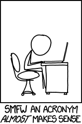

# [C5-L1-3] Acrònims #strings

En el món de la informàtica els acrònims són molt comuns: [https://en.wikipedia.org/wiki/List_of_computing_and_IT_abbreviations](https://en.wikipedia.org/wiki/List_of_computing_and_IT_abbreviations)

Transforma una frase en el seu acrònim.



## Input Format

Una frase en una línia.

## Constraints

-

## Output Format

L'acrònim de la frase

## Sample Input 0

```text
Hello world!
```

## Sample Output 0

```text
HW
```

## Sample Input 1

```text
is this the real life
```

## Sample Output 1

```text
ITTRL
```

## Sample Input 2

```text
what the font
```

## Sample Output 2

```text
WTF
```

## Sample Input 3

```text
Read the fucking manual
```

## Sample Output 3

```text
RTFM
```

## Sample Input 4

```text
GNU's not Unix
```

## Sample Output 4

```text
GNU
```

## Sample Input 5

```text
PHP Hypertext Preprocessor
```

## Sample Output 5

```text
PHP
```

## Sample Input 6

```text
What you see is what you get
```

## Sample Output 6

```text
WYSIWYG
```
