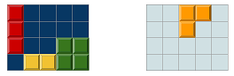
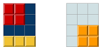

# Block Puzzle #array


En el juego Block Puzzle, el jugador va colocando unas piezas en el tablero completando filas o columnas. Las piezas no se pueden superponer.

Dado un tablero con las fichas que ya estaban colocadas, y otro tablero con la ficha que desea colocar el jugador, indica si la ficha se puede colocar en esa posición.


## Input Format

Los dos primeros números  y  indican el alto y ancho del tablero.

A continuación vienen las x casillas del tablero (`1` significa que la casilla está ocupada y `0` que está libre).

A continación viene otro tablero de x casillas, con la ficha que trata de poner el juagdor (`1` indica las casillas que ocupa la ficha).

## Constraints

-

## Output Format

Se imprimirá `true` si la ficha se puede colocar en esa posición, y `false` en caso contrario

## Sample Input 0

```text
4 5

1 0 0 0 0
1 0 0 0 0
1 0 0 1 1
0 1 1 1 1

0 0 1 1 0
0 0 1 0 0
0 0 0 0 0
0 0 0 0 0
```

## Sample Output 0

```text
true
```

## Explanation 0



## Sample Input 1

```text
4 3

1 1 0
1 1 0
0 0 0
1 1 1

0 0 0
0 0 0
0 1 1
0 1 1
```

## Sample Output 1

```text
false
```

## Explanation 1



## Sample Input 2

```text
5 5

0 1 1 0 1
0 1 0 0 1
0 1 0 0 1
0 0 0 1 1
0 0 0 1 1

0 0 0 0 0
0 0 0 0 0
1 1 1 0 0
1 1 1 0 0
1 1 1 0 0
```

## Sample Output 2

```text
false
```

## Sample Input 3

```text
2 3

0 1 1
0 0 1

1 0 0
1 1 0
```

## Sample Output 3

```text
true
```

## Sample Input 4

```text
4 6

1 1 1 1 0 1
1 1 1 0 0 1
1 1 1 1 0 1
0 0 0 0 0 1

0 0 0 0 1 0
0 0 0 1 1 0
0 0 0 0 1 0
0 0 0 0 0 0
```

## Sample Output 4

```text
true
```

## Explanation 4

true
