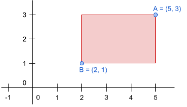

# [f22f4] Perímetre d'un rectangle  #operadors #aritmetics

El perímetre d'un rectangle és la suma de la longitud de tots els seus costats.

Un rectangle es pot definir proporcionant les coordenades del seu cantó superior dret, i les del seu cantó inferior esquerra:



## Input Format

La entrada consta de **dues** coordenades, primer el cantó superior dret i segon el cantó inferior esquerra.

Per a cada coordenada el primer nombre  es la posició en l'eix horitzontal, y el segon nombre  és la posició en l'eix vertical.

## Constraints

-

## Output Format

Un nombre enter indicant el perímetre del rectangle

## Sample Input 0

```text
3 2
0 0
```

## Sample Output 0

```text
10
```

## Sample Input 1

```text
1 1
1 1
```

## Sample Output 1

```text
0
```

## Sample Input 2

```text
2 2
1 1
```

## Sample Output 2

```text
4
```

## Sample Input 3

```text
1 1
-1 -1
```

## Sample Output 3

```text
8
```

## Sample Input 4

```text
4 7
-2 -5
```

## Sample Output 4

```text
36
```

## Sample Input 5

```text
7 6
2 4
```

## Sample Output 5

```text
14
```
