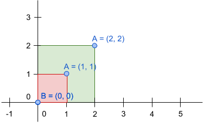
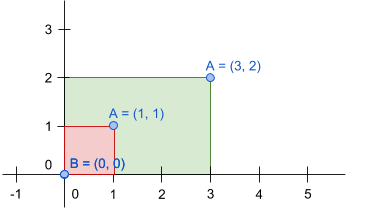
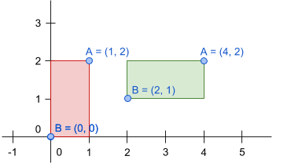
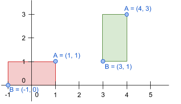
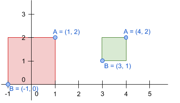

# [fa08c] Emmarcant les fotos  #operadors

En Joan té un munt de fotos per a emmarcar, i vol comprar els marcs.

Els marcs han de ser suficientment grans com per a que hi càpiga la foto i a més a més ha de tenir la mateixa proporció per a que quedi bé.

La definició del rectangle d'una foto i d'un marc es pot fer amb les coordenades dels seus punts superior-dreta i inferior-esquerra:


## Input Format

La entrada consta de la definició del rectangle de la **foto** i del rectangle del **marc**.

Per a cada rectangle s'indiquen les coordenades (x, y) dels seus cantons superior-dreta i inferior-esquerra.

## Constraints

-

## Output Format

S'imprimirà "true" si el marc és adequat per a la foto, i "false" si no ho és.

## Sample Input 0

```text
1 1 0 0
1 1 0 0
```

## Sample Output 0

```text
true
```

## Explanation 0

La foto i el marc són iguals, per tant si que hi cap i sí que té la mateixa proporció.

## Sample Input 1

```text
1 1 0 0
2 2 0 0
```

## Sample Output 1

```text
true
```

## Explanation 1

El marc és més gran que la foto i la proporció és la mateixa



## Sample Input 2

```text
1 1 0 0
3 2 0 0
```

## Sample Output 2

```text
false
```

## Explanation 2

El marc és més gran que la foto, però la proporció no és la mateixa



## Sample Input 3

```text
1 2  0 0
4 2  2 1
```

## Sample Output 3

```text
true
```

## Explanation 3

La foto i el marc tenen el mateix tamany i la proporció és la mateixa



## Sample Input 4

```text
1 1  -1 0
4 3  3 1
```

## Sample Output 4

```text
true
```

## Explanation 4

El marc i la foto tenen el mateix tamany i la proporció és la mateixa



## Sample Input 5

```text
1 2  -1 0
4 2  3 1
```

## Sample Output 5

```text
false
```

## Explanation 5

Tenen la mateixa proporció, però el marc és més petit que la foto:



## Sample Input 6

```text
4 -2  -1 1
3 2  1 1
```

## Sample Output 6

```text
false
```

## Sample Input 7

```text
4 3  0 1
8 6  0 1
```

## Sample Output 7

```text
false
```
