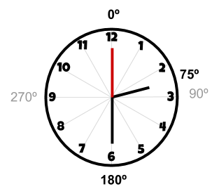
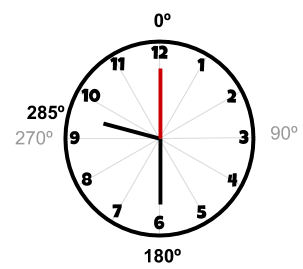
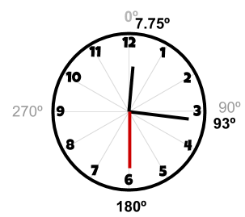

# [cb246] Rellotge de manilles #operadors

En un rellotge les manilles avancen una mica a cada segon. La manilla dels segons és la que avança més ràpid (6 graus cada segon). La manilla dels minuts és una mica més lenta (6 graus cada minut). I la manilla de les hores és la que avança més lentament (30 graus cada hora).

Però totes tres manilles avancen sempre a cada segon. Així, per exemple si és la 1:30:00, la manilla de les hores estarà a 45º, la dels minuts a 180º i la dels segons a 360º:


## Input Format

La entrada consisteix en una hora en format HH:MM:SS

## Constraints

-

## Output Format

S'imprimiran els graus de cada manilla (HH,MM,SS) que corresponen a l'hora, cadascuna en una línia.

## Sample Input 0

```text
2 30 0
```

## Sample Output 0

```text
75.0
180.0
0.0
```

## Explanation 0

La manilla de les hores està a 75º
La manilla dels minuts està a 180º
La manilla dels segons està a 0º



## Sample Input 1

```text
9 30 0
```

## Sample Output 1

```text
285.0
180.0
0.0
```

## Explanation 1



## Sample Input 2

```text
0 15 30
```

## Sample Output 2

```text
7.75
93.0
180.0
```

## Explanation 2



## Sample Input 3

```text
11 59 59
```

## Sample Output 3

```text
359.99167
359.9
354.0
```

## Sample Input 4

```text
7 43 23
```

## Sample Output 4

```text
231.69167
260.3
138.0
```

## Sample Input 5

```text
6 30 30
```

## Sample Output 5

```text
195.25
183.0
180.0
```
