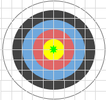
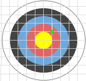
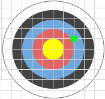
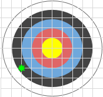
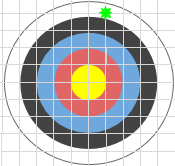
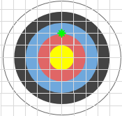

# [cae06] Tir amb arc #operadors

A l'esport de tir amb arc un arquer obté una puntuació segons l'anell on clava la fletxa.
En una diana com la aquesta, rebria 5 punts al color groc, 4 al vermell, 3 al blau, 2 al negre i 1 al blanc.


L'anell groc té un radi de 5cm, i cada anell és 5cm més gran.

Si el tir cau justament sobre el límit d'un anell, es considera que la puntuació és la que correspon a l'anell de menys puntuació.

## Input Format

La entrada consta de 2 nombres decimals (X, Y) que indiquen la posició on s'ha clavat la fletxa respecte al centre de la diana (0,0).

## Constraints

Es garanteix que la distància al centre de la diana sempre serà menor que 25.

## Output Format

S'imprimirà la puntuació obtinguda amb el tir.

## Sample Input 0

```text
0 0
```

## Sample Output 0

```text
5
```

## Explanation 0

Just al centre de la diana són 5 punts



## Sample Input 1

```text
5 5
```

## Sample Output 1

```text
4
```

## Explanation 1



## Sample Input 2

```text
10 5
```

## Sample Output 2

```text
3
```

## Explanation 2



## Sample Input 3

```text
-15 -10
```

## Sample Output 3

```text
2
```

## Explanation 3



## Sample Input 4

```text
20 5
```

## Sample Output 4

```text
1
```

## Explanation 4



## Sample Input 5

```text
0 10
```

## Sample Output 5

```text
3
```

## Explanation 5

Ha fet diana just al límit entre l'anell vermell i el blau, per tant es compta la puntuació del blau.



## Sample Input 6

```text
0.1 24.9
```

## Sample Output 6

```text
1
```

## Sample Input 7

```text
7.1 7.9
```

## Sample Output 7

```text
3
```

## Sample Input 8

```text
20 0
```

## Sample Output 8

```text
1
```

## Sample Input 9

```text
-2.67 4.89
```

## Sample Output 9

```text
4
```
