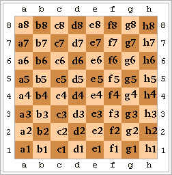

# [d5dbb] Notació algebraica als escacs  #conversio

Les caselles del tauler d'escacs es poden identificar per la seva fila i columna.

Hi han diverses notacions per a identificar la fila i columna d'una casella.

La més senzilla és la númèrica, on s'identifica cada fila i columna pel seu número d'ordre.

Una altra notació és l'algebraica, on la fila d'identifica pel seu número i la columna per les lletres minúscules a, b, c, d, e, f, g, h.



## Input Format

La entrada consisteix en dos nombres  i  corresponents a la fila i columna d'una casella.

## Constraints

-

## Output Format

S'imprimirà la posició de la casella en notació algebraica.

## Sample Input 0

```text
1 1
```

## Sample Output 0

```text
a1
```

## Sample Input 1

```text
2 3
```

## Sample Output 1

```text
b3
```

## Sample Input 2

```text
3 1
```

## Sample Output 2

```text
c1
```

## Sample Input 3

```text
4 8
```

## Sample Output 3

```text
d8
```

## Sample Input 4

```text
5 7
```

## Sample Output 4

```text
e7
```

## Sample Input 5

```text
6 6
```

## Sample Output 5

```text
f6
```

## Sample Input 6

```text
7 8
```

## Sample Output 6

```text
g8
```

## Sample Input 7

```text
8 1
```

## Sample Output 7

```text
h1
```
