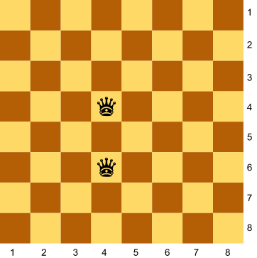
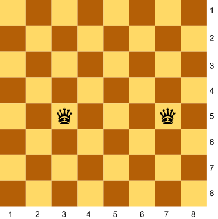
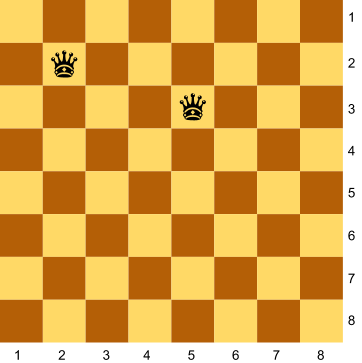
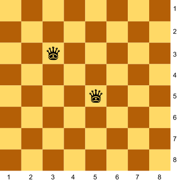
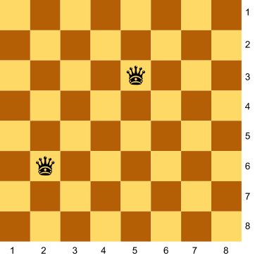
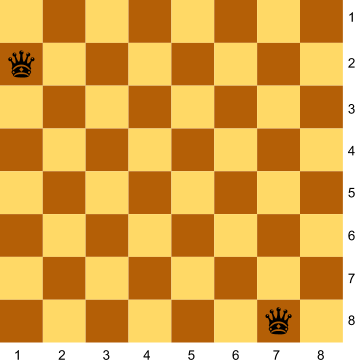
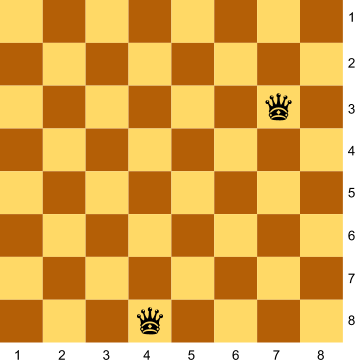

# [fd50d] Dues reines #operadors

Donades les posicions de les dues reines en un tauler d'escacs, digues si s'amenacen mútuament.


## Input Format

La entrada consisteix en 4 nombres indicant la  i  de cada reina

## Constraints

-

## Output Format

true | false

## Sample Input 0

```text
4 4
4 6
```

## Sample Output 0

```text
true
```

## Explanation 0



## Sample Input 1

```text
3 5
7 5
```

## Sample Output 1

```text
true
```

## Explanation 1



## Sample Input 2

```text
2 2
5 3
```

## Sample Output 2

```text
false
```

## Explanation 2



## Sample Input 3

```text
3 3
5 5
```

## Sample Output 3

```text
true
```

## Explanation 3



## Sample Input 4

```text
5 5
3 3
```

## Sample Output 4

```text
true
```

## Explanation 4


## Sample Input 5

```text
2 6
5 3
```

## Sample Output 5

```text
true
```

## Explanation 5



## Sample Input 6

```text
5 3
2 6
```

## Sample Output 6

```text
true
```

## Explanation 6


## Sample Input 7

```text
1 2
7 8
```

## Sample Output 7

```text
true
```

## Explanation 7



## Sample Input 8

```text
7 8
1 2
```

## Sample Output 8

```text
true
```

## Explanation 8


## Sample Input 9

```text
4 8
7 3
```

## Sample Output 9

```text
false
```

## Explanation 9


