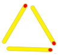
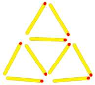
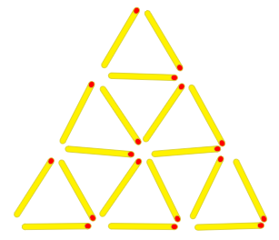
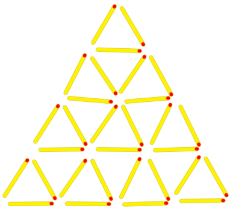

# [c1124] Piràmides de llumins #operadors

Al meu oncle li agrada fer figures amb els llumins a les sobretaules, com aquesta piràmide:


Per a fer aquesta piràmide de 3 pisos li calen 18 llumins.

¿Quants llumins calen per fer piràmides de diferents alçades?

*[https://www.aceptaelreto.com/problem/statement.php?id=371](https://www.aceptaelreto.com/problem/statement.php?id=371)*

## Input Format

La entrada consta d'un número  indicant l'alçada de la piràmide

## Constraints

-

## Output Format

El nombre de llumins necessaris per fer la piràmide.

## Sample Input 0

```text
1
```

## Sample Output 0

```text
3
```

## Explanation 0



## Sample Input 1

```text
2
```

## Sample Output 1

```text
9
```

## Explanation 1

9


## Sample Input 2

```text
3
```

## Sample Output 2

```text
18
```

## Explanation 2



## Sample Input 3

```text
4
```

## Sample Output 3

```text
30
```

## Explanation 3



## Sample Input 4

```text
5
```

## Sample Output 4

```text
45
```

## Sample Input 5

```text
6
```

## Sample Output 5

```text
63
```

## Sample Input 6

```text
10
```

## Sample Output 6

```text
165
```

## Sample Input 7

```text
50
```

## Sample Output 7

```text
3825
```

## Sample Input 8

```text
115
```

## Sample Output 8

```text
20010
```

## Sample Input 9

```text
800
```

## Sample Output 9

```text
961200
```

## Sample Input 10

```text
999
```

## Sample Output 10

```text
1498500
```
