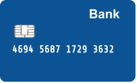

# [d59ab] Hardy-Ramanujan #operadors

Desde que va llegir sobre el matemàtic Ramanujan, busca el nombre 1729 per tot arreu: a les matrícules dels cotxes, als números de telèfon, a les tarjetes bancàries, ...

Especialment a les tarjetes busca que sigui un dels grups de nombres de 4 xifres.



## Input Format

La entrada consisteix en un nombre  de tarjeta bancària.

## Constraints

-

## Output Format

 si el 1729 es un dels grups de 4 xifres

 si no ho és

## Sample Input 0

```text
1111222233334444
```

## Sample Output 0

```text
false
```

## Sample Input 1

```text
1111222233331729
```

## Sample Output 1

```text
true
```

## Sample Input 2

```text
1111222217294444
```

## Sample Output 2

```text
true
```

## Sample Input 3

```text
1111172933334444
```

## Sample Output 3

```text
true
```

## Sample Input 4

```text
1729222233334444
```

## Sample Output 4

```text
true
```

## Sample Input 5

```text
1117292233334444
```

## Sample Output 5

```text
false
```

## Sample Input 6

```text
1111221729334444
```

## Sample Output 6

```text
false
```

## Sample Input 7

```text
1111222233317294
```

## Sample Output 7

```text
false
```

## Sample Input 8

```text
0000000017290000
```

## Sample Output 8

```text
true
```

## Sample Input 9

```text
0000000000001729
```

## Sample Output 9

```text
true
```

## Sample Input 10

```text
1234567891234567
```

## Sample Output 10

```text
false
```
