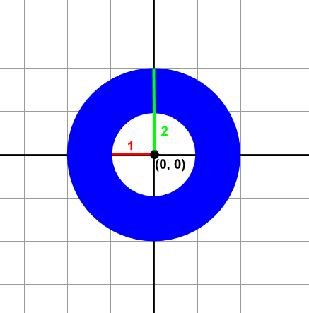
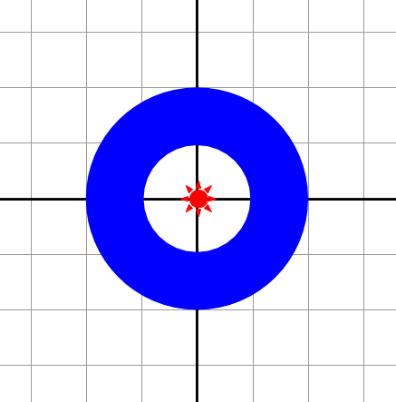
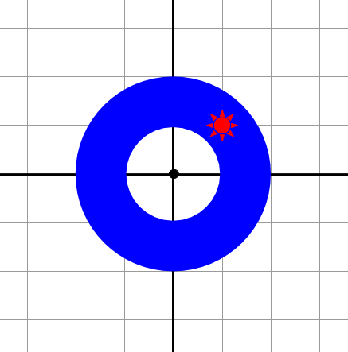
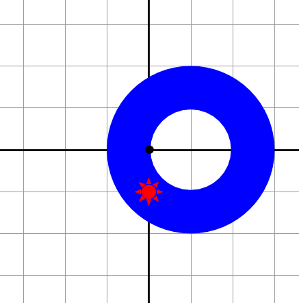
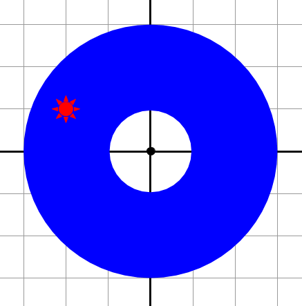
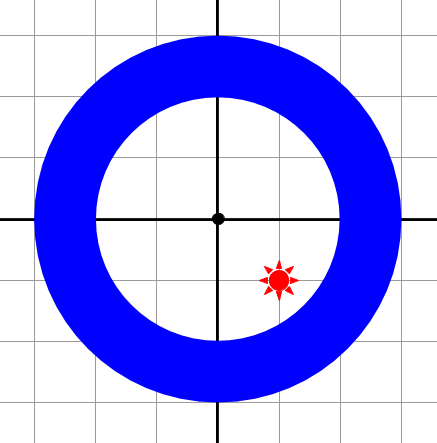
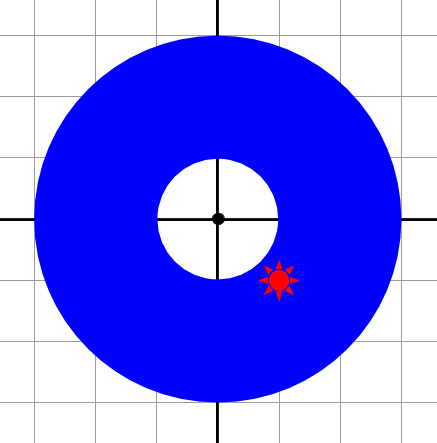

# [c7e8d] Just a l'anella #operadors

A la fira hi ha una parada que té una anella penjada. Es tracta de tirar un dard, i si encertes en l'anella tens un premi.

## Input Format

La entrada consisteix en la definició de l'anella i la posició on s'ha clavat el dard.

L'anella es defineix per les coordenades del seu centre (, ), i les longituds dels radis interior () i exterior ().

Per exemple, la següent anella té el centre a (0,0), el radi interior 1, i l'exterior 2.



La posició del dard es defineix per les seves coordenades (, ).

## Constraints

-

## Output Format

 si el dard s'ha clavat a l'anella

 en cas contrari

## Sample Input 0

```text
0 0 1 2
0 0
```

## Sample Output 0

```text
false
```

## Explanation 0



## Sample Input 1

```text
0 0 1 2
1 1
```

## Sample Output 1

```text
true
```

## Explanation 1



## Sample Input 2

```text
1 0 1 2
0 -1
```

## Sample Output 2

```text
true
```

## Explanation 2



## Sample Input 3

```text
0 0 1 3
-2 1
```

## Sample Output 3

```text
true
```

## Explanation 3



## Sample Input 4

```text
0 0 2 3
1 -1
```

## Sample Output 4

```text
false
```

## Explanation 4



## Sample Input 5

```text
0 0 1 3
1 -1
```

## Sample Output 5

```text
true
```

## Explanation 5



## Sample Input 6

```text
3 3 3 4
3 -1
```

## Sample Output 6

```text
false
```

## Sample Input 7

```text
3 -1 3 5
3 3
```

## Sample Output 7

```text
true
```

## Sample Input 8

```text
73 27 25 60
99 3
```

## Sample Output 8

```text
true
```

## Sample Input 9

```text
73 7 16 25
87 33
```

## Sample Output 9

```text
false
```
