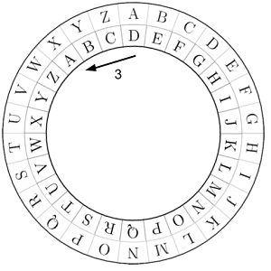
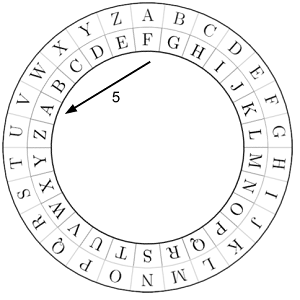
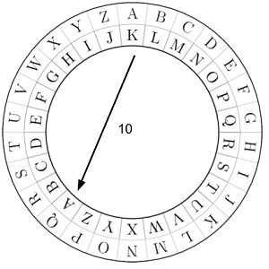
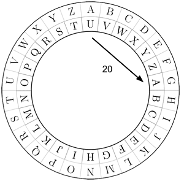
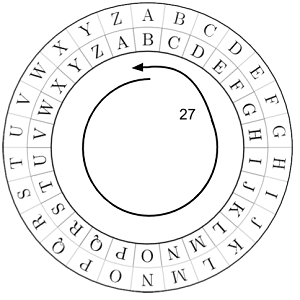

# [be233] Xifratge cèsar #operadors

En criptografia, el xifratge Cèsar, és un tipus de xifratge per substitució en el qual cada lletra del "text clar" es subsititueix per una altra lletra que estigui un determinat nombre fix de posicions desplaçades de l'alfabet. El nombre de posicions que s'ha de desplaçar cada lletra es coneix com a Clau.

## Input Format

La entrada consta d'una paraula de 4 caracters i una clau  de desplaçacament.

Tots els caracters són de l'alfabet anglès i en minúscules.

## Constraints

-

## Output Format

S'escriurà la paraula codificada.

## Sample Input 0

```text
beca
3
```

## Sample Output 0

```text
ehfd
```

## Explanation 0



## Sample Input 1

```text
beca
5
```

## Sample Output 1

```text
gjhf
```

## Explanation 1



## Sample Input 2

```text
hola
10
```

## Sample Output 2

```text
ryvk
```

## Explanation 2



## Sample Input 3

```text
java
20
```

## Sample Output 3

```text
dupu
```

## Explanation 3



## Sample Input 4

```text
zeta
27
```

## Sample Output 4

```text
afub
```

## Explanation 4



## Sample Input 5

```text
char
78
```

## Sample Output 5

```text
char
```

## Explanation 5

76 = 26*3  => 3 voltes completes

## Sample Input 6

```text
long
112
```

## Sample Output 6

```text
twvo
```

## Sample Input 7

```text
byte
0
```

## Sample Output 7

```text
byte
```
