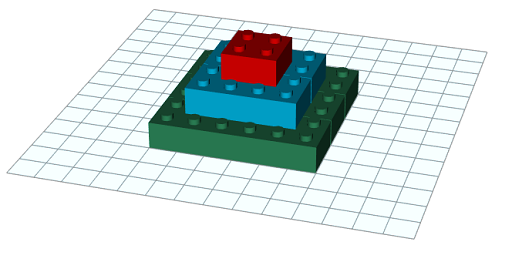
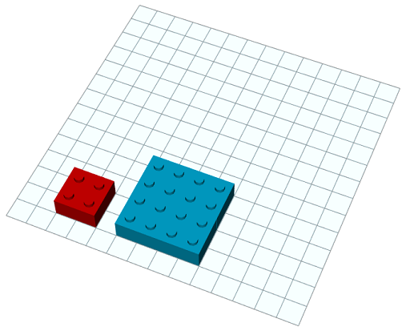
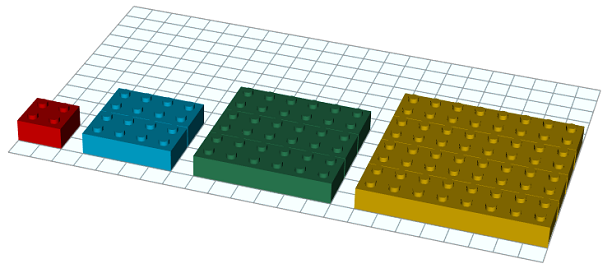

# [e1070] Piràmide lego #operadors

Amb peces de lego de 4x4 pots construir piràmides com aquesta de 3 pisos:



Per a construir-la hem utilitzat 14 peces:


¿Quantes peces es necessiten per a construir un piràmide d'un determinat nombre de pisos?

## Input Format

La entrada consta d'un nombre de pisos

## Constraints

-

## Output Format

El nombre de peces necessàries

## Sample Input 0

```text
2
```

## Sample Output 0

```text
5
```

## Explanation 0



## Sample Input 1

```text
3
```

## Sample Output 1

```text
14
```

## Sample Input 2

```text
4
```

## Sample Output 2

```text
30
```

## Explanation 2



## Sample Input 3

```text
5
```

## Sample Output 3

```text
55
```

## Sample Input 4

```text
6
```

## Sample Output 4

```text
91
```

## Sample Input 5

```text
10
```

## Sample Output 5

```text
385
```

## Sample Input 6

```text
1000
```

## Sample Output 6

```text
333833500
```

## Sample Input 7

```text
765892
```

## Sample Output 7

```text
149755297914942910
```

## Sample Input 8

```text
1000000
```

## Sample Output 8

```text
333333833333500000
```
