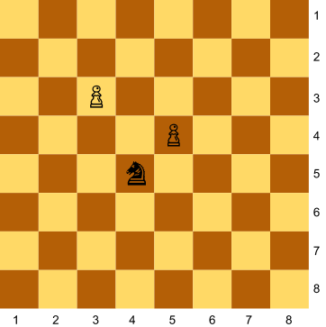
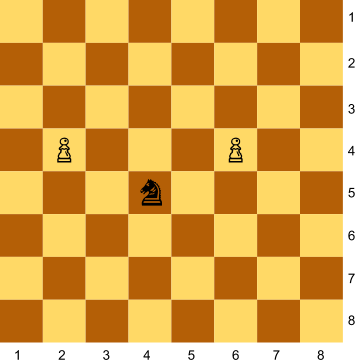
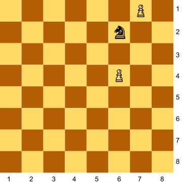
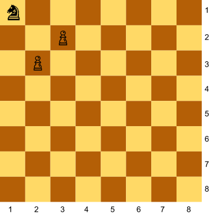
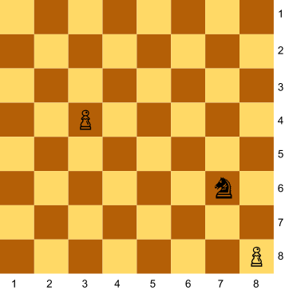

# [d87f8] Un cavall contra dos peons #operadors

Als escacs el cavall pot saltar fent una "L", així:


Donada la posició d'un cavall i de dos peons al tauler, digues quants peons està amenaçant el cavall.

## Input Format

La posició del cavall, i del dos peons

## Constraints

-

## Output Format

0 | 1 | 2

## Sample Input 0

```text
4 5
3 3
5 4
```

## Sample Output 0

```text
1
```

## Explanation 0



## Sample Input 1

```text
4 5
2 4
6 4
```

## Sample Output 1

```text
2
```

## Explanation 1



## Sample Input 2

```text
6 2
6 4
7 1
```

## Sample Output 2

```text
0
```

## Explanation 2



## Sample Input 3

```text
1 1
2 3
3 2
```

## Sample Output 3

```text
2
```

## Explanation 3



## Sample Input 4

```text
7 6
3 4
8 8
```

## Sample Output 4

```text
1
```

## Explanation 4



## Sample Input 5

```text
3 5
2 2
1 1
```

## Sample Output 5

```text
0
```

## Sample Input 6

```text
8 2
7 4
5 3
```

## Sample Output 6

```text
1
```
