# [b83b5] Cercles RGB #operadors

RGB és un model de color additiu en el qual la llum vermella, verda i blava son mesclades per a reproduir colors. És el model que s'usa en pantalles, projectors, càmeres o scànners.


Fem un experiment emetent sobre una pared tres focus rodons -de diferents tamanys i posicions- de llum vermella, verda i blava.

¿Quants colors distints veurem?

## Input Format

La entrada consisteix en la definició dels 3 cercles RGB.

Cada cercle es defineix per les coordinades del seu centre (, )
i la longitud del seu radi .

## Constraints

-

## Output Format

El nombre de colors distints que es veuran.

## Sample Input 0

```text
0 0 1
1 0 1
2 0 1
```

## Sample Output 0

```text
5
```

## Explanation 0

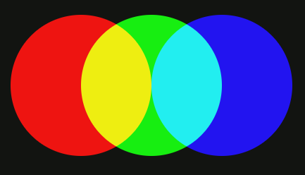

## Sample Input 1

```text
0 0 1
1 0 1
3 0 1
```

## Sample Output 1

```text
4
```

## Explanation 1

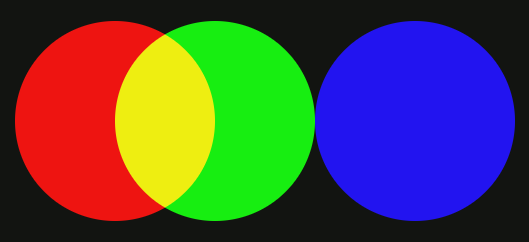

## Sample Input 2

```text
0 0 1
2 0 1
4 0 1
```

## Sample Output 2

```text
3
```

## Explanation 2

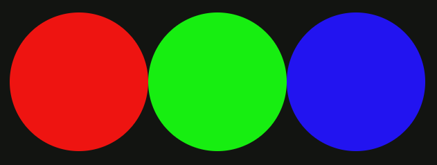

## Sample Input 3

```text
1 0 4
2 0 2
0 0 2
```

## Sample Output 3

```text
4
```

## Explanation 3

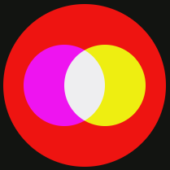

## Sample Input 4

```text
1 0 2
3 0 1
0 0 1
```

## Sample Output 4

```text
4
```

## Explanation 4

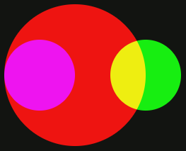

## Sample Input 5

```text
0 1 1
1 0 1
1 1 1
```

## Sample Output 5

```text
7
```

## Explanation 5

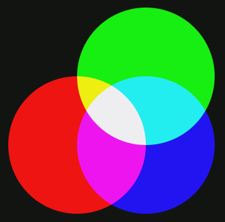

## Sample Input 6

```text
0 0 4
4 0 3
4 0 2
```

## Sample Output 6

```text
5
```

## Explanation 6

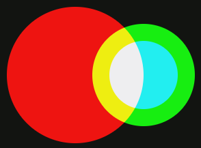

## Sample Input 7

```text
0 0 4
0 0 3
0 0 2
```

## Sample Output 7

```text
3
```

## Explanation 7

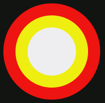

## Sample Input 8

```text
0 0 4
2 0 3
2 0 1
```

## Sample Output 8

```text
4
```

## Explanation 8

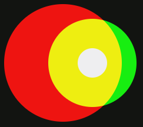

## Sample Input 9

```text
0 0 4
2 0 3
4 0 2
```

## Sample Output 9

```text
6
```

## Explanation 9

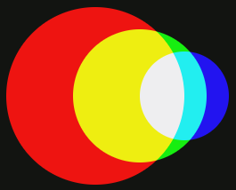

## Sample Input 10

```text
0 0 4
6 0 4
3 0 2
```

## Sample Output 10

```text
6
```

## Explanation 10

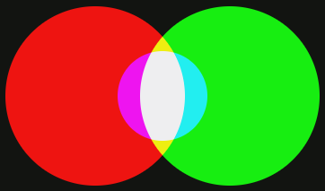

## Sample Input 11

```text
0 4 4
6 2 3
5 6 2
```

## Sample Output 11

```text
6
```

## Explanation 11

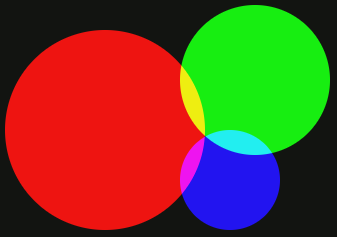

## Sample Input 12

```text
2 0 4
4 0 2
0 0 2
```

## Sample Output 12

```text
3
```

## Explanation 12

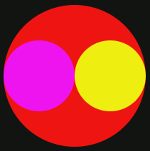
