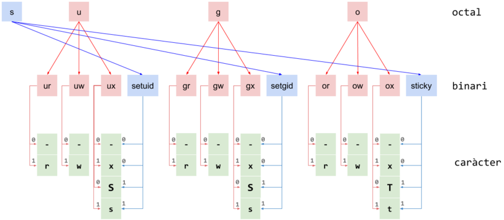

# [C2-L4-3] Permisos octals UNIX #if

Donats els permisos d'un fitxer en format octal, tradueix-los a format caràcters.

La primera xifra octal indica els permisos especials: setuid, setgid i sticky.
La segona xifra octal indica els permisos rwx per a l'usuari propietari del fitxer.
La tercera xifra octal indica els permisos rwx per als usuaris del grup propietari del fitxer.
La quarta xifra octal indica els permisos rwx per a la resta d'usuaris.

Per exemple, el nombre octal 4765 indica que els permisos especials són 4, el d'usuari 7, el de grup 6 i per als altres 5. Això es tradueix en uns permisos rwsrw-r-x


Per a traduir el permisos octals en els permisos **rwx** corresponents, cal passar cada xifra a binari.

Per als permisos d'usuari, grup i altres, un 0 en la primera i segona xifra binària siginifica que el permisos de lectura i espcriptura, respectivament, no es concedeixen, i un 1 que sí es concedeixen.
Per al permís d'execució, un 0 significa que no es concedeix, i un 1 que sí es concedeix. A més a més, si es concedeix el permís d'execució i també i hi ha un 1 en la xifra binària especial corresponent, aleshores s'aplica el permís especial.



```text
usuari:
    r: lectura
    w: escriptura
    x: execució
    s: setuid
    S: setuid però no execució

grup:
    r: lectura
    w: escriptura
    x: execució
    s: setuid
    S: setuid però no execució
altres
    r: lectura
    w: escriptura
    x: execució
    t: sticky
    T: sticky però no execució
```

## Input Format

La entrada consisteix en un nombre octal P indicant els permisos.

## Constraints

0 <= P <= 7777

## Output Format

S'imprimiran els permisos en format caràcter.

## Sample Input 0

```text
0
```

## Sample Output 0

```text
---------
```

## Sample Input 1

```text
6
```

## Sample Output 1

```text
------rw-
```

## Sample Input 2

```text
764
```

## Sample Output 2

```text
rwxrw-r--
```

## Sample Input 3

```text
1000
```

## Sample Output 3

```text
--------T
```

## Sample Input 4

```text
1001
```

## Sample Output 4

```text
--------t
```

## Sample Input 5

```text
1552
```

## Sample Output 5

```text
r-xr-x-wT
```

## Sample Input 6

```text
1553
```

## Sample Output 6

```text
r-xr-x-wt
```

## Sample Input 7

```text
2040
```

## Sample Output 7

```text
---r-S---
```

## Sample Input 8

```text
2050
```

## Sample Output 8

```text
---r-s---
```

## Sample Input 9

```text
2451
```

## Sample Output 9

```text
r--r-s--x
```

## Sample Input 10

```text
3032
```

## Sample Output 10

```text
----ws-wT
```

## Sample Input 11

```text
3766
```

## Sample Output 11

```text
rwxrwSrwT
```

## Sample Input 12

```text
4000
```

## Sample Output 12

```text
--S------
```

## Sample Input 13

```text
4100
```

## Sample Output 13

```text
--s------
```

## Sample Input 14

```text
4765
```

## Sample Output 14

```text
rwsrw-r-x
```

## Sample Input 15

```text
5766
```

## Sample Output 15

```text
rwsrw-rwT
```

## Sample Input 16

```text
6774
```

## Sample Output 16

```text
rwsrwsr--
```

## Sample Input 17

```text
7000
```

## Sample Output 17

```text
--S--S--T
```

## Sample Input 18

```text
7111
```

## Sample Output 18

```text
--s--s--t
```

## Sample Input 19

```text
7776
```

## Sample Output 19

```text
rwsrwsrwT
```

## Sample Input 20

```text
7777
```

## Sample Output 20

```text
rwsrwsrwt
```
