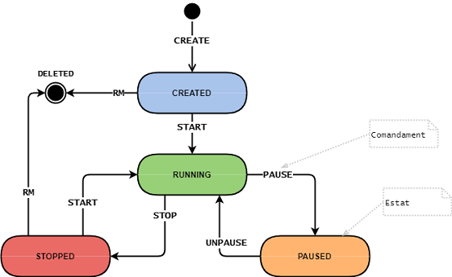

# [C2-L3-1] Contenidors #if

Els contenidors són entorns d'execució aïllats que només tenen accés als recursos (cpu, memòria, sistema d'arxius, xarxa, etc.) que li són assignats.

Existeixen moltes solucions de software que permeten el maneig de contenidors (crear, iniciar, parar, eliminar...).

Una forma habitual de gestionar els contenidors és a través de comandaments. Per exemple, el comandament START inicia un contenidor, i STOP l'atura. És clar, que un contenidor ha d'estar un estat adequat per a poder enviar-li un comandament. Per exemple, no es pot aturar un contenidor que no estigui en execució.

El següent diagrama ilustra els estats en els que pot estar un contenidor, i els comandaments que es poden executar sobre ell, canviant el seu estat.



Es requereix crear un programa per a gestionar els estats d'un contenidor a través de comandaments.

## Input Format

La entrada consisteix en un estat i un comandament.

Un contenidor que encara no existeix s'indica amb l'estat '_'

## Constraints

estat = { _ | CREATED | RUNNING | PAUSED | STOPPED }

comandament = { CREATE | START | PAUSE | UNPAUSE | STOP | RM }

## Output Format

S'indicarà l'estat en que ha de quedar el contenidor si el comandament es pot realitzar.
Si no es pot realitzar, s'indicarà amb el missatge d'error "Invalid command  for state "

## Sample Input 0

```text
_  CREATE
```

## Sample Output 0

```text
CREATED
```

## Sample Input 1

```text
_  START
```

## Sample Output 1

```text
Invalid command START for state _
```

## Sample Input 2

```text
_  PAUSE
```

## Sample Output 2

```text
Invalid command PAUSE for state _
```

## Sample Input 3

```text
_  UNPAUSE
```

## Sample Output 3

```text
Invalid command UNPAUSE for state _
```

## Sample Input 4

```text
_  STOP
```

## Sample Output 4

```text
Invalid command STOP for state _
```

## Sample Input 5

```text
_  RM
```

## Sample Output 5

```text
Invalid command RM for state _
```

## Sample Input 6

```text
CREATED  CREATE
```

## Sample Output 6

```text
Invalid command CREATE for state CREATED
```

## Sample Input 7

```text
CREATED  START
```

## Sample Output 7

```text
RUNNING
```

## Sample Input 8

```text
CREATED  PAUSE
```

## Sample Output 8

```text
Invalid command PAUSE for state CREATED
```

## Sample Input 9

```text
CREATED  UNPAUSE
```

## Sample Output 9

```text
Invalid command UNPAUSE for state CREATED
```

## Sample Input 10

```text
CREATED  STOP
```

## Sample Output 10

```text
Invalid command STOP for state CREATED
```

## Sample Input 11

```text
CREATED  RM
```

## Sample Output 11

```text
DELETED
```

## Sample Input 12

```text
RUNNING  CREATE
```

## Sample Output 12

```text
Invalid command CREATE for state RUNNING
```

## Sample Input 13

```text
RUNNING  START
```

## Sample Output 13

```text
Invalid command START for state RUNNING
```

## Sample Input 14

```text
RUNNING  PAUSE
```

## Sample Output 14

```text
PAUSED
```

## Sample Input 15

```text
RUNNING  UNPAUSE
```

## Sample Output 15

```text
Invalid command UNPAUSE for state RUNNING
```

## Sample Input 16

```text
RUNNING  STOP
```

## Sample Output 16

```text
STOPPED
```

## Sample Input 17

```text
RUNNING  RM
```

## Sample Output 17

```text
Invalid command RM for state RUNNING
```

## Sample Input 18

```text
PAUSED  CREATE
```

## Sample Output 18

```text
Invalid command CREATE for state PAUSED
```

## Sample Input 19

```text
PAUSED  START
```

## Sample Output 19

```text
Invalid command START for state PAUSED
```

## Sample Input 20

```text
PAUSED  PAUSE
```

## Sample Output 20

```text
Invalid command PAUSE for state PAUSED
```

## Sample Input 21

```text
PAUSED  UNPAUSE
```

## Sample Output 21

```text
RUNNING
```

## Sample Input 22

```text
PAUSED  STOP
```

## Sample Output 22

```text
Invalid command STOP for state PAUSED
```

## Sample Input 23

```text
PAUSED  RM
```

## Sample Output 23

```text
Invalid command RM for state PAUSED
```

## Sample Input 24

```text
STOPPED  CREATE
```

## Sample Output 24

```text
Invalid command CREATE for state STOPPED
```

## Sample Input 25

```text
STOPPED  START
```

## Sample Output 25

```text
RUNNING
```

## Sample Input 26

```text
STOPPED  PAUSE
```

## Sample Output 26

```text
Invalid command PAUSE for state STOPPED
```

## Sample Input 27

```text
STOPPED  UNPAUSE
```

## Sample Output 27

```text
Invalid command UNPAUSE for state STOPPED
```

## Sample Input 28

```text
STOPPED  STOP
```

## Sample Output 28

```text
Invalid command STOP for state STOPPED
```

## Sample Input 29

```text
STOPPED  RM
```

## Sample Output 29

```text
DELETED
```
