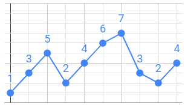
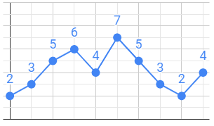
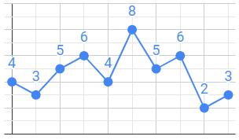
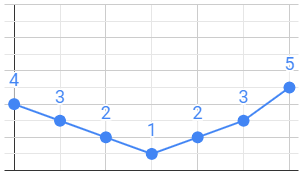
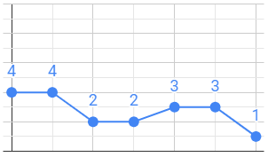
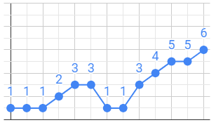

# [C3-L2-1] Pics i valls #for

Els gràfics de línes mostren la informació en una sèrie de punts de dades connectats per segments de línies rectes. Es tracta d'un tipus bàsic de taula comú en molts camps.



Un element d'anàlisi d'aquests gràfics és dels pics i valls. Un pic és un valor local màxim, i una vall és un valor local mínim. És a dir, un pic és aquell valor el qual el seu anterior és menor que ell i el seu posterior és menor o igual que ell. I una vall és quan el seu anterior és major que ell i el seu posterior és major o igual que ell.

Al gràfic de dalt trobem dos pics (5 i 7) i dues valls (2 i 2). El primer i l'últim valor no els hem de comptar.

## Input Format

La entrada consta d'una seqüència de  valors. La seqüència acaba amb un -1 que no s'ha de comptar.

## Constraints

-

## Output Format

S'imprimirà el nombre de pics i el nombre de valls. També s'imprimirà el valor màxim i el valor mínim.

## Sample Input 0

```text
2 3 5 6 4 7 5 3 2 4     -1
```

## Sample Output 0

```text
2
2
7
2
```

## Explanation 0

Hi ha dos pics, dues valles, el valor màxim és 7 i el mínim és 2



## Sample Input 1

```text
4 3 5 6 4 8 5 6 2 3     -1
```

## Sample Output 1

```text
3
4
8
2
```

## Explanation 1

Hi ha tres pics, quatre valls, el valor màxim és 8 i el mínim 2.



## Sample Input 2

```text
4 3 2 1 2 3 5     -1
```

## Sample Output 2

```text
0
1
5
1
```

## Explanation 2

Hi ha zero pics, una vall, el màxim és 5 i el mínim 1



## Sample Input 3

```text
4 4 2 2 3 3 1     -1
```

## Sample Output 3

```text
1
1
4
1
```

## Explanation 3



## Sample Input 4

```text
1 1 1 2 3 3 1 1 3 4 5 5 6     -1
```

## Sample Output 4

```text
2
1
6
1
```

## Explanation 4



## Sample Input 5

```text
45 45 45 89 89 1 3 25 25 24 25 24 2     -1
```

## Sample Output 5

```text
3
2
89
1
```

## Sample Input 6

```text
1 1     -1
```

## Sample Output 6

```text
0
0
1
1
```

## Sample Input 7

```text
4 5     -1
```

## Sample Output 7

```text
0
0
5
4
```

## Sample Input 8

```text
7 5     -1
```

## Sample Output 8

```text
0
0
7
5
```

## Sample Input 9

```text
1 4 3 5 2 6 4 9     -1
```

## Sample Output 9

```text
3
3
9
1
```
