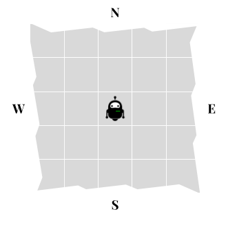
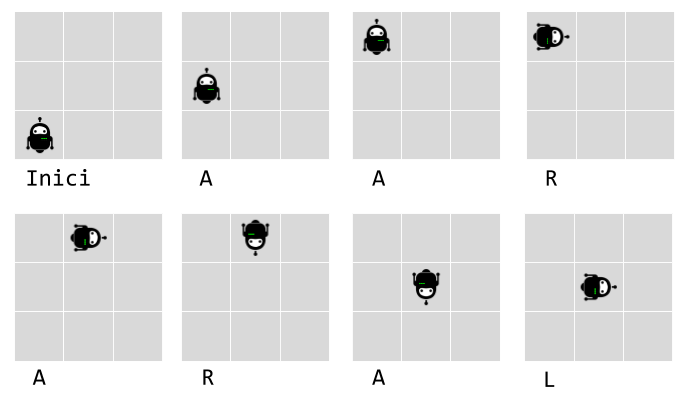
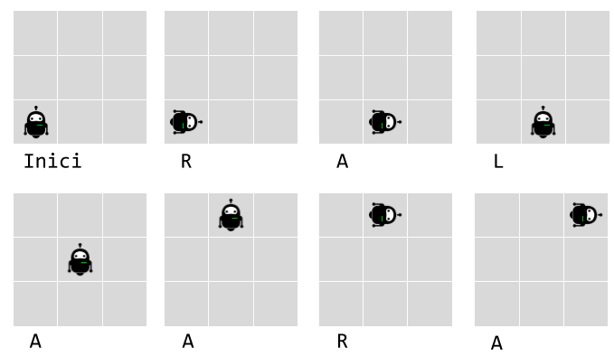
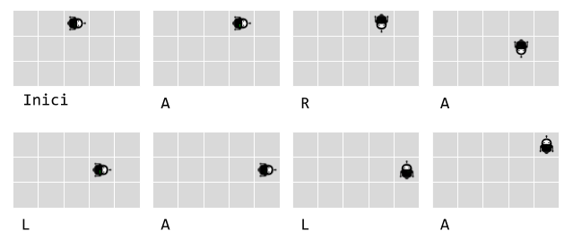

# [C3-L3-1] Robot simulator #for

La instal·lació de proves d'una fàbrica de robots necessita un programa per verificar els moviments del robot.

Els robots tenen tres possibles moviments:

- gir a la dreta (R)

- gir a l'esquerra (L)

- avançar (A)

Els robots es col loquen en una xarxa hipotètica infinita, orientats cap a una direcció particular (, , , ) en unes coordenades {, }.



Aleshores el robot rep diverses instruccions, moment en què la instal·lació de proves verifica la nova posició del robot i en quina direcció apunta.

Per exemple, la cadena de lletres  significa:

- Avançar (A)

- Gir a la dreta (R)

- Avançar (A)

- Gir a l'esquerra x3 (LLL)

- Avançar (A)

Digueu que un robot comença a {0, 0} mirant al nord. A continuació, executar aquest flux d'instruccions hauria de deixar-lo a {1, 0} mirant al sud.


## Input Format

La entrada consisteix en:

Dos nombres {, } indicant les coordenades de la posició inicial.

Un caràcter  indicant la orientació inicial.

Una cadena de  caràcters amb les instruccions

## Constraints

-100 <= X <= 100

-100 <= Y <= 100

O = { |  |  | }

1 <= L <= 100

## Output Format

S'imprimiran les coordenades finals {, } i la orientació en que queda el robot

## Sample Input 0

```text
0 0
N
AARARAL
```

## Sample Output 0

```text
{1, 1}
E
```

## Explanation 0



## Sample Input 1

```text
0 0
N
RALAARA
```

## Sample Output 1

```text
{2, 2}
E
```

## Explanation 1



## Sample Input 2

```text
2 2
E
ARALALA
```

## Sample Output 2

```text
{4, 2}
N
```

## Explanation 2



## Sample Input 3

```text
3 1
E
LARLAAR
```

## Sample Output 3

```text
{3, 4}
E
```

## Sample Input 4

```text
-1 -2
S
AAA
```

## Sample Output 4

```text
{-1, -5}
S
```

## Sample Input 5

```text
17 -3
E
AAALAAA
```

## Sample Output 5

```text
{20, 0}
N
```

## Sample Input 6

```text
20 10
W
ALARLARLARRARRR
```

## Sample Output 6

```text
{19, 8}
W
```

## Sample Input 7

```text
134 -33
S
ALARRLAAALRLLAARLAARLLLARRRALARLRLALLLRAALRALRALLRAAALRAALR
```

## Sample Output 7

```text
{141, -36}
E
```
