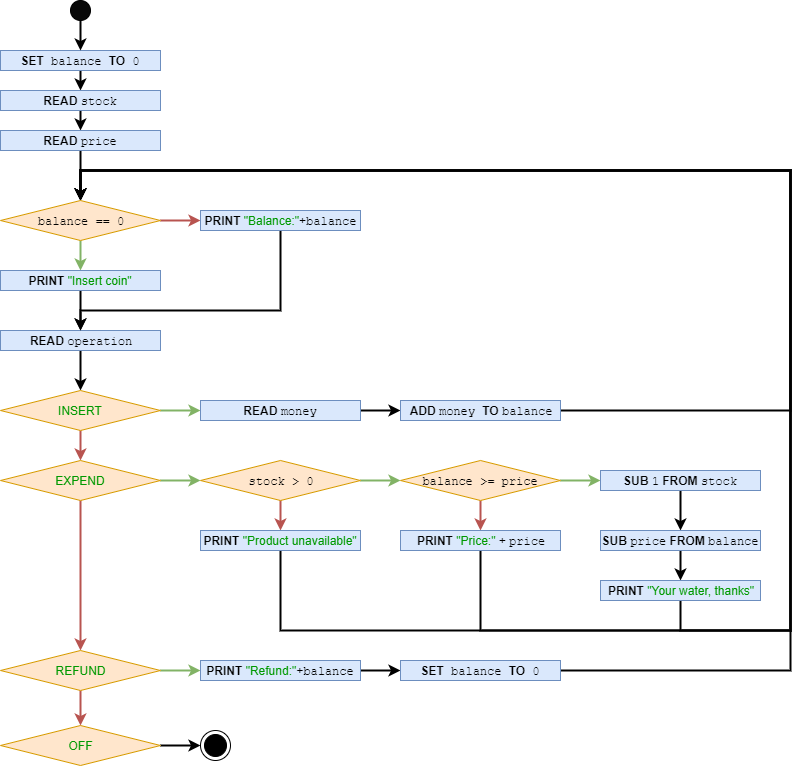

# [C3-L3-5] Màquina de vending #for

Es demana implementar una màquina expenedora d'ampolles d'aigua.

El següent diagrama de flux explica el seu funcionament:



## Input Format

En primer lloc un nombre enter indicant l'stock d'ampolles.

En segon lloc un nombre float indicant el preu de l'ampolla.

A continuació venen les operacions realitzades: , , ,

## Constraints

-

## Output Format

S'imprimiràn els següents missatges, en funció del *workflow* de la màquina:

- Balance:

- Insert coin

- Product unavailable

- Price:

- Refund:

- Your water, thanks

## Sample Input 0

```text
5
0.75

INSERT 1
EXPEND
REFUND
OFF
```

## Sample Output 0

```text
Insert coin
Balance:1.0
Your water, thanks
Balance:0.25
Refund:0.25
```

## Sample Input 1

```text
5
0.75

INSERT 2
EXPEND
EXPEND
REFUND
OFF
```

## Sample Output 1

```text
Insert coin
Balance:2.0
Your water, thanks
Balance:1.25
Your water, thanks
Balance:0.5
Refund:0.5
```

## Sample Input 2

```text
5
0.75

INSERT 0.5
EXPEND
INSERT 0.25
EXPEND
REFUND
OFF
```

## Sample Output 2

```text
Insert coin
Balance:0.5
Price:0.75
Balance:0.5
Balance:0.75
Your water, thanks
Insert coin
Refund:0.0
```

## Sample Input 3

```text
2
1.5

INSERT 4.5
EXPEND
EXPEND
EXPEND
REFUND
OFF
```

## Sample Output 3

```text
Insert coin
Balance:4.5
Your water, thanks
Balance:3.0
Your water, thanks
Balance:1.5
Product unavailable
Balance:1.5
Refund:1.5
```

## Sample Input 4

```text
1
0.5

EXPEND
INSERT 0.5
EXPEND
REFUND
EXPEND
OFF
```

## Sample Output 4

```text
Insert coin
Price:0.5
Insert coin
Balance:0.5
Your water, thanks
Insert coin
Refund:0.0
Insert coin
Product unavailable
```

## Sample Input 5

```text
2
0.5

REFUND
EXPEND
INSERT 0.5
EXPEND
INSERT 0.25
REFUND
INSERT 0.75
EXPEND
EXPEND
REFUND
INSERT 0.25
OFF
```

## Sample Output 5

```text
Insert coin
Refund:0.0
Insert coin
Price:0.5
Insert coin
Balance:0.5
Your water, thanks
Insert coin
Balance:0.25
Refund:0.25
Insert coin
Balance:0.75
Your water, thanks
Balance:0.25
Product unavailable
Balance:0.25
Refund:0.25
Insert coin
```
