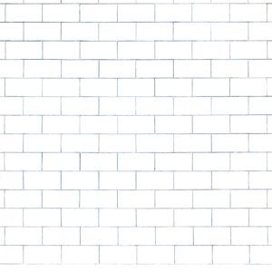

# [b490c] Another brick in the wall #for

L'any 1978, el mític grup Pink Floyd va publicar el seu 11è disc: The Wall.
A les seves actuacions, Pink FLoyd, sempre utilitzaven efectes visuals per acompanyar la seva psicodèlica música rock. Per al tour de The Wall, un enorme mur es construïa a l'escenari entre la banda i el públic.



En aquesta ocasió la banda ens demana una aplicació que generi un mur ASCII-ART per a projectar a l'escenari.

## Input Format

L'entrada consisteix en 4 nombres: amplada del maó, alçada del maó, nombre de maons per línia, nombre de línies de maons.

## Constraints

No hi ha restriccions significatives.

## Output Format

S'imprimirà un mur de les dimensions especificades.
El mur ha de començar amb un maó complet.

Exemple de mur 8-1-3-3:

```text
----------------------------
|        |        |        |
----------------------------
    |        |        |
----------------------------
|        |        |        |
----------------------------
```

## Sample Input 0

```text
8 1 4 3
```

## Sample Output 0

```text
-------------------------------------
|        |        |        |        |
-------------------------------------
    |        |        |        |
-------------------------------------
|        |        |        |        |
-------------------------------------
```

## Sample Input 1

```text
6 1 5 4
```

## Sample Output 1

```text
------------------------------------
|      |      |      |      |      |
------------------------------------
   |      |      |      |      |
------------------------------------
|      |      |      |      |      |
------------------------------------
   |      |      |      |      |
------------------------------------
```

## Sample Input 2

```text
6 2 4 3
```

## Sample Output 2

```text
-----------------------------
|      |      |      |      |
|      |      |      |      |
-----------------------------
   |      |      |      |
   |      |      |      |
-----------------------------
|      |      |      |      |
|      |      |      |      |
-----------------------------
```

## Sample Input 3

```text
6 3 4 2
```

## Sample Output 3

```text
-----------------------------
|      |      |      |      |
|      |      |      |      |
|      |      |      |      |
-----------------------------
   |      |      |      |
   |      |      |      |
   |      |      |      |
-----------------------------
```

## Sample Input 4

```text
8 1 6 10
```

## Sample Output 4

```text
-------------------------------------------------------
|        |        |        |        |        |        |
-------------------------------------------------------
    |        |        |        |        |        |
-------------------------------------------------------
|        |        |        |        |        |        |
-------------------------------------------------------
    |        |        |        |        |        |
-------------------------------------------------------
|        |        |        |        |        |        |
-------------------------------------------------------
    |        |        |        |        |        |
-------------------------------------------------------
|        |        |        |        |        |        |
-------------------------------------------------------
    |        |        |        |        |        |
-------------------------------------------------------
|        |        |        |        |        |        |
-------------------------------------------------------
    |        |        |        |        |        |
-------------------------------------------------------
```
