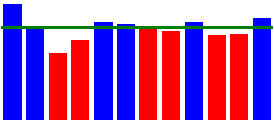
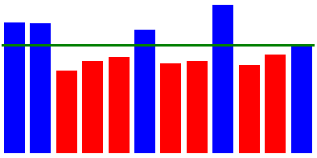
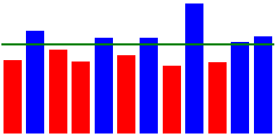
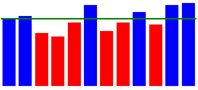
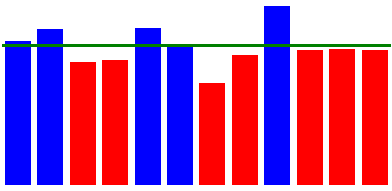

# [fa865] Mitjana de vendes


Ens demanen un programa per a generar els gràfics de la **mitjana mensual** de vendes d'una empresa, a partir de les dades de vendes de cada dia de l'any.

El gràfic ha de mostrar també la **mitjana anual per mesos** i marcar quins mesos estàn per sota d'aquesta mitjana.

## Input Format

L'entrada consta del volum de vendes de cada dia de l'any (comptant amb que febrer té sempre 28 dies) en format CSV.

## Constraints

-

## Output Format

S'imprimirà el codi HTML que genera el gràfic de vendes mensual:

```text

```

La propietat  de cada DIV correspon a la mitjana mensual de vendes del mes corresponent.

El color de fons de cada DIV es  si la mitjana d'aquell mes està per sota de la mitjana anual, i  si és igual o superior.

La propietat  de l'últim DIV correspon a la mitjana anual per mesos.

## Sample Input 0

```text
36, 1, 125, 181, 189, 2, 169, 130, 124, 126, 41, 66, 220, 34, 87, 157, 52, 99, 65, 24, 203, 98, 96, 98, 167, 159, 157, 115, 88, 11, 64
127, 9, 133, 96, 62, 59, 0, 138, 136, 186, 94, 100, 84, 137, 10, 18, 30, 9, 103, 42, 106, 102, 85, 220, 38, 87, 65, 60
76, 31, 36, 57, 16, 11, 105, 56, 3, 70, 88, 1, 6, 106, 35, 114, 1, 8, 23, 28, 105, 49, 109, 86, 126, 49, 13, 0, 104, 170, 150
125, 52, 107, 139, 11, 6, 109, 123, 119, 53, 52, 26, 94, 35, 18, 77, 51, 42, 93, 5, 62, 67, 31, 138, 117, 1, 135, 93, 21, 104
74, 48, 137, 62, 141, 56, 238, 35, 89, 25, 56, 1, 123, 168, 209, 79, 29, 148, 79, 24, 7, 48, 29, 21, 77, 74, 94, 142, 127, 130, 153
87, 86, 52, 20, 100, 85, 98, 184, 179, 2, 207, 139, 78, 52, 83, 83, 136, 75, 35, 106, 29, 61, 107, 38, 81, 194, 26, 69, 76, 0
3, 39, 74, 121, 0, 9, 107, 168, 73, 86, 61, 111, 33, 41, 36, 119, 74, 113, 191, 199, 61, 23, 88, 80, 68, 22, 130, 159, 74, 79, 51
96, 54, 103, 31, 59, 46, 129, 71, 93, 138, 92, 63, 60, 140, 39, 175, 146, 63, 1, 71, 85, 4, 16, 109, 94, 27, 105, 73, 121, 113, 34
83, 201, 166, 185, 46, 61, 51, 35, 42, 246, 51, 34, 27, 46, 12, 28, 112, 131, 101, 112, 148, 54, 9, 0, 98, 66, 126, 20, 148, 152
33, 161, 176, 97, 20, 3, 169, 7, 44, 43, 50, 80, 91, 32, 64, 93, 80, 52, 11, 129, 100, 43, 100, 124, 125, 131, 3, 145, 99, 12, 27
167, 11, 6, 25, 72, 171, 24, 60, 85, 65, 167, 78, 27, 102, 127, 138, 78, 68, 63, 30, 95, 34, 26, 98, 20, 96, 91, 122, 107, 40
59, 178, 48, 12, 39, 71, 220, 191, 111, 69, 78, 74, 196, 22, 43, 1, 139, 4, 84, 58, 106, 123, 16, 69, 33, 101, 99, 250, 89, 122, 100
```

## Sample Output 0

```text

```

## Explanation 0



## Sample Input 1

```text
160, 58, 32, 87, 52, 65, 25, 121, 35, 88, 6, 147, 103, 196, 78, 43, 180, 107, 84, 122, 126, 236, 103, 188, 70, 89, 82, 96, 118, 84, 164
235, 119, 160, 89, 149, 21, 16, 15, 137, 127, 141, 71, 110, 12, 120, 72, 17, 109, 124, 157, 108, 75, 12, 125, 144, 110, 159, 84
67, 13, 79, 60, 19, 73, 146, 124, 51, 88, 36, 103, 51, 149, 61, 21, 21, 13, 30, 51, 6, 49, 97, 89, 12, 95, 50, 130, 129, 2, 77
151, 105, 114, 32, 123, 18, 12, 157, 10, 45, 20, 68, 62, 134, 97, 98, 45, 95, 106, 50, 56, 50, 58, 89, 60, 70, 125, 2, 40, 54
4, 106, 32, 89, 11, 28, 14, 93, 2, 0, 125, 69, 15, 98, 94, 166, 96, 63, 45, 43, 7, 65, 112, 192, 3, 120, 155, 126, 238, 18, 71
174, 48, 64, 36, 56, 138, 81, 82, 32, 117, 131, 19, 177, 33, 79, 54, 139, 86, 53, 172, 97, 71, 113, 77, 199, 3, 183, 160, 27, 164
130, 168, 50, 111, 112, 55, 14, 113, 94, 59, 126, 53, 12, 84, 50, 7, 20, 127, 32, 45, 37, 16, 64, 50, 42, 94, 27, 86, 92, 66, 117
94, 59, 114, 6, 62, 125, 21, 12, 0, 87, 125, 43, 132, 13, 31, 59, 19, 107, 26, 70, 64, 85, 103, 113, 67, 191, 130, 85, 151, 6, 3
99, 73, 8, 100, 39, 217, 161, 160, 40, 240, 85, 162, 197, 106, 96, 17, 99, 134, 102, 168, 184, 147, 116, 6, 216, 6, 63, 168, 91, 125
109, 131, 133, 0, 18, 25, 30, 108, 107, 93, 149, 99, 9, 16, 79, 46, 152, 36, 2, 10, 72, 25, 85, 17, 93, 87, 28, 96, 53, 79, 148
45, 13, 174, 64, 51, 139, 16, 166, 6, 5, 91, 215, 49, 95, 16, 44, 123, 90, 119, 12, 71, 36, 32, 52, 23, 183, 77, 56, 143, 74
156, 138, 24, 51, 0, 59, 61, 26, 95, 91, 259, 203, 68, 104, 121, 28, 15, 113, 94, 126, 37, 75, 92, 175, 78, 29, 86, 73, 0, 78, 34
```

## Sample Output 1

```text

```

## Explanation 1



## Sample Input 2

```text
28, 66, 40, 40, 81, 46, 50, 22, 84, 41, 80, 2, 95, 57, 34, 31, 146, 54, 7, 63, 162, 17, 121, 112, 50, 113, 46, 150, 29, 61, 114
12, 114, 154, 171, 51, 30, 148, 84, 16, 193, 136, 17, 25, 11, 81, 142, 117, 153, 17, 141, 93, 125, 85, 120, 146, 38, 59, 90
7, 103, 43, 134, 133, 106, 122, 145, 85, 132, 77, 35, 101, 9, 53, 84, 91, 45, 13, 66, 54, 26, 3, 45, 55, 93, 111, 4, 123, 114, 89
65, 130, 50, 65, 13, 105, 17, 58, 133, 91, 77, 13, 104, 34, 52, 110, 34, 84, 85, 34, 26, 14, 121, 29, 73, 42, 101, 110, 10, 63
29, 223, 33, 13, 6, 53, 78, 239, 44, 53, 85, 65, 146, 73, 94, 84, 122, 33, 80, 36, 30, 142, 90, 116, 163, 8, 2, 84, 97, 210, 108
49, 66, 13, 4, 55, 123, 26, 21, 58, 234, 35, 123, 7, 6, 99, 154, 76, 10, 38, 31, 159, 65, 34, 138, 116, 6, 44, 77, 68, 154
12, 95, 65, 157, 132, 29, 59, 51, 78, 49, 76, 136, 126, 96, 30, 78, 165, 83, 79, 83, 158, 120, 122, 106, 56, 32, 106, 6, 56, 142, 73
58, 6, 27, 92, 168, 46, 14, 102, 81, 21, 3, 65, 122, 40, 72, 35, 89, 107, 30, 64, 47, 18, 14, 34, 139, 1, 9, 138, 62, 40, 128
53, 5, 211, 207, 93, 189, 169, 60, 105, 224, 75, 150, 190, 117, 63, 1, 197, 130, 122, 29, 178, 146, 10, 91, 65, 158, 152, 133, 125, 29
38, 88, 48, 71, 125, 50, 134, 114, 29, 78, 107, 81, 13, 114, 60, 17, 62, 42, 63, 37, 10, 131, 43, 2, 62, 75, 83, 58, 80, 6, 51
225, 226, 171, 9, 87, 88, 107, 64, 13, 193, 61, 50, 41, 97, 20, 210, 30, 57, 24, 4, 116, 27, 51, 62, 55, 144, 143, 2, 40, 42
52, 176, 81, 97, 51, 18, 15, 164, 33, 95, 87, 190, 92, 114, 48, 39, 162, 41, 101, 96, 75, 62, 84, 103, 44, 64, 31, 107, 130, 60, 183
```

## Sample Output 2

```text

```

## Explanation 2



## Sample Input 3

```text
18, 97, 105, 134, 65, 81, 18, 180, 113, 88, 76, 104, 150, 146, 8, 3, 141, 71, 119, 101, 178, 105, 64, 92, 108, 100, 26, 15, 37, 82, 3
66, 26, 126, 102, 65, 52, 16, 209, 60, 58, 37, 29, 158, 96, 97, 216, 104, 23, 51, 192, 170, 65, 0, 21, 142, 136, 102, 12
10, 64, 44, 95, 9, 76, 52, 75, 42, 103, 156, 74, 96, 144, 18, 55, 5, 46, 8, 59, 87, 66, 13, 98, 80, 23, 69, 106, 73, 116, 58
38, 36, 53, 140, 86, 86, 44, 70, 7, 62, 42, 141, 9, 110, 37, 40, 34, 52, 23, 50, 27, 61, 48, 31, 128, 145, 150, 39, 57, 13
117, 61, 49, 56, 122, 105, 96, 18, 82, 85, 94, 178, 41, 105, 169, 2, 71, 59, 1, 116, 86, 9, 159, 125, 12, 117, 37, 37, 95, 71, 58
144, 127, 227, 133, 95, 42, 188, 163, 41, 202, 24, 119, 17, 115, 81, 82, 29, 133, 14, 25, 151, 94, 110, 83, 188, 163, 116, 15, 77, 6
23, 98, 140, 88, 112, 48, 85, 167, 101, 22, 76, 17, 79, 62, 37, 72, 42, 27, 99, 109, 65, 39, 12, 105, 26, 87, 99, 5, 98, 74, 21
97, 57, 155, 86, 28, 98, 119, 70, 15, 11, 133, 123, 47, 98, 78, 29, 80, 132, 142, 34, 74, 113, 40, 45, 60, 6, 88, 67, 124, 63, 121
78, 236, 91, 20, 72, 29, 70, 207, 135, 92, 10, 66, 13, 73, 134, 184, 144, 30, 47, 18, 125, 30, 161, 6, 50, 96, 80, 107, 100, 244
69, 12, 67, 1, 97, 114, 60, 37, 15, 77, 169, 51, 101, 152, 65, 23, 52, 14, 17, 57, 60, 109, 93, 91, 144, 116, 104, 110, 92, 137, 74
209, 102, 188, 28, 55, 23, 174, 92, 27, 210, 105, 166, 117, 123, 108, 80, 2, 89, 117, 28, 213, 1, 83, 67, 83, 57, 157, 199, 10, 104
159, 103, 80, 84, 136, 97, 142, 184, 181, 85, 190, 76, 53, 207, 204, 16, 176, 76, 22, 82, 107, 133, 2, 63, 72, 36, 46, 74, 42, 222, 37
```

## Sample Output 3

```text

```

## Explanation 3



## Sample Input 4

```text
99, 111, 55, 168, 77, 123, 15, 166, 30, 44, 16, 86, 18, 123, 108, 64, 187, 23, 87, 171, 138, 4, 9, 89, 60, 116, 118, 161, 136, 77, 109
5, 224, 97, 225, 77, 56, 102, 96, 104, 103, 155, 125, 53, 49, 39, 191, 17, 61, 16, 123, 67, 158, 90, 94, 52, 78, 104, 145
27, 67, 98, 59, 21, 85, 122, 50, 127, 95, 37, 107, 6, 114, 94, 84, 157, 25, 163, 31, 75, 32, 51, 137, 69, 110, 48, 62, 48, 104, 58
102, 100, 80, 22, 125, 37, 76, 45, 139, 128, 97, 66, 14, 118, 36, 89, 124, 146, 105, 32, 94, 132, 109, 39, 18, 93, 42, 25, 31, 58
105, 93, 120, 63, 73, 181, 164, 91, 114, 182, 36, 41, 128, 101, 24, 187, 10, 252, 81, 83, 4, 116, 103, 83, 116, 52, 11, 162, 151, 3, 85
69, 103, 161, 111, 135, 52, 15, 101, 74, 109, 91, 14, 137, 112, 70, 13, 143, 135, 132, 110, 105, 88, 47, 105, 114, 2, 51, 23, 110, 95
125, 6, 116, 54, 40, 86, 119, 105, 48, 4, 54, 16, 15, 73, 96, 40, 50, 36, 13, 97, 90, 136, 155, 20, 64, 36, 28, 163, 38, 10, 45
104, 63, 156, 121, 85, 56, 65, 135, 50, 31, 30, 94, 131, 23, 103, 88, 110, 98, 126, 110, 39, 12, 152, 112, 18, 38, 77, 3, 65, 130, 66
9, 180, 217, 242, 70, 194, 84, 3, 25, 94, 146, 264, 189, 27, 46, 120, 213, 133, 146, 87, 81, 47, 171, 20, 82, 44, 135, 95, 143, 12
93, 58, 152, 21, 30, 134, 121, 128, 68, 122, 126, 15, 35, 119, 4, 156, 53, 23, 172, 12, 51, 149, 94, 1, 99, 69, 129, 97, 58, 103, 108
58, 32, 50, 49, 28, 111, 73, 137, 99, 46, 20, 135, 37, 50, 83, 169, 145, 198, 189, 27, 190, 95, 54, 105, 14, 91, 118, 26, 71, 36
6, 24, 106, 10, 20, 32, 183, 42, 68, 113, 46, 168, 85, 152, 77, 45, 4, 59, 92, 37, 102, 98, 87, 143, 54, 195, 104, 115, 101, 198, 12
```

## Sample Output 4

```text

```

## Explanation 4


