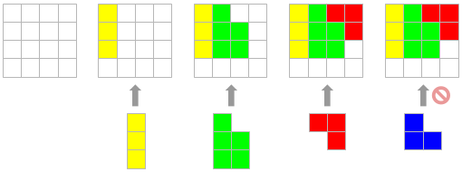
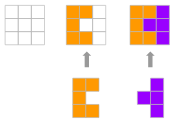
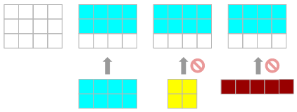
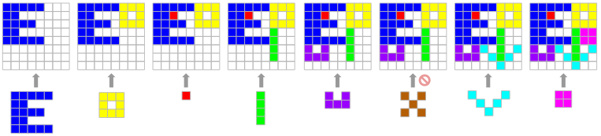

# [C4-L4-3] Organitzant el magatzem #arrays

Una empresa de logística té desitja revisar la política de col·locació de productes al magatzem.
Actualment la política és colocar els productes que van arribant el més al fons i a l'esquerra possible:



Aquesta política però, no és l'òptima, ja que els productes s'haurien pogut col·locar d'aquesta altra forma:


L'empresa desitja realitzar algunes simulacions per a detectar quan ocorren aquests problemes i poder aplicar estratègies diferents.

## Input Format

L'entrada consta en primer lloc del tamany del magatzem (MxN).
A continuació venen els productes que s'han d'emmagatzemar.
Primer ve el nombre de productes que venen a continuació.
Per a cada producte s'indica el nombre de línies de la seva figura, i a continuació ve la figura.

## Constraints

No hi ha

## Output Format

S'imprimirà la distribució final en que queda el magatzem. Els espais buits del magatzem s'indiquen amb un punt.

## Sample Input 0

```text
4 4
4
3
a
a
a
3
b
bb
bb
2
cc
 c
2
d
dd
```

## Sample Output 0

```text
abcc
abbc
abb.
....
```

## Sample Input 1

```text
3 3
2
3
pp
p
pp
3
 x
xx
 x
```

## Sample Output 1

```text
ppx
pxx
ppx
```

## Explanation 1



## Sample Input 2

```text
3 4
3
2
oooo
oooo
2
xx
xx
1
mmmmm
```

## Sample Output 2

```text
oooo
oooo
....
```

## Explanation 2



## Sample Input 3

```text
8 8
8
5
eeeee
ee
eeee
ee
eeeee
3
ooo
o o
ooo
1
a
4
i
i
i
i
2
u u
uuu
3
x x
 x
x x
3
y   y
 y y
  y
2
zz
zz
```

## Sample Output 3

```text
eeeeeooo
eea..o.o
eeee.ooo
ee...izz
eeeeeizz
u.uy.i.y
uuu.yiy.
.....y..
```

## Explanation 3



## Sample Input 4

```text
3 6
8
2
 ss
ss
2
w w w
wwwww
2
ttt
 t
2
l
ll
2
v v
 v
2
u u
uuu
2
 j
jj
2
zz
 zz
```

## Sample Output 4

```text
.ssttt
sslvtv
..llv.
```

## Sample Input 5

```text
5 10
10
1
iiii
2
 t
ttt
3
s
ss
 s
2
  l
lll
2
oo
oo
3
 j
 j
jj
2
zz
 zz
4
i
i
i
i
3
l
l
ll
3
t
tt
t
```

## Sample Output 5

```text
iiiit.s.oo
..ltttssoo
llljzz.sl.
...j.zz.l.
..jj....ll
```
