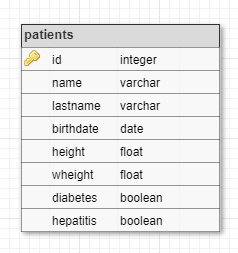

# [C5-L2-2] SELECT

Donades les tuples de la següent relació:



Realitza les següents consultes:

```text
SELECT *
    FROM patients
```

```text
SELECT *
    FROM patients
    WHERE LOWER(name) LIKE %pa% OR LOWER(lastname) LIKE %er%
```

```text
SELECT name, lastname, birthdate
    FROM patients
    WHERE birthdate BETWEEN '1707-04-15' AND '1937-12-26'
```

```text
SELECT name, lastname, weight/height^2 AS ims
    FROM patients
    WHERE weight/height^2  25 AND (diabetes IS TRUE || hepatitis IS TRUE)
```

## Input Format

El primer nombre indica el la quantitat de tuples que venen a continuació.

El format de cada tupla és:

```text
id lastname, name, birthdate, height, weight, diabetes, hepatitis
```

Els valors de l'atribut birthdate estan en format 'YYYY-MM-DD'

Els booleans s'expresen amb {0|1}

En les dades d'entrada poden haver diversos espais en blanc entre els diferents atributs.

## Constraints

-

## Output Format

El format de sortida serà en format taula:

```text
col1   |col2   |col3
-------+-------+-------
val    |val    |val
val    |val    |val
```

Els noms de les columnes s'aliniaran a l'esquerra.

El format dels valors ha de ser:

- Integer: amplada 4, aliniat a l'esquerra

- String: amplada 16, aliniat a l'esquerra

- Data: amplada 12, aliniat a la dreta

- Float: amplada 10, aliniat a la dreta, amb dues xifres decimals

- Boolean: amplada 10, aliniat a la dreta, {true|false}

S'ha de deixar una separació de 2 salts de línia entre cada resultat.

## Sample Input 0

```text
10
1 of Samos,   Pyhtagoras, -0570-01-01, 1.75, 63.2, 0, 0
2   of Alexandria,  Hypatia, 0350-01-01, 1.59, 46.1,  0, 1
 3  Cardano,  Gerolamo, 1501-09-24, 1.73,  69.2,   1, 0
  4  Euler,    Leonhard,   1707-04-15,    1.64,  59.9, 1, 1
5 Gauss, Carl, 1777-04-30, 1.70, 92.2, 1, 0
6 Cantor,   Georg, 1845-03-03,    1.75, 75.2, 0, 0
 7    Erdos, Paul,     1913-03-26, 1.76, 56.6,  1,    1
 8 Conway, John, 1937-12-26, 1.72, 88.2, 0, 1
9 Perelman, Grigori,    1966-06-13, 1.90, 89.9, 1,   1
  10 Tao, Terry, 1975-07-17,  1.74, 68.4, 0, 0
```

## Sample Output 0

```text
id  |name            |lastname        |birthdate   |height  |wheight |diabetes  |hepatitis
----+----------------+----------------+------------+--------+--------+----------+----------
1   |Pyhtagoras      |of Samos        | -0570-01-01|    1.75|   63.20|     false|     false
2   |Hypatia         |of Alexandria   |  0350-01-01|    1.59|   46.10|     false|      true
3   |Gerolamo        |Cardano         |  1501-09-24|    1.73|   69.20|      true|     false
4   |Leonhard        |Euler           |  1707-04-15|    1.64|   59.90|      true|      true
5   |Carl            |Gauss           |  1777-04-30|    1.70|   92.20|      true|     false
6   |Georg           |Cantor          |  1845-03-03|    1.75|   75.20|     false|     false
7   |Paul            |Erdos           |  1913-03-26|    1.76|   56.60|      true|      true
8   |John            |Conway          |  1937-12-26|    1.72|   88.20|     false|      true
9   |Grigori         |Perelman        |  1966-06-13|    1.90|   89.90|      true|      true
10  |Terry           |Tao             |  1975-07-17|    1.74|   68.40|     false|     false

id  |name            |lastname        |birthdate   |height  |wheight |diabetes  |hepatitis
----+----------------+----------------+------------+--------+--------+----------+----------
2   |Hypatia         |of Alexandria   |  0350-01-01|    1.59|   46.10|     false|      true
4   |Leonhard        |Euler           |  1707-04-15|    1.64|   59.90|      true|      true
7   |Paul            |Erdos           |  1913-03-26|    1.76|   56.60|      true|      true
9   |Grigori         |Perelman        |  1966-06-13|    1.90|   89.90|      true|      true

name            |lastname        |birthdate
----------------+----------------+------------
Leonhard        |Euler           |  1707-04-15
Carl            |Gauss           |  1777-04-30
Georg           |Cantor          |  1845-03-03
Paul            |Erdos           |  1913-03-26
John            |Conway          |  1937-12-26

name            |lastname        |ims
----------------+----------------+--------
Hypatia         |of Alexandria   |   18.24
Paul            |Erdos           |   18.27

name            |lastname        |ims
----------------+----------------+--------
Carl            |Gauss           |   31.90
John            |Conway          |   29.81
```
