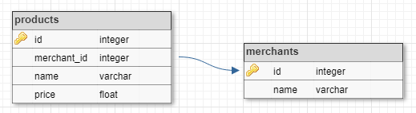

# [C5-L3-1] JOIN

Donades les tuples de les següents relacions:



Realitza la següent consulta:

```text
SELECT name, merchants.name AS merchant, price
FROM products
    JOIN merchants ON product.merchant_id = merchants.id
```

## Input Format

La entrada consisteix en les tuples per a les taules 'products', 'merchants'.
En primer lloc va el nombre de tuples i després les tuples, cadascuna en una línia.

Per a la taula **products** el format de cada tupla és:

```text
id id_merchant nom price
```

Per a la taula **merchants** el format és:

```text
id nom
```

## Constraints

No hi ha cap restricció significativa

## Output Format

La sortida serà el resultat de la consulta en format taula:

```text
name            |merchant        |price
----------------+----------------+----------
```

L'amplada de les columnes 'name' i 'merchant' és 16, i la 'price' és 10. El preu s'haurà de posar amb dos decimals.

Tot el text s'ha d'aliniar a l'esquerra.

Per últim caldrà indicar el número de tuples retornades per la consulta: "(X rows)"

## Sample Input 0

```text
3
1 1 Java 0
7 6 Gnome 0
10 6 gcc 0

2
1 Oracle
6 GNU
```

## Sample Output 0

```text
name            |merchant        |price
----------------+----------------+----------
Java            |Oracle          |      0.00
Gnome           |GNU             |      0.00
gcc             |GNU             |      0.00
(3 rows)
```

## Sample Input 1

```text
1
14 8 Firefox 0

2
2 Microsoft
8 Mozilla
```

## Sample Output 1

```text
name            |merchant        |price
----------------+----------------+----------
Firefox         |Mozilla         |      0.00
(1 rows)
```

## Sample Input 2

```text
9
7 6 Gnome 0
8 6 Gimp 0
9 6 Guix 0
10 6 gcc 0
11 7 Apache 0
12 7 Hadoop 0
13 7 Spark 0
14 8 Firefox 0
15 9 PostgreSQL 0

1
4 Apple
```

## Sample Output 2

```text
name            |merchant        |price
----------------+----------------+----------
(0 rows)
```

## Sample Input 3

```text
1
10 6 gcc 0

9
1 Oracle
2 Microsoft
3 Google
4 Apple
5 Adobe
6 GNU
7 Apache SF
8 Mozilla
9 PGDB
```

## Sample Output 3

```text
name            |merchant        |price
----------------+----------------+----------
gcc             |GNU             |      0.00
(1 rows)
```

## Sample Input 4

```text
15
1 1 Java 0
2 1 OracleDB 109.4
3 2 Windows 37.3
4 3 Android 0
5 4 OSX 74.1
6 5 Photoshop 55
7 6 Gnome 0
8 6 Gimp 0
9 6 Guix 0
10 6 gcc 0
11 7 Apache 0
12 7 Hadoop 0
13 7 Spark 0
14 8 Firefox 0
15 9 PostgreSQL 0

9
1 Oracle
2 Microsoft
3 Google
4 Apple
5 Adobe
6 GNU
7 Apache SF
8 Mozilla
9 PGDB
```

## Sample Output 4

```text
name            |merchant        |price
----------------+----------------+----------
Java            |Oracle          |      0.00
OracleDB        |Oracle          |    109.40
Windows         |Microsoft       |     37.30
Android         |Google          |      0.00
OSX             |Apple           |     74.10
Photoshop       |Adobe           |     55.00
Gnome           |GNU             |      0.00
Gimp            |GNU             |      0.00
Guix            |GNU             |      0.00
gcc             |GNU             |      0.00
Apache          |Apache SF       |      0.00
Hadoop          |Apache SF       |      0.00
Spark           |Apache SF       |      0.00
Firefox         |Mozilla         |      0.00
PostgreSQL      |PGDB            |      0.00
(15 rows)
```
