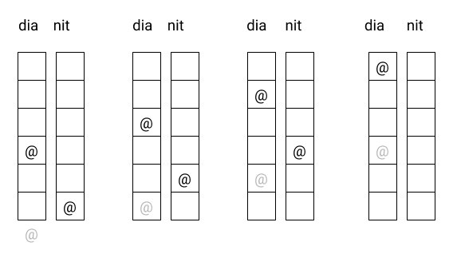
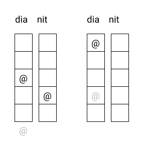
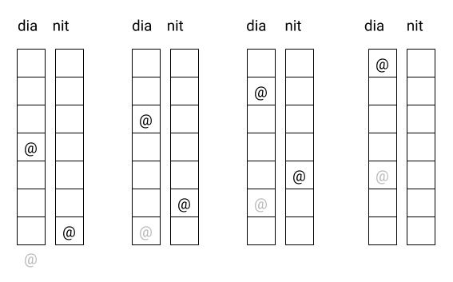

# Cargol  #operadors

Un cargol vol trepar un pal d'una alçada d' metres. Si puja  metres durant el dia, però rellisca  metres avall per la nit, en quin dia aconseguirà arribar a dalt de tot?

## Input Format

Tres números enters positius: ,  i

## Constraints

 >

 >

## Output Format

-

## Sample Input 0

```text
6 3 2
```

## Sample Output 0

```text
4
```

## Explanation 0



## Sample Input 1

```text
5 3 1
```

## Sample Output 1

```text
2
```

## Explanation 1



## Sample Input 2

```text
7 4 3
```

## Sample Output 2

```text
4
```

## Explanation 2



## Sample Input 3

```text
6 4 2
```

## Sample Output 3

```text
2
```

## Sample Input 4

```text
9 4 2
```

## Sample Output 4

```text
4
```

## Sample Input 5

```text
13 5 3
```

## Sample Output 5

```text
5
```

## Sample Input 6

```text
12 4 1
```

## Sample Output 6

```text
4
```
