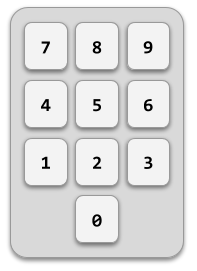

# [f280a] Combinación secreta de la caja fuerte #for



En una caja fuerte de combinación hay que introducir los números de la combinación secreta en el orden correcto para abrirla.

## Input Format

La entrada consiste en primer lugar en tres números que indican la combinación secreta.

A continuación viene la secuencia de números introducidos (como mínimo 3). La secuencia termina con -1.

## Constraints

-

## Output Format

Se imprimirá "ABIERTA" si se ha introducido en algún momento la combinación secreta o "CERRADA" en caso contrario.

## Sample Input 0

```text
13 42 25
66 13 42 25 77    -1
```

## Sample Output 0

```text
ABIERTA
```

## Sample Input 1

```text
7 11 17
9 3 7 11 17   -1
```

## Sample Output 1

```text
ABIERTA
```

## Sample Input 2

```text
7 11 17
9 3 7 11 15 17   -1
```

## Sample Output 2

```text
CERRADA
```

## Sample Input 3

```text
1 1 1
1 1 2 1 1 2    -1
```

## Sample Output 3

```text
CERRADA
```
