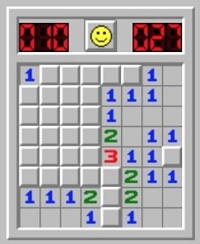
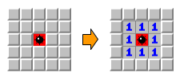
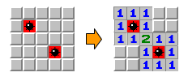
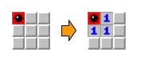
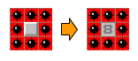
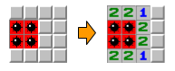
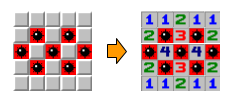
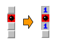

# [d74f9] Comptant mines



Donat un tauler de buscamines, dir per a cada casella sense mina, quantes caselles amb mina té al seu voltant.

## Input Format

L'entrada consta en primer lloc de dos números  i  que indiquen el tamany (files i columnes) del tauler.

A continuación venen les caselles del tauler. (0=no hi ha mina, 1=hi ha mina)

## Constraints

-

## Output Format

S'imprimirá el tauler amb les casellas separades amb un espai i les files separades per un salt de línia.

En cada casella sense mina s'escriurà el número de mines que té al seu voltant.

Les caselles amb mina es deixaran igual, és a dir, amb un 1.

## Sample Input 0

```text
5 5
0 0 0 0 0
0 0 0 0 0
0 0 1 0 0
0 0 0 0 0
0 0 0 0 0
```

## Sample Output 0

```text
0 0 0 0 0
0 1 1 1 0
0 1 1 1 0
0 1 1 1 0
0 0 0 0 0
```

## Explanation 0



## Sample Input 1

```text
5 5
0 0 0 0 0
0 1 0 0 0
0 0 0 0 0
0 0 0 1 0
0 0 0 0 0
```

## Sample Output 1

```text
1 1 1 0 0
1 1 1 0 0
1 1 2 1 1
0 0 1 1 1
0 0 1 1 1
```

## Explanation 1



## Sample Input 2

```text
3 3

1 0 0
0 0 0
0 0 0
```

## Sample Output 2

```text
1 1 0
1 1 0
0 0 0
```

## Explanation 2



## Sample Input 3

```text
3 3

1 1 1
1 0 1
1 1 1
```

## Sample Output 3

```text
1 1 1
1 8 1
1 1 1
```

## Explanation 3



## Sample Input 4

```text
4 4

0 0 0 0
1 1 0 0
1 1 0 0
0 0 0 0
```

## Sample Output 4

```text
2 2 1 0
1 1 2 0
1 1 2 0
2 2 1 0
```

## Explanation 4



## Sample Input 5

```text
1 4

1 0 1 0
```

## Sample Output 5

```text
1 2 1 1
```

## Explanation 5


## Sample Input 6

```text
5 5

0 0 0 0 0
0 1 0 1 0
1 0 1 0 1
0 1 0 1 0
0 0 0 0 0
```

## Sample Output 6

```text
1 1 2 1 1
2 1 3 1 2
1 4 1 4 1
2 1 3 1 2
1 1 2 1 1
```

## Explanation 6



## Sample Input 7

```text
4 1

0
1
0
0
```

## Sample Output 7

```text
1
1
1
0
```

## Explanation 7



## Sample Input 8

```text
8 8

0 0 0 0 0 0 0 1
0 1 0 0 0 0 1 0
1 0 1 0 0 0 0 1
1 1 1 0 0 0 0 0
0 0 0 0 1 1 0 0
0 0 0 0 0 0 0 0
0 0 0 0 0 0 0 0
1 0 0 1 0 0 0 1
```

## Sample Output 8

```text
1 1 1 0 0 1 2 1
2 1 2 1 0 1 1 3
1 6 1 2 0 1 2 1
1 1 1 3 2 2 2 1
2 3 2 2 1 1 1 0
0 0 0 1 2 2 1 0
1 1 1 1 1 0 1 1
1 1 1 1 1 0 1 1
```
