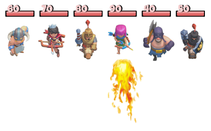
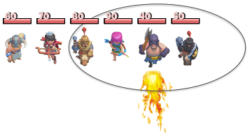

# Fireball #arrays



En un videojoc els enemics es disposen en una fila. El jugador els hi pot llançar boles de foc i provocar un dany a l'enemic en el qual impacta i també als que estiguin a l'abast de la bola de foc.

Cada enemic té un nivell de vida, i quan els alcança la bola de foc els hi resta una quantitat determinada de vida. Quan un enemic té nivell zero, ja no se li pot restar més vida.

## Input Format

- El primer nombre  indica la quantitat d'enemics.

- A continuació venen els nivells de vida de cadascun dels enemics.

- Després venen les dades de les boles de foc. Tres números per cada bola de foc:

El primer nombre  indica la posició (començant per `0`) de l'enemic al qual impacta la bola de foc

- El segon nombre  indica l'abast de la bola de foc

- El tercer nombre  indica el dany que causa la bola de foc.

- L'entrada finalitza amb tres `-1`

Per exemple, la següent bola de foc impacta a l'enemic en la posició `4` i té un abast `2`:



## Constraints

-

## Output Format

Per cada bola llançada, s'imprimirà en una nova línia el nivell de vida resultant dels enemics, separats per espais.

## Sample Input 0

```text
5
100 50 30 20 10
1 1 10
2 2 5
-1 -1 -1
```

## Sample Output 0

```text
90 40 20 20 10
85 35 15 15 5
```

## Sample Input 1

```text
3
50 50 50
1 0 25
-1 -1 -1
```

## Sample Output 1

```text
50 25 50
```

## Sample Input 2

```text
3
30 10 30
1 1 10
1 1 10
1 1 10
-1 -1 -1
```

## Sample Output 2

```text
20 0 20
10 0 10
0 0 0
```

## Sample Input 3

```text
5
100 100 100 100 100
2 0 10
2 1 10
2 2 10
2 3 10
-1 -1 -1
```

## Sample Output 3

```text
100 100 90 100 100
100 90 80 90 100
90 80 70 80 90
80 70 60 70 80
```
