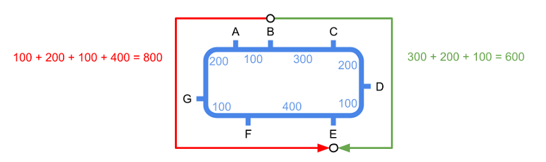
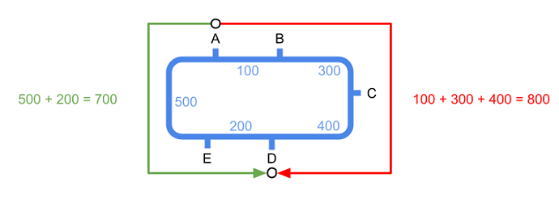
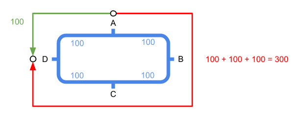
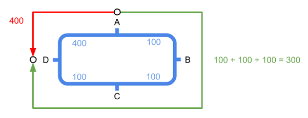
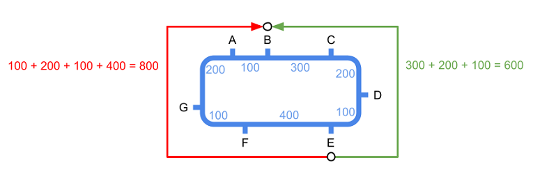
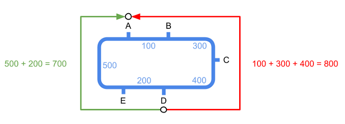
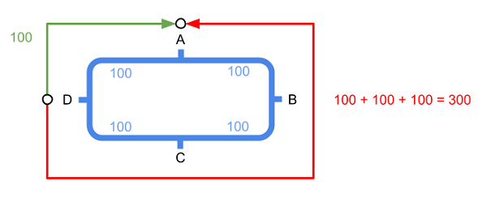
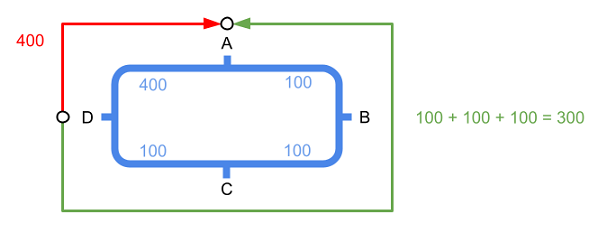

# Metro circular #array


Estamos desarrollando un app para planificar rutas en metro. Ya la tenemos casi lista, pero hay algunas líneas que son circulares y nos traen de cabeza.

En estas líneas de metro circulares hay trenes dando vueltas en los dos sentidos. Así que si un pasajero quiere ir de una estación A a otra estación B, puede viajar en cualquiera de los dos sentidos. Claro está que en un sentido el viaje puede ser más corto que en el otro.

Nuestra app, debe informar cuál es la ruta más corta entre las estaciones de origen y destino seleccionadas por el usuario, informando del tiempo total de viaje y de todas las paradas intermedias.

## Input Format

El primer número  indica la cantidad de estaciones.

A continuación vienen los  nombres de cada estación (una palabra)

A continuación vienen los  tiempos de trayecto entre estaciones (en segundos):
El primer tiempo corresponde al tiempo de viaje entre la primera y la segunda estación, y así sucesivamente, de forma que el último tiempo corresponde al tiempo entre la última y la primera. Los tiempos de viajes entre las estaciones son los mismos en ambos sentidos.

Por último vienen los nombres de las estaciones de origen y destino.

## Constraints

Se garantiza que los tiempos de viaje en ambos sentidos entre origen y destino son distintos.

## Output Format

Se imprimirán los nombres de las estaciones de la ruta más corta, cada una en una nueva línea.

Al final se imprimirá el tiempo total de viaje (en segundos).

## Sample Input 0

```text
7
A   B   C   D   E   F   G
100 300 200 100 400 100 200

B E
```

## Sample Output 0

```text
B
C
D
E
600
```

## Explanation 0



## Sample Input 1

```text
5
A   B   C   D   E
100 300 400 200 500

A D
```

## Sample Output 1

```text
A
E
D
700
```

## Explanation 1



## Sample Input 2

```text
4
A   B   C   D
100 100 100 100

A D
```

## Sample Output 2

```text
A
D
100
```

## Explanation 2



## Sample Input 3

```text
4
A   B   C   D
100 100 100 400

A D
```

## Sample Output 3

```text
A
B
C
D
300
```

## Explanation 3



## Sample Input 4

```text
7
A   B   C   D   E   F   G
100 300 200 100 400 100 200

E B
```

## Sample Output 4

```text
E
D
C
B
600
```

## Explanation 4



## Sample Input 5

```text
5
A   B   C   D   E
100 300 400 200 500

D A
```

## Sample Output 5

```text
D
E
A
700
```

## Explanation 5



## Sample Input 6

```text
4
A   B   C   D
100 100 100 100

D A
```

## Sample Output 6

```text
D
A
100
```

## Explanation 6



## Sample Input 7

```text
4
A   B   C   D
100 100 100 400

D A
```

## Sample Output 7

```text
D
C
B
A
300
```

## Explanation 7



## Sample Input 8

```text
10
Laguna Carpetana Oporto Usera Legazpi Arganzuela Pacifico Conde Baranda ODonell
300    400       350    220   550     430        290      190   400     100

Carpetana Pacifico
```

## Sample Output 8

```text
Carpetana
Laguna
ODonell
Baranda
Conde
Pacifico
1280
```

## Sample Input 9

```text
10
Laguna Carpetana Oporto Usera Legazpi Arganzuela Pacifico Conde Baranda ODonell
300    400       350    220   550     430        290      190   400     100

Pacifico Carpetana
```

## Sample Output 9

```text
Pacifico
Conde
Baranda
ODonell
Laguna
Carpetana
1280
```

## Sample Input 10

```text
10
Laguna Carpetana Oporto Usera Legazpi Arganzuela Pacifico Conde Baranda ODonell
300    400       350    220   550     430        290      190   400     100

Arganzuela ODonell
```

## Sample Output 10

```text
Arganzuela
Pacifico
Conde
Baranda
ODonell
1310
```

## Sample Input 11

```text
10
Laguna Carpetana Oporto Usera Legazpi Arganzuela Pacifico Conde Baranda ODonell
300    400       350    220   550     430        290      190   400     100

ODonell Arganzuela
```

## Sample Output 11

```text
ODonell
Baranda
Conde
Pacifico
Arganzuela
1310
```
