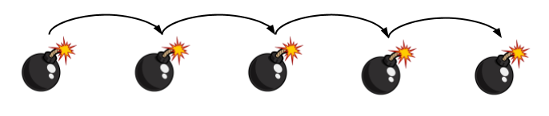
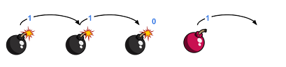
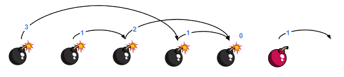
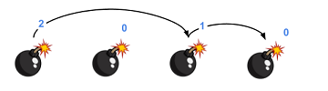
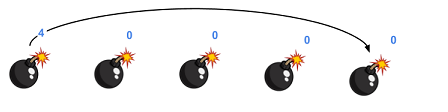
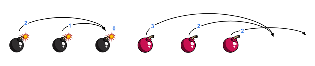
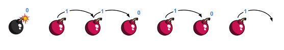
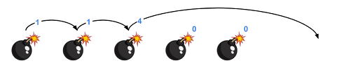
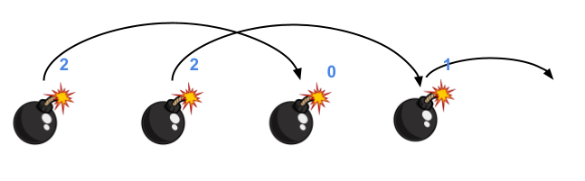

# Reacció en cadena #arrays



Hi han una sèrie de bombes col·locades en línia recta i separades per 1 metre.

Quan una bomba explota, la seva ona expansiva fa que explotin totes aquelles bombes que estiguin dintre del seu abast.

A partir de l'abast de l'ona expansiva de cada bomba, indica quina serà l'última bomba en explotar si fem explotar la primera de totes.

## Input Format

El primer nombre  indica la quantitat de bombes que hi ha.

A continuació venen els  abasts de l'ona expansiva de cada bomba.

Per exemple, els següents abasts corresponen a les següents bombes:

```text
2 1 3 0 1 1
```


## Constraints

-

## Output Format

S'imprimirà la posició de l'última bomba en explotar (començant a comptar per 1)

## Sample Input 0

```text
4
1 1 0 1
```

## Sample Output 0

```text
3
```

## Explanation 0



## Sample Input 1

```text
6
3 1 2 1 0 1
```

## Sample Output 1

```text
5
```

## Explanation 1



## Sample Input 2

```text
4
2 0 1 0
```

## Sample Output 2

```text
4
```

## Explanation 2



## Sample Input 3

```text
5
4 0 0 0 0
```

## Sample Output 3

```text
5
```

## Explanation 3



## Sample Input 4

```text
6
2 1 0 3 2 2
```

## Sample Output 4

```text
3
```

## Explanation 4



## Sample Input 5

```text
7
0 1 1 0 1 0 1
```

## Sample Output 5

```text
1
```

## Explanation 5



## Sample Input 6

```text
5
1 1 4 0 0
```

## Sample Output 6

```text
5
```

## Explanation 6



## Sample Input 7

```text
10
3 0 0 2 0 1 8 0 0 0
```

## Sample Output 7

```text
10
```

## Sample Input 8

```text
1
0
```

## Sample Output 8

```text
1
```

## Sample Input 9

```text
1
5
```

## Sample Output 9

```text
1
```

## Sample Input 10

```text
4
2 2 0 1
```

## Sample Output 10

```text
4
```

## Explanation 10



## Sample Input 11

```text
10
3 2 2 0 1 2 3 0 0 1
```

## Sample Output 11

```text
10
```
