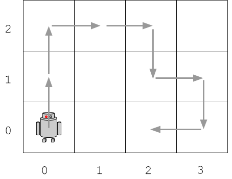

# [C3-L1-5] Robot simulator #for

Un robot pot moure's en una quadrícula en direcció , , , .

En un primer moment el robot es situa en la posició {,} de la quadrícula. Després, el robot rep una sèrie d'instruccions de moviment. El simulador ha d'indicar la posició final {,} en la que quedaria el robot després de realitzar els moviments.

Les instruccions de moviment són un String amb les direccions en les que s'ha de moure. Un punt indica el fi de les instruccions.
Per exemple:

```text
N N E E S E S W .
```



Posició final: {2,0}

Exemple 2:

```text
N E E N .
```


Posició final: {2,2}

## Input Format

Un String amb les instruccions `N`, `S`, `E`, `W`, `.`

## Constraints

-

## Output Format

Dos enters indicant la posició final separats per un salt de línia.
Primer la posició , i després la posició .

## Sample Input 0

```text
N N N .
```

## Sample Output 0

```text
0
3
```

## Sample Input 1

```text
N E E .
```

## Sample Output 1

```text
2
1
```

## Sample Input 2

```text
N N S S .
```

## Sample Output 2

```text
0
0
```

## Sample Input 3

```text
N E .
```

## Sample Output 3

```text
1
1
```

## Sample Input 4

```text
S W N N E E .
```

## Sample Output 4

```text
1
1
```

## Sample Input 5

```text
S N W W E N S E N N E S .
```

## Sample Output 5

```text
1
1
```

## Sample Input 6

```text
S S W W W .
```

## Sample Output 6

```text
-3
-2
```
