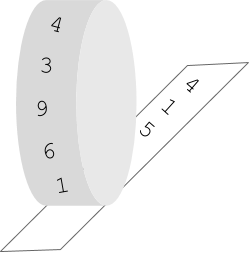

# [ddcb9] Parin les rotatives!

A la redacció del periòdic arriba una notícia molt important... parin les rotatives!!

La màquina rotativa del periòdic és així:



En un rodet està el text que es va a imprimir. Aleshores el rodet comença a rodar i el paper va corrent per sota.

## Input Format

El primer número  indica el tamany de la seqüència. A continuació ve la seqüència de números a imprimir.

Després ve la quantitat de números  que s'havien imprés en el moment en que es para la rotativa.

## Constraints

-

## Output Format

La seqüència de números impresos separada per espais.

## Sample Input 0

```text
3    100 200 300
5
```

## Sample Output 0

```text
100 200 300 100 200
```

## Sample Input 1

```text
3    100 200 300
7
```

## Sample Output 1

```text
100 200 300 100 200 300 100
```

## Sample Input 2

```text
3    100 200 300
2
```

## Sample Output 2

```text
100 200
```

## Sample Input 3

```text
5    100 200 300 400 500
4
```

## Sample Output 3

```text
100 200 300 400
```

## Sample Input 4

```text
3    10 20 30
10
```

## Sample Output 4

```text
10 20 30 10 20 30 10 20 30 10
```

## Sample Input 5

```text
3    1 2 3
20
```

## Sample Output 5

```text
1 2 3 1 2 3 1 2 3 1 2 3 1 2 3 1 2 3 1 2
```
