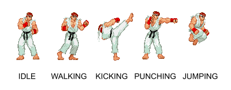

# [C2-L2-5] Street Fighter #if

En la majoria de jocs, per a modelar el comportament dels personatges s'utilitza una **màquina d'estats**.

La màquina d'estats defineix les possibles accions que pot estar realitzant un personatge, i els events que inicien les accions. Per exemple, un jugador pot estar en estat "CAMINANT" i quan es produeix l'event en què l'usuari "POLSA LA TECLA DE DISPAR", aleshores canvia l'acció i passa a estar en estat "DISPARANT".

La cosa es complica una mica perquè hi ha estats als quals no es pot arribar partint d'altres. Per exemple, hi ha jocs en els que el personatge no pot disparar mentre esta saltant. En aquest cas no seria possible la transició directa entre l'estat "SALTANT" i l'estat "DISPARANT"·

Es demana implementar una màquina d'estats bàsica per a un personatge del joc Street Fighter:

Els **estats** possibles d'un personatge són:



Els **events** que poden canviar l'estat d'un personatge són:

- JOYSTICK_UP: El jugador ha accionat el joystick cap amunt

- JOYSTICK_LEFT/RIGHT: El jugador ha accionat el joystick a esquerra o dreta

- JOYSTICK_CENTER: El jugador a deixat el joystick al centre

- PUNCH_KEY: El jugador a polsat el botó de cop de puny

- KICK_KEY: El jugador a polsat el botó de cop de peu

- PUNCH_END: L'acció de cop de puny ha acabat

- KICK_END: L'acció de cop de peu ha acabat

- TOUCH_FLOOR: El personatge ha tocat terra

El següent diagrama ilustra les transicions entre estats que provoquen aquests events.


## Input Format

L'entrada consta de dues paraules:

- L'estat actual del personatge: {"IDLE", "WALK", "JUMP", "KICK", "PUNCH"}

- L'event que ha ocorregut: {"JOYSTICK_UP", "JOYSTICK_LEFT/RIGHT", "JOYSTICK_CENTER", "PUNCH_KEY", "KICK_KEY", "PUNCH_END", "KICK_END", "TOUCH_FLOOR"}

## Constraints

No hi ha

## Output Format

S'imprimirà l'estat en el qual quedarà el personatge.

Si l'event ocorregut no modifica l'estat, es mostrarà el que tenia abans de l'event.

## Sample Input 0

```text
IDLE JOYSTICK_UP
```

## Sample Output 0

```text
JUMPING
```

## Explanation 0

El personatge es troba en estat "IDLE" i ocorre l'event "JOYSTICK_UP".
El nou estat passa a ser "JUMPING"

## Sample Input 1

```text
IDLE JOYSTICK_LEFT/RIGHT
```

## Sample Output 1

```text
WALKING
```

## Explanation 1

El personatge es troba en estat "IDLE" i ocorre l'event "JOYSTICK_LEFT/RIGHT".
El nou estat passa a ser "WALKING"

## Sample Input 2

```text
IDLE JOYSTICK_CENTER
```

## Sample Output 2

```text
IDLE
```

## Explanation 2

L'estat del personatge és "IDLE" i ocorre l'event "JOYSTICK_CENTER".
Aquest event **no** modifica l'estat del personatge.

## Sample Input 3

```text
IDLE PUNCH_KEY
```

## Sample Output 3

```text
PUNCHING
```

## Sample Input 4

```text
IDLE KICK_KEY
```

## Sample Output 4

```text
KICKING
```

## Sample Input 5

```text
IDLE PUNCH_END
```

## Sample Output 5

```text
IDLE
```

## Sample Input 6

```text
IDLE KICK_END
```

## Sample Output 6

```text
IDLE
```

## Sample Input 7

```text
IDLE TOUCH_FLOOR
```

## Sample Output 7

```text
IDLE
```

## Sample Input 8

```text
WALKING JOYSTICK_UP
```

## Sample Output 8

```text
JUMPING
```

## Sample Input 9

```text
WALKING JOYSTICK_LEFT/RIGHT
```

## Sample Output 9

```text
WALKING
```

## Sample Input 10

```text
WALKING JOYSTICK_CENTER
```

## Sample Output 10

```text
IDLE
```

## Sample Input 11

```text
WALKING PUNCH_KEY
```

## Sample Output 11

```text
PUNCHING
```

## Sample Input 12

```text
WALKING KICK_KEY
```

## Sample Output 12

```text
KICKING
```

## Sample Input 13

```text
WALKING PUNCH_END
```

## Sample Output 13

```text
WALKING
```

## Sample Input 14

```text
WALKING KICK_END
```

## Sample Output 14

```text
WALKING
```

## Sample Input 15

```text
WALKING TOUCH_FLOOR
```

## Sample Output 15

```text
WALKING
```

## Sample Input 16

```text
JUMPING JOYSTICK_UP
```

## Sample Output 16

```text
JUMPING
```

## Sample Input 17

```text
JUMPING JOYSTICK_LEFT/RIGHT
```

## Sample Output 17

```text
JUMPING
```

## Sample Input 18

```text
JUMPING JOYSTICK_CENTER
```

## Sample Output 18

```text
JUMPING
```

## Sample Input 19

```text
JUMPING PUNCH_KEY
```

## Sample Output 19

```text
PUNCHING
```

## Sample Input 20

```text
JUMPING KICK_KEY
```

## Sample Output 20

```text
KICKING
```

## Sample Input 21

```text
JUMPING PUNCH_END
```

## Sample Output 21

```text
JUMPING
```

## Sample Input 22

```text
JUMPING KICK_END
```

## Sample Output 22

```text
JUMPING
```

## Sample Input 23

```text
JUMPING TOUCH_FLOOR
```

## Sample Output 23

```text
IDLE
```

## Sample Input 24

```text
KICKING JOYSTICK_UP
```

## Sample Output 24

```text
KICKING
```

## Sample Input 25

```text
KICKING JOYSTICK_LEFT/RIGHT
```

## Sample Output 25

```text
KICKING
```

## Sample Input 26

```text
KICKING JOYSTICK_CENTER
```

## Sample Output 26

```text
KICKING
```

## Sample Input 27

```text
KICKING PUNCH_KEY
```

## Sample Output 27

```text
KICKING
```

## Sample Input 28

```text
KICKING KICK_KEY
```

## Sample Output 28

```text
KICKING
```

## Sample Input 29

```text
KICKING PUNCH_END
```

## Sample Output 29

```text
KICKING
```

## Sample Input 30

```text
KICKING KICK_END
```

## Sample Output 30

```text
IDLE
```

## Sample Input 31

```text
KICKING TOUCH_FLOOR
```

## Sample Output 31

```text
KICKING
```

## Sample Input 32

```text
PUNCHING JOYSTICK_UP
```

## Sample Output 32

```text
PUNCHING
```

## Sample Input 33

```text
PUNCHING JOYSTICK_LEFT/RIGHT
```

## Sample Output 33

```text
PUNCHING
```

## Sample Input 34

```text
PUNCHING JOYSTICK_CENTER
```

## Sample Output 34

```text
PUNCHING
```

## Sample Input 35

```text
PUNCHING PUNCH_KEY
```

## Sample Output 35

```text
PUNCHING
```

## Sample Input 36

```text
PUNCHING KICK_KEY
```

## Sample Output 36

```text
PUNCHING
```

## Sample Input 37

```text
PUNCHING PUNCH_END
```

## Sample Output 37

```text
IDLE
```

## Sample Input 38

```text
PUNCHING KICK_END
```

## Sample Output 38

```text
PUNCHING
```

## Sample Input 39

```text
PUNCHING TOUCH_FLOOR
```

## Sample Output 39

```text
PUNCHING
```
