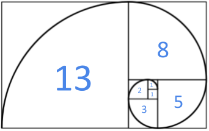

# [C3-L2-2] Successions de Fibonacci #for

La successió de Fibonacci comença amb els nombres 0 i 1, i a partir d'aquests, «cada terme és la suma dels dos anteriors».



A partir de vàries sequències de nombres, determina si són successions de Fibonacci.

## Input Format

El primer nombre  indica la quantitat de seqüències que venen després.

Cada sequència de N nombres acaba amb un -1.

## Constraints

Cada seqüència té almenys 2 números.

## Output Format

Un "SI" o un "NO" per cada seqüència; separats per un salt de línia.

## Sample Input 0

```text
2
1 1 2 3    -1
0 1 1    -1
```

## Sample Output 0

```text
NO
SI
```

## Sample Input 1

```text
2
0 1 1 2 3 5    -1
0 1 1 5    -1
```

## Sample Output 1

```text
SI
NO
```

## Sample Input 2

```text
2
1 1 2 3 5    -1
0 1    -1
```

## Sample Output 2

```text
NO
SI
```

## Sample Input 3

```text
4
0 0 1 1 2 3 5    -1
0 1 2 3 5 8    -1
0 1 1 2 3 5 13    -1
0 1 1 2 3 5 8 13 21 34 55    -1
```

## Sample Output 3

```text
NO
NO
NO
SI
```
