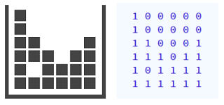

# Tetris, eliminar línies #arrays


Al Tetris, quan una línia horitzontal es completa, aquesta línia desapareix i totes les peces que estan a sobre descendeixen una posició.

Donat un tauler de Tetris, imprimeix el tauler resultant d'eliminar les línies completades.

## Input Format

Primer s'indica el número de  i  del tauler.

A continuació venen una sèrie de `1` i `0` que indiquen l'estat de cada casella. `1` significa ocupada i `0` significa lliure.

Per exemple, aquest tauler de Tetris es podria representar així:



## Constraints

-

## Output Format

S'imprimirà el tauler resultant amb el mateix format que a l'entrada.

## Sample Input 0

```text
3 4
1 1 0 1
1 0 0 1
1 1 1 1
```

## Sample Output 0

```text
1 1 0 1
1 0 0 1
```

## Sample Input 1

```text
5 4
1 0 0 1
1 1 1 1
1 0 1 1
1 1 0 0
0 1 1 1
```

## Sample Output 1

```text
1 0 0 1
1 0 1 1
1 1 0 0
0 1 1 1
```

## Sample Input 2

```text
6 4
1 0 0 0
1 1 0 0
1 1 1 1
1 1 1 1
0 1 1 1
1 1 1 1
```

## Sample Output 2

```text
1 0 0 0
1 1 0 0
0 1 1 1
```

## Sample Input 3

```text
8 5
0 0 0 0 0
0 0 0 0 0
1 0 0 0 1
1 1 0 0 1
1 1 1 1 1
1 1 1 1 1
0 1 1 1 1
1 1 1 1 0
```

## Sample Output 3

```text
0 0 0 0 0
0 0 0 0 0
1 0 0 0 1
1 1 0 0 1
0 1 1 1 1
1 1 1 1 0
```

## Sample Input 4

```text
3 4
1 1 1 1
1 1 1 1
1 1 1 1
```
