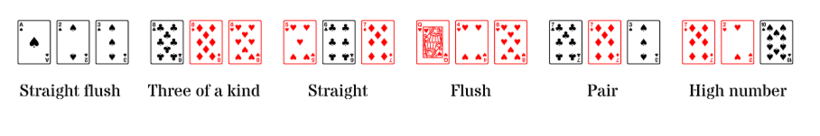

# [C2-L2-6] Three card poker #if



Al Three Card Poker es poden fer les següents figures:

- **Straight flush**: 3 cartes amb números consecutius del mateix pal

- **Three of a kind**: 3 cartes del mateix número

- **Straight**: 3 cartes amb números consecutius

- **Flush**: 3 cartes del mateix pal

- **Pair**: 2 cartes del mateix número

- **High number**: cap de les anteriors

En la nostra versió del joc, jugarem només amb els números, no amb els pals. Així, les figures possibles seran:

- **Three of a kind**

- **Straight**

- **Pair**

- **High number**

## Input Format

L'entrada consta de 3 números enters corresponents als números de les cartes.

## Constraints

No hi ha

## Output Format

S'imprimirà la figura de més valor.

{     |  |  |   }

## Sample Input 0

```text
1 1 1
```

## Sample Output 0

```text
THREE OF A KIND
```

## Sample Input 1

```text
1 1 2
```

## Sample Output 1

```text
PAIR
```

## Sample Input 2

```text
1 1 3
```

## Sample Output 2

```text
PAIR
```

## Sample Input 3

```text
1 1 4
```

## Sample Output 3

```text
PAIR
```

## Sample Input 4

```text
1 2 1
```

## Sample Output 4

```text
PAIR
```

## Sample Input 5

```text
1 2 2
```

## Sample Output 5

```text
PAIR
```

## Sample Input 6

```text
1 2 3
```

## Sample Output 6

```text
STRAIGHT
```

## Sample Input 7

```text
1 2 4
```

## Sample Output 7

```text
HIGH CARD
```

## Sample Input 8

```text
1 3 1
```

## Sample Output 8

```text
PAIR
```

## Sample Input 9

```text
1 3 2
```

## Sample Output 9

```text
STRAIGHT
```

## Sample Input 10

```text
1 3 3
```

## Sample Output 10

```text
PAIR
```

## Sample Input 11

```text
1 3 4
```

## Sample Output 11

```text
HIGH CARD
```

## Sample Input 12

```text
1 4 1
```

## Sample Output 12

```text
PAIR
```

## Sample Input 13

```text
1 4 2
```

## Sample Output 13

```text
HIGH CARD
```

## Sample Input 14

```text
1 4 3
```

## Sample Output 14

```text
HIGH CARD
```

## Sample Input 15

```text
1 4 4
```

## Sample Output 15

```text
PAIR
```

## Sample Input 16

```text
2 1 1
```

## Sample Output 16

```text
PAIR
```

## Sample Input 17

```text
2 1 2
```

## Sample Output 17

```text
PAIR
```

## Sample Input 18

```text
2 1 3
```

## Sample Output 18

```text
STRAIGHT
```

## Sample Input 19

```text
2 1 4
```

## Sample Output 19

```text
HIGH CARD
```

## Sample Input 20

```text
2 2 1
```

## Sample Output 20

```text
PAIR
```

## Sample Input 21

```text
2 2 2
```

## Sample Output 21

```text
THREE OF A KIND
```

## Sample Input 22

```text
2 2 3
```

## Sample Output 22

```text
PAIR
```

## Sample Input 23

```text
2 2 4
```

## Sample Output 23

```text
PAIR
```

## Sample Input 24

```text
2 3 1
```

## Sample Output 24

```text
STRAIGHT
```

## Sample Input 25

```text
2 3 2
```

## Sample Output 25

```text
PAIR
```

## Sample Input 26

```text
2 3 3
```

## Sample Output 26

```text
PAIR
```

## Sample Input 27

```text
2 3 4
```

## Sample Output 27

```text
STRAIGHT
```

## Sample Input 28

```text
2 4 1
```

## Sample Output 28

```text
HIGH CARD
```

## Sample Input 29

```text
2 4 2
```

## Sample Output 29

```text
PAIR
```

## Sample Input 30

```text
2 4 3
```

## Sample Output 30

```text
STRAIGHT
```

## Sample Input 31

```text
2 4 4
```

## Sample Output 31

```text
PAIR
```

## Sample Input 32

```text
3 1 1
```

## Sample Output 32

```text
PAIR
```

## Sample Input 33

```text
3 1 2
```

## Sample Output 33

```text
STRAIGHT
```

## Sample Input 34

```text
3 1 3
```

## Sample Output 34

```text
PAIR
```

## Sample Input 35

```text
3 1 4
```

## Sample Output 35

```text
HIGH CARD
```

## Sample Input 36

```text
3 2 1
```

## Sample Output 36

```text
STRAIGHT
```

## Sample Input 37

```text
3 2 2
```

## Sample Output 37

```text
PAIR
```

## Sample Input 38

```text
3 2 3
```

## Sample Output 38

```text
PAIR
```

## Sample Input 39

```text
3 2 4
```

## Sample Output 39

```text
STRAIGHT
```

## Sample Input 40

```text
3 3 1
```

## Sample Output 40

```text
PAIR
```

## Sample Input 41

```text
3 3 2
```

## Sample Output 41

```text
PAIR
```

## Sample Input 42

```text
3 3 3
```

## Sample Output 42

```text
THREE OF A KIND
```

## Sample Input 43

```text
3 3 4
```

## Sample Output 43

```text
PAIR
```

## Sample Input 44

```text
3 4 1
```

## Sample Output 44

```text
HIGH CARD
```

## Sample Input 45

```text
3 4 2
```

## Sample Output 45

```text
STRAIGHT
```

## Sample Input 46

```text
3 4 3
```

## Sample Output 46

```text
PAIR
```

## Sample Input 47

```text
3 4 4
```

## Sample Output 47

```text
PAIR
```

## Sample Input 48

```text
4 1 1
```

## Sample Output 48

```text
PAIR
```

## Sample Input 49

```text
4 1 2
```

## Sample Output 49

```text
HIGH CARD
```

## Sample Input 50

```text
4 1 3
```

## Sample Output 50

```text
HIGH CARD
```

## Sample Input 51

```text
4 1 4
```

## Sample Output 51

```text
PAIR
```

## Sample Input 52

```text
4 2 1
```

## Sample Output 52

```text
HIGH CARD
```

## Sample Input 53

```text
4 2 2
```

## Sample Output 53

```text
PAIR
```

## Sample Input 54

```text
4 2 3
```

## Sample Output 54

```text
STRAIGHT
```

## Sample Input 55

```text
4 2 4
```

## Sample Output 55

```text
PAIR
```

## Sample Input 56

```text
4 3 1
```

## Sample Output 56

```text
HIGH CARD
```

## Sample Input 57

```text
4 3 2
```

## Sample Output 57

```text
STRAIGHT
```

## Sample Input 58

```text
4 3 3
```

## Sample Output 58

```text
PAIR
```

## Sample Input 59

```text
4 3 4
```

## Sample Output 59

```text
PAIR
```

## Sample Input 60

```text
4 4 1
```

## Sample Output 60

```text
PAIR
```

## Sample Input 61

```text
4 4 2
```

## Sample Output 61

```text
PAIR
```

## Sample Input 62

```text
4 4 3
```

## Sample Output 62

```text
PAIR
```

## Sample Input 63

```text
4 4 4
```

## Sample Output 63

```text
THREE OF A KIND
```
