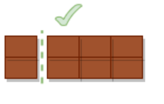
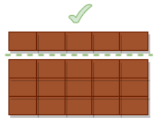
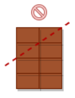

# Xocolata  #operadors #ternari

Una barra de xocolata té x quadradets. Esbrina si és possible paritr la barra per una única línia, de forma que ens quedi un troç amb exactament  quadradets.

## Input Format

Tres nombres enters:
 - Açada
 - Amplada
 - Quadradets a obtenir

## Constraints

-

## Output Format

`SI` | `NO`

## Sample Input 0

```text
4 2 6
```

## Sample Output 0

```text
SI
```

## Explanation 0



## Sample Input 1

```text
5 4 5
```

## Sample Output 1

```text
SI
```

## Explanation 1



## Sample Input 2

```text
2 4 3
```

## Sample Output 2

```text
NO
```

## Explanation 2



## Sample Input 3

```text
2 6 18
```

## Sample Output 3

```text
NO
```

## Explanation 3

No hi ha prou quadradets a la barreta

## Sample Input 4

```text
6 7 18
```

## Sample Output 4

```text
SI
```

## Sample Input 5

```text
5 6 12
```

## Sample Output 5

```text
SI
```

## Sample Input 6

```text
5 6 12
```

## Sample Output 6

```text
SI
```

## Sample Input 7

```text
4 6 10
```

## Sample Output 7

```text
NO
```
