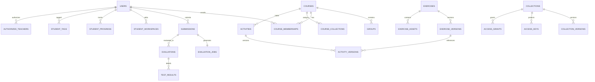
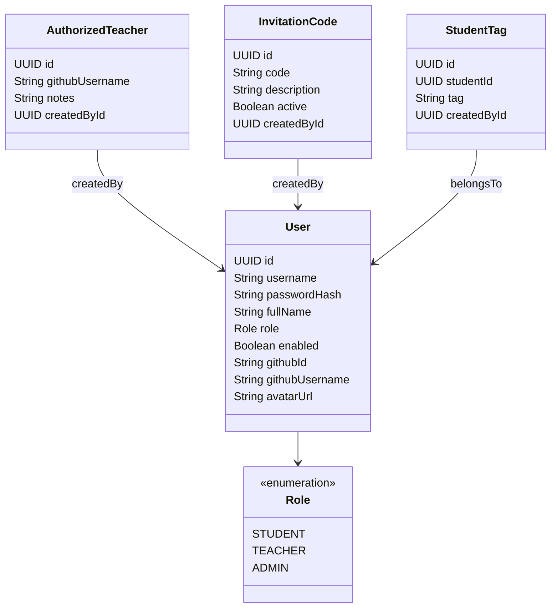
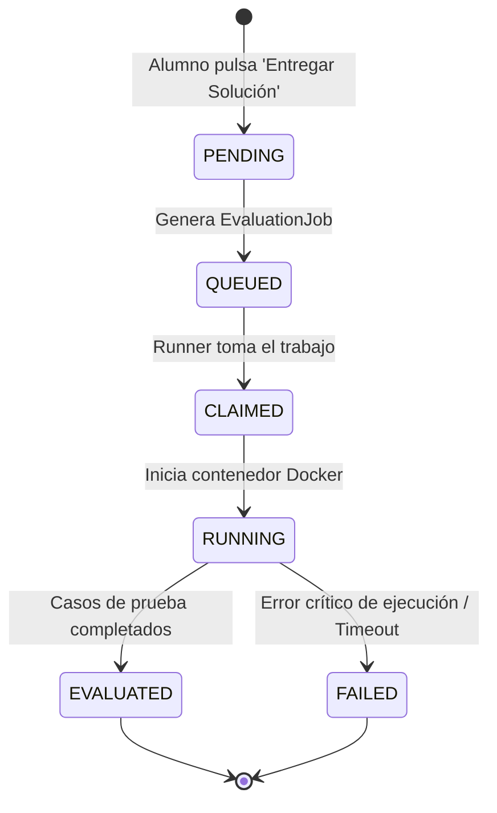
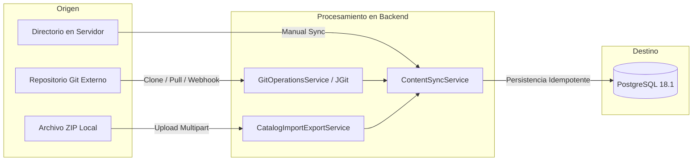
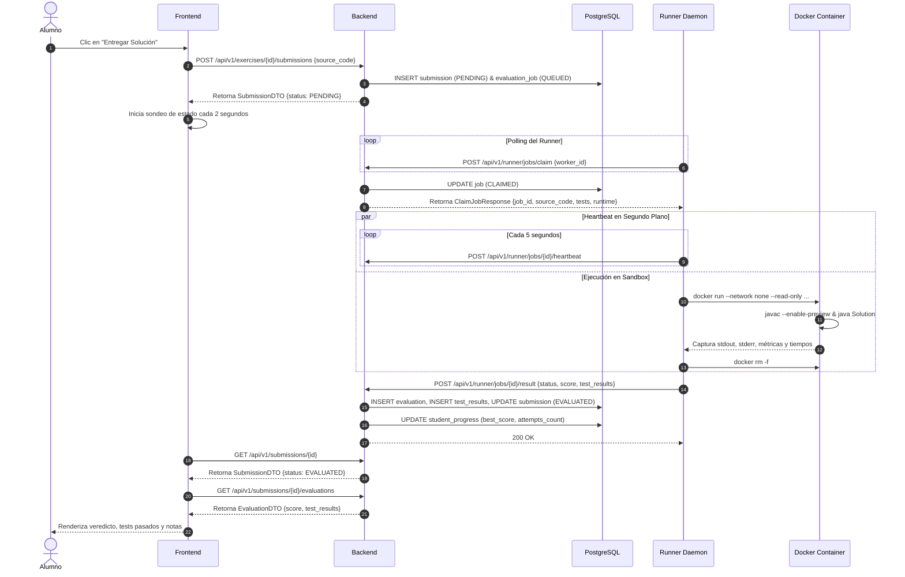
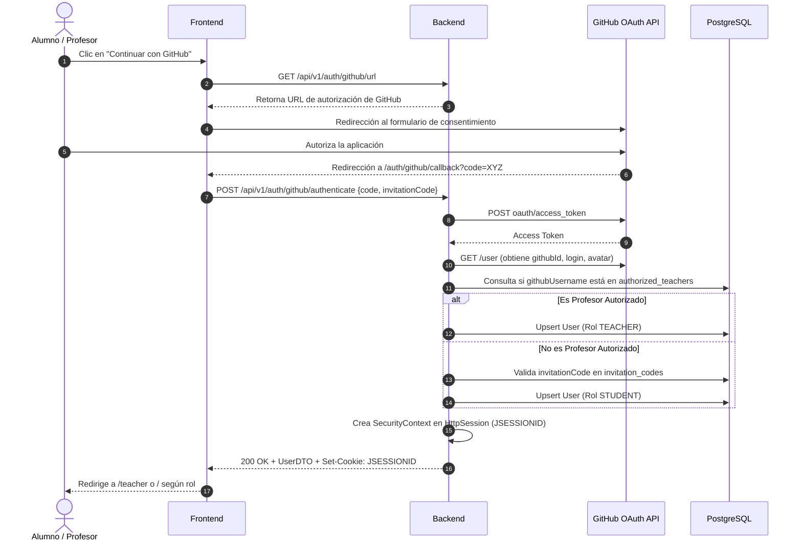

# Radiografía Técnica Completa del Estado Actual de Benigascode

**Fecha de auditoría**: Septiembre 2026  
**Entorno de auditoría**: Repositorio de código fuente `benigascode`  
**Tipo de documento**: Auditoría y especificación técnica exhaustiva basada exclusivamente en el código existente.

## Resumen de Dimensiones del Sistema
- Entidades JPA / Tablas en PostgreSQL: 28 entidades correspondientes a 28 tablas gestionadas con 15 migraciones Flyway secuenciales (V1 a V15).
- Servicios de Lógica de Negocio: 20 servicios Spring repartidos en módulos funcionales (activities, audit, content, evaluation, export, identity, learning, submissions).
- Endpoints REST: 51 endpoints distribuidos en 18 controladores @RestController.
- Archivos modificados/creados: Únicamente docs/CURRENT_STATE.md (sin alterar el código fuente de la aplicación ni tocar producción).

## Top 5 Hallazgos Técnicos Más Relevantes
1. Versionado Inmutable de Ejercicios y Actividades: El modelo separa la identidad permanente del ejercicio (Exercise, por slug) de sus revisiones históricas (ExerciseVersion). Cada actualización genera una nueva versión inmutable con sus propios casos de prueba y configuraciones de compilación/ejecución en JSONB. Las entregas (Submission) y las actividades (ActivityVersion) se enlazan siempre a una versión inmutable específica, impidiendo que cambios docentes futuros alteren el histórico de notas o reproduzcan errores en entregas pasadas.

2. Aislamiento Estricto y Defensa en Profundidad en el Sandbox: El motor de ejecución de código (runner/src/sandbox.py) orquesta contenedores Docker efímeros para cada ejecución bajo restricciones de alta seguridad:

    - Aislamiento total de red: network_mode: "none".
    - Sistema de ficheros raíz inmutable: read_only: True con un tmpfs limitado a 64 MB (noexec, nosuid).
    - Eliminación completa de privilegios del kernel: cap_drop: ["ALL"], no-new-privileges: true y ejecución bajo el usuario sin privilegios runner:runner (UID 1001).
    - Límites estrictos de procesos (pids_limit: 64 contra fork-bombs), cuota de CPU y memoria RAM sin swap.

3. Arquitectura Asíncrona Desacoplada del Runner (Polling + Heartbeat): El backend no realiza llamadas salientes directas hacia el Runner; es el demonio Python (daemon.py) el que realiza polling autenticado mediante cabecera X-Runner-Token contra POST /api/v1/runner/jobs/claim. Durante ejecuciones largas, un hilo en segundo plano emite señales periódicas a /heartbeat cada 5 segundos, evitando que trabajos intensivos sean catalogados erróneamente como fallidos o expiren por timeout.

4. Sincronización Multimodal de Contenido con Resolución de Conflictos: El catálogo de ejercicios y colecciones puede sincronizarse mediante tres canales:

    - Git remoto (vía HTTPS con PAT o SSH con par de claves gestionado en la plataforma).
    - Webhooks entrantes de GitHub automáticos ante eventos push.
    - Importación de archivos .zip con simulación previa (preview) y tres estrategias de resolución de colisiones configurables por el profesor: OVERWRITE, SKIP o NEW_SLUG.

5. Espacios de Trabajo Persistentes (Workspaces) sin Penalización: El sistema persiste el código fuente editable de los estudiantes en student_workspaces de forma independiente a las entregas formales. Esto permite a los alumnos guardar borradores continuos y probar casos públicos (preview-runs) sin consumir los límites de intentos oficiales (max_attempts en attempt_ledgers) definidos por el profesor para las actividades evaluables.


---

## 1. Resumen

**Benigascode** es una plataforma educativa web de aprendizaje y evaluación automática de programación, orientada específicamente a la enseñanza de Java moderno (Java 26 con características *preview*).

El sistema permite:
- **A los alumnos**: Explorar colecciones de ejercicios organizados temáticamente, programar soluciones en un editor de código integrado en el navegador con soporte de sintaxis Markdown y Java, validar su progreso contra casos de prueba públicos y privados, mantener borradores de trabajo (*workspaces*) y participar en cursos y actividades docentes (prácticas, exámenes y tareas).
- **A los profesores**: Administrar cursos, grupos y estudiantes (con etiquetado de alumnos); crear, editar y versionar ejercicios y colecciones; definir actividades con ventanas de disponibilidad y límites de intentos; sincronizar catálogos de contenido directamente con repositorios Git (vía HTTPS/SSH o webhooks) o mediante archivos ZIP; autorizar a otros profesores; gestionar códigos de invitación; inspeccionar entregas en tiempo real con estadísticas y reevaluar envíos.
- **A la plataforma**: Ejecutar el código de los alumnos de manera aislada y segura mediante un servicio de ejecución desacoplado (*Runner*) en contenedores Docker efímeros bajo estrictas restricciones de recursos y privilegios (sandbox de red aislada, sistema de archivos de solo lectura y límites de memoria/CPU).

La arquitectura general está desacoplada en tres subsistemas autónomos:
1. **Frontend**: Single Page Application (SPA) desarrollada en React 18 con TypeScript y Vite, servida en producción mediante Caddy.
2. **Backend**: API REST basada en Spring Boot 3.3.4 (Java 21), persistencia relacional en PostgreSQL 18.1 con control de migraciones mediante Flyway y autenticación basada en sesiones HTTP y GitHub OAuth.
3. **Runner**: Demonio en Python 3.12 que consume trabajos de evaluación mediante sondeo (*polling*) HTTP autenticado sobre el backend, ejecutando los casos de prueba dentro de contenedores Docker efímeros con Java 26.

---

## 2. Estructura del proyecto

El repositorio está estructurado en módulos claros e independientes:

```text
benigascode/
├── backend/                  # API REST y lógica de negocio principal en Spring Boot
│   ├── src/
│   │   ├── main/
│   │   │   ├── java/com/benigascode/
│   │   │   │   ├── activities/     # Gestión de actividades docentes y asignaciones
│   │   │   │   ├── audit/          # Registro de auditoría de acciones críticas
│   │   │   │   ├── common/         # Configuraciones globales (seguridad, excepciones, web)
│   │   │   │   ├── content/        # Catálogo: colecciones, ejercicios, assets y Git sync
│   │   │   │   ├── evaluation/     # Trabajos de evaluación y API para el runner
│   │   │   │   ├── export/         # Exportación CSV y empaquetado de reportes
│   │   │   │   ├── identity/       # Usuarios, roles, códigos de invitación y OAuth
│   │   │   │   ├── learning/       # Cursos, grupos y matrículas de alumnos
│   │   │   │   └── submissions/    # Entregas de alumnos, workspaces y progreso
│   │   │   └── resources/
│   │   │       ├── db/migration/   # Migraciones Flyway V1__initial_schema.sql a V15
│   │   │       └── application.yml # Configuración Spring Boot
│   │   └── test/                   # Suite de pruebas automatizadas (unitarias e integración)
│   ├── Dockerfile
│   └── pom.xml                     # Maven POM (Java 21, Spring Boot 3.3.4)
├── frontend/                 # Interfaz de usuario SPA
│   ├── src/
│   │   ├── components/       # Componentes visuales (Navbar, CodeEditor, SortableHeader)
│   │   ├── pages/            # Vistas principales de alumno y profesor
│   │   ├── services/         # Cliente HTTP (api.ts) con soporte CSRF y credenciales
│   │   ├── types/            # Definiciones de tipos TypeScript
│   │   ├── utils/            # Utilidades (parseo de Markdown, etc.)
│   │   ├── App.tsx           # Configuración de enrutamiento con React Router 6
│   │   ├── main.tsx          # Punto de entrada de la aplicación React
│   │   └── index.css         # Estilos globales y diseño CSS moderno
│   ├── Dockerfile
│   ├── index.html
│   ├── package.json
│   ├── tsconfig.json
│   └── vite.config.ts
├── runner/                   # Servicio de ejecución segura de código de alumnos
│   ├── runtimes/
│   │   └── java26/           # Imagen Docker base del runtime de ejecución (Java 26 Alpine)
│   │       └── Dockerfile.runtime
│   ├── src/
│   │   ├── evaluators/       # Evaluadores específicos por lenguaje (java_evaluator.py)
│   │   ├── daemon.py         # Demonio de sondeo y gestión de ciclo de vida de jobs
│   │   └── sandbox.py        # Orquestación de contenedores Docker con flags de seguridad
│   ├── Dockerfile            # Imagen del demonio Python
│   └── requirements.txt      # Dependencias Python (requests, docker, etc.)
├── deployment/               # Orquestación de despliegues y contenedores
│   ├── caddy/
│   │   └── Caddyfile         # Configuración del reverse proxy Caddy
│   ├── docker-compose.dev.yml  # Orquestación para desarrollo local
│   └── docker-compose.prod.yml # Orquestación para producción
├── docs/                     # Documentación técnica, diseño de arquitectura y especificaciones
└── scripts/                  # Scripts de utilidad y mantenimiento
```

---

## 3. Arquitectura

### 3.1 Diagrama de interacción global

```mermaid
graph TD
    UserClient[Navegador del Usuario (Alumno / Profesor)]
    Caddy[Caddy Reverse Proxy (Puerto 80/443)]
    Frontend[Frontend SPA (React 18 + Vite / Nginx)]
    Backend[Backend API (Spring Boot 3.3.4, Java 21)]
    Postgres[(PostgreSQL 18.1)]
    Runner[Runner Daemon (Python 3.12)]
    DockerEngine[Docker Engine Host]
    SandboxContainer[Contenedor Docker Efímero (Java 26 Runtime)]
    GitRemote[Repositorio Git Externo (GitHub / GitLab)]

    UserClient -->|HTTP/HTTPS| Caddy
    Caddy -->|/api/*| Backend
    Caddy -->|/*| Frontend

    Backend -->|JDBC / Flyway| Postgres
    Backend <-->|HTTPS / SSH| GitRemote

    Runner -->|Polling /api/v1/runner/jobs/claim| Backend
    Runner -->|Docker API /var/run/docker.sock| DockerEngine
    DockerEngine -->|Crea / Ejecuta / Destruye| SandboxContainer
    SandboxContainer -->|Salida / Logs / Status| Runner
    Runner -->|POST /api/v1/runner/jobs/{id}/result| Backend
```

### 3.2 Desacoplamiento de componentes

1. **Frontend / Backend**: Se comunican estrictamente a través de una API REST JSON. La autenticación se mantiene mediante cookies de sesión HTTP (`JSESSIONID`) con política `SameSite` y tokens de sincronización CSRF (`XSRF-TOKEN`).
2. **Backend / Base de Datos**: Spring Data JPA / Hibernate interactúa con PostgreSQL 18.1. Todas las modificaciones de esquema están versionadas e indexadas mediante 15 migraciones Flyway secuenciales.
3. **Backend / Runner**: Totalmente asíncrono y desacoplado de la red de usuario. El backend no llama al runner; es el runner el que consulta (`polling`) la cola de trabajos (`evaluation_jobs`) mediante peticiones periódicas HTTP autenticadas con un token precompartido (`X-Runner-Token`).
4. **Runner / Sandbox**: El demonio corre como proceso independiente en Python y utiliza el socket de Docker (`/var/run/docker.sock`) para lanzar contenedores efímeros aislados para cada ejecución, eliminándolos inmediatamente al finalizar.

---

## 4. Tecnologías

| Componente | Tecnología | Versión | Propósito |
| :--- | :--- | :--- | :--- |
| **Backend Core** | Java (Eclipse Temurin) | 21 | Lenguaje y plataforma del backend |
| **Backend Framework** | Spring Boot | 3.3.4 | Framework principal de servicios y REST |
| **Seguridad Backend** | Spring Security | 6.3.3 | Control de autenticación, autorización y sesiones |
| **Criptografía** | Bouncy Castle & Argon2 | 1.78.1 | Hash seguro de contraseñas (Argon2id) |
| **Persistencia** | Spring Data JPA / Hibernate | 6.5.3 | ORM y mapeo objeto-relacional |
| **Base de Datos** | PostgreSQL (Alpine) | 18.1 | Motor relacional transaccional |
| **Migraciones DB** | Flyway Core | 10.10.0 | Versionado evolutivo de base de datos (V1-V15) |
| **Formatos y Parseo** | Jackson (Core, Databind, YAML) | 2.17.2 | Serialización JSON y parseo de especificaciones YAML |
| **Control Git** | Eclipse JGit | 6.9.0 | Operaciones internas de Git y clonado en backend |
| **Frontend Core** | React | 18.3.1 | Librería de componentes de interfaz de usuario |
| **Frontend Language** | TypeScript | 5.5.3 | Tipado estático de la aplicación cliente |
| **Frontend Tooling** | Vite | 5.4.6 | Empaquetado y servidor de desarrollo rápido |
| **Enrutamiento Web** | React Router DOM | 6.26.2 | Enrutamiento cliente declarativo SPA |
| **Editor de Código** | CodeEditor propio + Highlight.js | 11.10.0 | Editor con numeración de líneas y resaltado |
| **Renderizado Markdown** | Marked + DOMPurify | 14.1.1 / 3.1.6 | Renderizado seguro de enunciados de ejercicios |
| **Runner Core** | Python | 3.12 | Lenguaje de ejecución del demonio del runner |
| **Docker SDK Python** | docker-py | 7.1.0 | Comunicación con Docker Engine vía socket |
| **Runner Requests** | requests | 2.32.3 | Comunicación HTTP con la API del backend |
| **Runtime Evaluación** | Eclipse Temurin Alpine | 26-jdk-alpine | Contenedor para compilación y ejecución Java 26 |
| **Reverse Proxy** | Caddy | 2.8 (Alpine) | Terminación TLS, proxy inverso y servidor estático |

---

## 5. Modelo de datos

El esquema relacional cuenta con **28 entidades JPA** y sus respectivas **28 tablas** en la base de datos PostgreSQL, administradas a través de 15 migraciones Flyway:



### 5.1 Tablas detalladas

#### 1. `users` (`User`)
- `id` (UUID, PK): Identificador único del usuario.
- `username` (VARCHAR(100), UNIQUE, NOT NULL): Nombre de usuario o identificador para inicio de sesión.
- `password_hash` (VARCHAR(255), NULL): Hash Argon2id de la contraseña (puede ser nulo en usuarios exclusivos de GitHub OAuth).
- `full_name` (VARCHAR(255), NULL): Nombre completo para visualización.
- `role` (VARCHAR(30), NOT NULL): Rol del usuario (`STUDENT`, `TEACHER`, `ADMIN`).
- `enabled` (BOOLEAN, NOT NULL, DEFAULT true): Indica si la cuenta está activa.
- `github_id` (VARCHAR(100), NULL): ID numérico del usuario de GitHub.
- `github_username` (VARCHAR(100), NULL): Handle de GitHub (`login`).
- `avatar_url` (VARCHAR(500), NULL): Enlace a la imagen de avatar.
- `created_at`, `updated_at` (TIMESTAMP WITH TIME ZONE, NOT NULL).

#### 2. `authorized_teachers` (`AuthorizedTeacher`)
- `id` (UUID, PK).
- `github_username` (VARCHAR(100), UNIQUE, NOT NULL): Nombre de usuario de GitHub autorizado para ser profesor.
- `notes` (TEXT, NULL): Notas explicativas del alta.
- `created_by_id` (UUID, FK -> `users.id`, NULL): Profesor o administrador que concedió la autorización.
- `created_at` (TIMESTAMP WITH TIME ZONE, NOT NULL).

#### 3. `invitation_codes` (`InvitationCode`)
- `id` (UUID, PK).
- `code` (VARCHAR(64), UNIQUE, NOT NULL): Código o clave alfanumérica de invitación.
- `description` (VARCHAR(255), NULL): Descripción del propósito del código (ej. curso académico).
- `active` (BOOLEAN, NOT NULL, DEFAULT true): Estado de validez del código.
- `created_by_id` (UUID, FK -> `users.id`, NULL): Creador del código.
- `created_at`, `updated_at` (TIMESTAMP WITH TIME ZONE, NOT NULL).

#### 4. `student_tags` (`StudentTag`)
- `id` (UUID, PK).
- `student_id` (UUID, FK -> `users.id`, NOT NULL): Alumno etiquetado.
- `tag` (VARCHAR(50), NOT NULL): Etiqueta asignada (ej. `repetidor`, `dual`, `avanzado`).
- `created_by_id` (UUID, FK -> `users.id`, NOT NULL): Profesor que asignó la etiqueta.
- `created_at` (TIMESTAMP WITH TIME ZONE, NOT NULL).
- *Constraint*: `UNIQUE(student_id, tag)`.

#### 5. `courses` (`Course`)
- `id` (UUID, PK).
- `name` (VARCHAR(200), NOT NULL): Nombre descriptivo (ej. "Programación 1º DAM").
- `code` (VARCHAR(50), UNIQUE, NOT NULL): Código identificativo del curso.
- `academic_year` (VARCHAR(20), NOT NULL): Año lectivo (ej. "2025-2026").
- `description` (TEXT, NULL).
- `created_at` (TIMESTAMP WITH TIME ZONE, NOT NULL).

#### 6. `groups` (`Group`)
- `id` (UUID, PK).
- `course_id` (UUID, FK -> `courses.id`, NOT NULL): Curso de pertenencia.
- `name` (VARCHAR(100), NOT NULL): Nombre del grupo (ej. "Grupo Mañana A").
- `created_at` (TIMESTAMP WITH TIME ZONE, NOT NULL).
- *Constraint*: `UNIQUE(course_id, name)`.

#### 7. `course_memberships` (`CourseMembership`)
- `id` (UUID, PK).
- `user_id` (UUID, FK -> `users.id`, NOT NULL): Usuario inscrito.
- `course_id` (UUID, FK -> `courses.id`, NOT NULL): Curso.
- `group_id` (UUID, FK -> `groups.id`, NULL): Grupo específico asignado (opcional).
- `role` (VARCHAR(30), NOT NULL): Rol en el curso (`STUDENT`, `TEACHER`).
- `created_at` (TIMESTAMP WITH TIME ZONE, NOT NULL).
- *Constraint*: `UNIQUE(user_id, course_id)`.

#### 8. `course_collections` (`CourseCollection`)
- `id` (UUID, PK).
- `course_id` (UUID, FK -> `courses.id`, NOT NULL): Curso receptor.
- `collection_id` (UUID, FK -> `collections.id`, NOT NULL): Colección asignada.
- `assigned_all_students` (BOOLEAN, NOT NULL, DEFAULT true): Si la colección es visible para todos los estudiantes matriculados o sólo para una selección específica.
- `created_at` (TIMESTAMP WITH TIME ZONE, NOT NULL).
- *Constraint*: `UNIQUE(course_id, collection_id)`.

#### 9. `course_collection_students` (`CourseCollectionStudent`)
- `id` (UUID, PK).
- `course_collection_id` (UUID, FK -> `course_collections.id`, NOT NULL): Asignación curso-colección.
- `student_id` (UUID, FK -> `users.id`, NOT NULL): Estudiante específico al que se le da acceso cuando `assigned_all_students` es falso.
- `created_at` (TIMESTAMP WITH TIME ZONE, NOT NULL).
- *Constraint*: `UNIQUE(course_collection_id, student_id)`.

#### 10. `collections` (`Collection`)
- `id` (UUID, PK).
- `slug` (VARCHAR(100), UNIQUE, NOT NULL): Slug identificativo (ej. `java-basico`).
- `visibility` (VARCHAR(30), NOT NULL): `PUBLIC` o `PRIVATE`.
- `created_at` (TIMESTAMP WITH TIME ZONE, NOT NULL).

#### 11. `collection_versions` (`CollectionVersion`)
- `id` (UUID, PK).
- `collection_id` (UUID, FK -> `collections.id`, NOT NULL): Colección asociada.
- `version_number` (INTEGER, NOT NULL): Número secuencial de versión.
- `title` (VARCHAR(200), NOT NULL): Título legible.
- `description` (TEXT, NULL): Descripción pedagógica.
- `items` (JSONB, NOT NULL): Array ordenado de elementos: `[{"type": "exercise", "id": "uuid", "position": 1, "required": true, "weight": 1.0}]`.
- `templates_config` (JSONB, NULL): Configuración de plantillas asociadas.
- `created_at` (TIMESTAMP WITH TIME ZONE, NOT NULL).
- *Constraint*: `UNIQUE(collection_id, version_number)`.

#### 12. `exercises` (`Exercise`)
- `id` (UUID, PK).
- `slug` (VARCHAR(100), UNIQUE, NOT NULL): Slug único del ejercicio (ej. `hola-mundo`, `calculadora-matrices`).
- `created_at` (TIMESTAMP WITH TIME ZONE, NOT NULL).

#### 13. `exercise_versions` (`ExerciseVersion`)
- `id` (UUID, PK).
- `exercise_id` (UUID, FK -> `exercises.id`, NOT NULL): Ejercicio al que pertenece.
- `version_number` (INTEGER, NOT NULL): Versión inmutable del ejercicio.
- `title` (VARCHAR(200), NOT NULL): Título del ejercicio.
- `statement` (TEXT, NOT NULL): Enunciado en formato Markdown.
- `language` (VARCHAR(50), NOT NULL, DEFAULT 'java'): Lenguaje de programación.
- `runtime_id` (VARCHAR(50), NOT NULL, DEFAULT 'java-26'): Identificador del runtime de ejecución.
- `compile_config` (JSONB, NULL): Configuración de compilación (flags, memory limit, timeout).
- `run_config` (JSONB, NULL): Configuración de ejecución (flags, límites de CPU/memoria).
- `test_cases` (JSONB, NOT NULL): Array de casos de prueba `{id, name, type, input, expected_output, is_public, weight, timeout_ms}`.
- `templates_config` (JSONB, NULL): Código inicial y plantillas adicionales.
- `starter_code` (TEXT, NULL): Código base presentado al estudiante al abrir el ejercicio por primera vez.
- `tags` (JSONB, NULL): Array de etiquetas temáticas.
- `created_at` (TIMESTAMP WITH TIME ZONE, NOT NULL).
- *Constraint*: `UNIQUE(exercise_id, version_number)`.

#### 14. `exercise_assets` (`ExerciseAsset`)
- `id` (UUID, PK).
- `exercise_id` (UUID, FK -> `exercises.id`, NOT NULL): Ejercicio al que está vinculado el recurso.
- `filename` (VARCHAR(255), NOT NULL): Nombre del archivo (ej. `diagrama.png`).
- `content_type` (VARCHAR(100), NOT NULL): Tipo MIME del recurso.
- `file_size` (BIGINT, NOT NULL): Tamaño en bytes.
- `data` (BYTEA, NOT NULL): Contenido binario del archivo.
- `created_at` (TIMESTAMP WITH TIME ZONE, NOT NULL).
- *Constraint*: `UNIQUE(exercise_id, filename)`.

#### 15. `access_keys` (`AccessKey`)
- `id` (UUID, PK).
- `collection_id` (UUID, FK -> `collections.id`, NOT NULL): Colección que desbloquea la clave.
- `key_hash` (VARCHAR(255), NOT NULL): Hash de la clave de acceso.
- `created_by_id` (UUID, FK -> `users.id`, NOT NULL): Profesor creador.
- `max_uses` (INTEGER, NULL): Usos máximos permitidos (o ilimitados si es null).
- `current_uses` (INTEGER, NOT NULL, DEFAULT 0): Usos consumidos.
- `expires_at` (TIMESTAMP WITH TIME ZONE, NULL): Fecha límite de validez.
- `revoked` (BOOLEAN, NOT NULL, DEFAULT false): Estado de revocación manual.
- `created_at` (TIMESTAMP WITH TIME ZONE, NOT NULL).

#### 16. `access_grants` (`AccessGrant`)
- `id` (UUID, PK).
- `user_id` (UUID, FK -> `users.id`, NOT NULL): Usuario beneficiario.
- `collection_id` (UUID, FK -> `collections.id`, NOT NULL): Colección concedida.
- `mechanism` (VARCHAR(50), NOT NULL): Mecanismo de concesión (`KEY`, `ENROLLMENT`, `PUBLIC`).
- `granted_at` (TIMESTAMP WITH TIME ZONE, NOT NULL).
- *Constraint*: `UNIQUE(user_id, collection_id)`.

#### 17. `git_repositories` (`GitRepository`)
- `id` (UUID, PK).
- `name` (VARCHAR(200), NOT NULL): Nombre del repositorio.
- `repository_url` (VARCHAR(500), NOT NULL): URL HTTPS o SSH del repositorio Git remoto.
- `branch` (VARCHAR(100), NOT NULL, DEFAULT 'main'): Rama a sincronizar.
- `root_path` (VARCHAR(255), NOT NULL, DEFAULT ''): Subdirectorio raíz dentro del repo que contiene el catálogo.
- `auth_type` (VARCHAR(50), NOT NULL): Tipo de autenticación (`NONE`, `TOKEN`, `SSH_KEY`).
- `auth_token` (VARCHAR(500), NULL): Personal Access Token cifrado o token OAuth.
- `public_key` (TEXT, NULL): Clave pública SSH generada.
- `private_key` (TEXT, NULL): Clave privada SSH generada.
- `created_by_id` (UUID, FK -> `users.id`, NOT NULL): Profesor que vinculó el repositorio.
- `created_at`, `updated_at` (TIMESTAMP WITH TIME ZONE, NOT NULL).

#### 18. `content_syncs` (`ContentSync`)
- `id` (UUID, PK).
- `git_repository_id` (UUID, FK -> `git_repositories.id`, NULL): Repositorio origen si la sincronización fue por Git.
- `sync_type` (VARCHAR(50), NOT NULL): `MANUAL`, `WEBHOOK`, `DIRECTORY`, `ZIP_IMPORT`.
- `status` (VARCHAR(50), NOT NULL): `STARTED`, `SUCCESS`, `FAILED`.
- `exercises_synced` (INTEGER, NOT NULL, DEFAULT 0): Cantidad de ejercicios sincronizados.
- `collections_synced` (INTEGER, NOT NULL, DEFAULT 0): Cantidad de colecciones sincronizadas.
- `error_message` (TEXT, NULL): Descripción del error en caso de fallo.
- `commit_hash` (VARCHAR(100), NULL): Hash del commit procesado.
- `started_at`, `completed_at` (TIMESTAMP WITH TIME ZONE).

#### 19. `activities` (`Activity`)
- `id` (UUID, PK).
- `course_id` (UUID, FK -> `courses.id`, NOT NULL): Curso al que pertenece la actividad.
- `name` (VARCHAR(200), NOT NULL): Nombre de la actividad.
- `type` (VARCHAR(50), NOT NULL): Modalidad pedagógica (`PRACTICE`, `EXAM`, `ASSIGNMENT`).
- `current_version_id` (UUID, NULL): Puntero a la versión actual de la actividad.
- `created_at` (TIMESTAMP WITH TIME ZONE, NOT NULL).

#### 20. `activity_versions` (`ActivityVersion`)
- `id` (UUID, PK).
- `activity_id` (UUID, FK -> `activities.id`, NOT NULL): Actividad padre.
- `version_number` (INTEGER, NOT NULL): Número de versión de la actividad.
- `exercise_version_id` (UUID, FK -> `exercise_versions.id`, NOT NULL): Versión concreta del ejercicio asignada a la actividad.
- `max_attempts` (INTEGER, NULL): Límite de entregas oficiales permitidas (nulo = intentos ilimitados).
- `available_from` (TIMESTAMP WITH TIME ZONE, NULL): Fecha/hora de apertura de la actividad.
- `available_until` (TIMESTAMP WITH TIME ZONE, NULL): Fecha/hora de cierre estricto de la actividad.
- `due_at` (TIMESTAMP WITH TIME ZONE, NULL): Fecha recomendada o límite de entrega sin penalización.
- `is_published` (BOOLEAN, NOT NULL, DEFAULT false): Estado de visibilidad para los alumnos del curso.
- `created_at` (TIMESTAMP WITH TIME ZONE, NOT NULL).
- *Constraint*: `UNIQUE(activity_id, version_number)`.

#### 21. `student_workspaces` (`StudentWorkspace`)
- `id` (UUID, PK).
- `student_id` (UUID, FK -> `users.id`, NOT NULL): Alumno propietario del borrador.
- `exercise_version_id` (UUID, FK -> `exercise_versions.id`, NOT NULL): Ejercicio específico.
- `activity_id` (UUID, NULL): Actividad en curso (si el borrador se originó dentro de una actividad).
- `source_code` (TEXT, NOT NULL): Código fuente actual guardado en el borrador.
- `updated_at` (TIMESTAMP WITH TIME ZONE, NOT NULL).
- *Constraint*: `UNIQUE(student_id, exercise_version_id)`.

#### 22. `attempt_ledgers` (`AttemptLedger`)
- `id` (UUID, PK).
- `student_id` (UUID, FK -> `users.id`, NOT NULL): Alumno.
- `activity_version_id` (UUID, FK -> `activity_versions.id`, NOT NULL): Versión de actividad entregada.
- `attempt_number` (INTEGER, NOT NULL): Número correlativo del intento consumido.
- `created_at` (TIMESTAMP WITH TIME ZONE, NOT NULL).
- *Constraint*: `UNIQUE(student_id, activity_version_id, attempt_number)`.

#### 23. `submissions` (`Submission`)
- `id` (UUID, PK).
- `student_id` (UUID, FK -> `users.id`, NOT NULL): Alumno que realiza la entrega.
- `activity_version_id` (UUID, FK -> `activity_versions.id`, NULL): Actividad docente asociada (nulo si es práctica libre).
- `exercise_version_id` (UUID, FK -> `exercise_versions.id`, NOT NULL): Versión exacta del ejercicio entregado.
- `source_code` (TEXT, NOT NULL): Código fuente completo enviado para evaluación.
- `source_hash` (VARCHAR(64), NOT NULL): Hash SHA-256 del código fuente para auditoría y deduplicación.
- `attempt_number` (INTEGER, NOT NULL, DEFAULT 1): Número de intento oficial.
- `status` (VARCHAR(50), NOT NULL): `PENDING`, `EVALUATING`, `EVALUATED`, `FAILED`.
- `created_at` (TIMESTAMP WITH TIME ZONE, NOT NULL).

#### 24. `evaluation_jobs` (`EvaluationJob`)
- `id` (UUID, PK).
- `submission_id` (UUID, FK -> `submissions.id`, NOT NULL): Entrega asociada a ser evaluada.
- `status` (VARCHAR(50), NOT NULL): `QUEUED`, `CLAIMED`, `RUNNING`, `COMPLETED`, `TIMEOUT`, `FAILED`.
- `priority` (INTEGER, NOT NULL, DEFAULT 0): Prioridad de procesamiento en cola.
- `worker_id` (VARCHAR(100), NULL): Identificador de la instancia del runner que tomó el trabajo.
- `claimed_at` (TIMESTAMP WITH TIME ZONE, NULL): Momento de toma por el runner.
- `last_heartbeat_at` (TIMESTAMP WITH TIME ZONE, NULL): Última señal de vida emitida por el runner.
- `completed_at` (TIMESTAMP WITH TIME ZONE, NULL): Momento de finalización.
- `retry_count` (INTEGER, NOT NULL, DEFAULT 0): Contador de reintentos.
- `max_retries` (INTEGER, NOT NULL, DEFAULT 3): Reintentos máximos antes de marcar error definitivo.
- `failure_reason` (TEXT, NULL): Razón del fallo en caso de excepción no controlada.
- `created_at` (TIMESTAMP WITH TIME ZONE, NOT NULL).

#### 25. `evaluations` (`Evaluation`)
- `id` (UUID, PK).
- `submission_id` (UUID, FK -> `submissions.id`, NOT NULL): Entrega evaluada.
- `evaluation_job_id` (UUID, FK -> `evaluation_jobs.id`, NULL): Job de ejecución.
- `status` (VARCHAR(50), NOT NULL): Veredicto final (`CORRECT`, `INCORRECT`, `COMPILE_ERROR`, `TIMEOUT`, `MEMORY_LIMIT`, `RUNTIME_ERROR`, `SYSTEM_ERROR`).
- `score` (DOUBLE PRECISION, NOT NULL, DEFAULT 0.0): Puntuación ponderada normalizada (de 0.0 a 100.0).
- `compile_output` (TEXT, NULL): Salida estándar o de error producida por el compilador (`javac`).
- `stdout` (TEXT, NULL): Salida estándar general capturada.
- `stderr` (TEXT, NULL): Salida de error general capturada.
- `execution_time_ms` (BIGINT, NULL): Tiempo de ejecución total consumido en milisegundos.
- `peak_memory_bytes` (BIGINT, NULL): Consumo máximo de memoria RAM detectado en bytes.
- `created_at` (TIMESTAMP WITH TIME ZONE, NOT NULL).

#### 26. `test_results` (`TestResult`)
- `id` (UUID, PK).
- `evaluation_id` (UUID, FK -> `evaluations.id`, NOT NULL): Evaluación contenedora.
- `test_case_name` (VARCHAR(200), NOT NULL): Nombre descriptivo del test ejecutado.
- `test_case_id` (VARCHAR(100), NULL): ID interno del caso de prueba.
- `status` (VARCHAR(50), NOT NULL): `PASSED`, `FAILED`, `TIMEOUT`, `RUNTIME_ERROR`.
- `execution_time_ms` (BIGINT, NULL): Tiempo de ejecución del test particular.
- `memory_bytes` (BIGINT, NULL): Memoria consumida por este caso de prueba.
- `stdout` (TEXT, NULL): Salida producida por el programa del alumno.
- `stderr` (TEXT, NULL): Errores o trazas producidas.
- `expected_output` (TEXT, NULL): Salida esperada según la especificación del ejercicio.
- `is_public` (BOOLEAN, NOT NULL, DEFAULT false): Determina si el alumno puede ver los detalles completos del test o si permanece oculto/privado.
- `weight` (DOUBLE PRECISION, NOT NULL, DEFAULT 1.0): Ponderación del test en la nota.
- `score` (DOUBLE PRECISION, NOT NULL, DEFAULT 0.0): Puntuación obtenida en el caso de prueba.
- `error_message` (TEXT, NULL): Mensaje o diferencia detectada.
- `created_at` (TIMESTAMP WITH TIME ZONE, NOT NULL).

#### 27. `student_progress` (`StudentProgress`)
- `id` (UUID, PK).
- `user_id` (UUID, FK -> `users.id`, NOT NULL): Alumno.
- `exercise_id` (UUID, FK -> `exercises.id`, NOT NULL): Ejercicio.
- `exercise_version_id` (UUID, FK -> `exercise_versions.id`, NULL): Versión en la que se obtuvo el progreso.
- `course_id` (UUID, FK -> `courses.id`, NULL): Curso en el que se realizó la entrega (si aplica).
- `status` (VARCHAR(50), NOT NULL): `ATTEMPTED`, `MASTERED`.
- `best_score` (DOUBLE PRECISION, NOT NULL, DEFAULT 0.0): Mejor puntuación histórica obtenida por el alumno en el ejercicio.
- `attempts_count` (INTEGER, NOT NULL, DEFAULT 0): Total de entregas oficiales realizadas.
- `tests_passed` (INTEGER, NOT NULL, DEFAULT 0): Casos de prueba superados en el mejor intento.
- `total_tests` (INTEGER, NOT NULL, DEFAULT 0): Total de casos de prueba del ejercicio.
- `last_evaluation_id` (UUID, NULL): ID de la última evaluación procesada.
- `updated_at` (TIMESTAMP WITH TIME ZONE, NOT NULL).
- *Constraint*: `UNIQUE(user_id, exercise_id)`.

#### 28. `audit_events` (`AuditEvent`)
- `id` (UUID, PK).
- `timestamp` (TIMESTAMP WITH TIME ZONE, NOT NULL): Momento exacto del evento.
- `actor_id` (UUID, FK -> `users.id`, NULL): Usuario causante de la acción.
- `action` (VARCHAR(100), NOT NULL): Acción auditada (ej. `LOGIN_SUCCESS`, `EXERCISE_CREATE`, `SUBMISSION_REEVALUATE`, `REPO_SYNC`).
- `entity_type` (VARCHAR(50), NOT NULL): Entidad impactada (`USER`, `EXERCISE`, `SUBMISSION`, `COURSE`).
- `entity_id` (VARCHAR(100), NULL): ID de la entidad involucrada.
- `details` (TEXT, NULL): Detalles serializados o información complementaria en texto plano o JSON.
- `ip_address` (VARCHAR(50), NULL): Dirección IP remota del cliente.

---

## 6. Relaciones principales

### 6.1 Jerarquía Académica
- Un `Course` contiene múltiples `Group` (1:N, cascada en eliminación).
- Un `User` se asocia a un `Course` (y opcionalmente a un `Group`) mediante `CourseMembership` (N:M desacoplada con rol `STUDENT` o `TEACHER`).
- Un `Course` se asocia a múltiples `Collection` mediante `CourseCollection`.
- Si `CourseCollection.assigned_all_students` es `false`, el acceso restringido se modela mediante registros en `CourseCollectionStudent`.

### 6.2 Jerarquía de Contenido
- Una `Collection` posee múltiples `CollectionVersion` (1:N, inmutables).
- Un `Exercise` posee múltiples `ExerciseVersion` (1:N, inmutables) y múltiples `ExerciseAsset` (archivos e imágenes adjuntas 1:N).
- La pertenencia de ejercicios a colecciones se define de forma desacoplada y ordenada dentro del campo `JSONB` denominado `items` en `CollectionVersion`.
- El acceso a colecciones protegidas o privadas se gestiona mediante `AccessKey` (claves temporales/con límite de uso) y `AccessGrant` (concesiones registradas para cada alumno).

### 6.3 Jerarquía de Actividades y Entregas
- Una `Activity` pertenece a un `Course` y referencia a una o varias `ActivityVersion`.
- Cada `ActivityVersion` enlaza directamente a un `ExerciseVersion` concreto, fijando la versión inmutable a resolver durante dicha actividad docente.
- Un alumno produce `StudentWorkspace` (guardado temporal de código sin evaluación formal, 1:1 por usuario y versión de ejercicio).
- Al pulsar entregar, se genera una `Submission`, se incrementa el intento en `AttemptLedger` y se crea un `EvaluationJob` en estado `QUEUED`.
- El resultado de la evaluación se almacena en `Evaluation` (1:1 o 1:N en caso de reevaluación) y se desglosa en múltiples `TestResult`.
- Los resultados recalculan automáticamente la fila acumulativa del alumno en `StudentProgress`.

---

## 7. Backend

El backend está desarrollado en **Spring Boot 3.3.4** sobre **Java 21**, organizado bajo una arquitectura modular por dominios o *features*:

```text
com.benigascode/
├── activities/     # Dominio de actividades de cursos (exámenes, prácticas obligatorias)
│   ├── api/        # Controladores REST (StudentActivityController, TeacherActivityController)
│   ├── domain/     # Entidades JPA (Activity, ActivityVersion, ActivityType)
│   ├── dto/        # DTOs de solicitud y respuesta
│   ├── repository/ # Repositorios Spring Data JPA
│   └── service/    # Lógica de negocio (ActivityService)
├── audit/          # Registro y consulta de auditoría
│   ├── domain/     # Entidad AuditEvent
│   ├── repository/ # AuditEventRepository
│   └── service/    # AuditService
├── common/         # Utilidades transversales y configuración global
│   ├── config/     # SecurityConfig, WebMvcConfig
│   ├── exception/  # GlobalExceptionHandler, AccessDeniedException, ResourceNotFoundException
│   └── json/       # Serializadores y convertidores Jackson
├── content/        # Catálogo educativo, repositorios Git y sincronización
│   ├── api/        # StudentCollectionController, TeacherContentController, TeacherCatalogController, TeacherGitHubController, GitHubWebhookController
│   ├── domain/     # Collection, CollectionVersion, Exercise, ExerciseVersion, ExerciseAsset, GitRepository, ContentSync, AccessKey, AccessGrant
│   ├── dto/        # DTOs de ejercicios, colecciones, catálogo e import/export
│   ├── repository/ # Repositorios de contenido y sincronización
│   └── service/    # ContentService, ContentSyncService, CatalogImportExportService, ContentExportService, GitOperationsService, GitHubOAuthService, SshKeyService
├── evaluation/     # Orquestación de trabajos de evaluación y comunicación con Runner
│   ├── api/        # RunnerApiController, StudentEvaluationController, TeacherEvaluationController
│   ├── domain/     # EvaluationJob, Evaluation, TestResult, JobStatus, EvaluationStatus
│   ├── dto/        # ClaimJobResponse, RunnerJobResultRequest, EvaluationDTO
│   ├── repository/ # EvaluationJobRepository, EvaluationRepository, TestResultRepository
│   └── service/    # EvaluationService
├── export/         # Informes y exportaciones analíticas
│   ├── api/        # ExportController
│   └── service/    # CsvExportService
├── identity/       # Autenticación, usuarios y control de acceso
│   ├── api/        # AuthController, TeacherStudentController, TeacherManagementController, TeacherInvitationController
│   ├── domain/     # User, Role, AuthorizedTeacher, InvitationCode, StudentTag
│   ├── dto/        # LoginRequest, RegisterRequest, UserDTO, StudentTagDTO
│   ├── repository/ # UserRepository, AuthorizedTeacherRepository, InvitationCodeRepository, StudentTagRepository
│   └── service/    # UserService, CustomUserDetailsService, AuthorizedTeacherService, TeacherInvitationService, TeacherStudentService
├── learning/       # Cursos, grupos y asignaciones de alumnos
│   ├── api/        # TeacherCourseController
│   ├── domain/     # Course, Group, CourseMembership, CourseCollection, CourseCollectionStudent
│   ├── dto/        # CourseDTO, GroupDTO, CourseCollectionDTO
│   ├── repository/ # CourseRepository, GroupRepository, CourseMembershipRepository, CourseCollectionRepository, CourseCollectionStudentRepository
│   └── service/    # LearningService
└── submissions/    # Entregas, workspaces de alumnos y estadísticas de progreso
    ├── api/        # StudentSubmissionController, TeacherSubmissionController
    ├── domain/     # Submission, StudentWorkspace, AttemptLedger, StudentProgress, SubmissionStatus
    ├── dto/        # CreateSubmissionRequest, SubmissionDTO, StudentWorkspaceDTO, TeacherInsightsDTO
    ├── repository/ # SubmissionRepository, StudentWorkspaceRepository, AttemptLedgerRepository, StudentProgressRepository
    └── service/    # SubmissionService, StudentWorkspaceService, StudentProgressService
```

---

## 8. Servicios principales

En el backend operan **20 servicios principales** de lógica de negocio:

1. **`ActivityService`**: Gestiona la creación, actualización y publicación de actividades pedagógicas en los cursos; verifica permisos y comprueba si un alumno puede acceder a una actividad evaluando sus fechas y límites.
2. **`AuditService`**: Registra de forma asíncrona eventos de auditoría (creación de ejercicios, login de usuarios, reevaluaciones, sincronizaciones Git) capturando IP y actor.
3. **`CatalogImportExportService`**: Implementa la lógica de importación y exportación de catálogos pedagógicos completos (en formato ZIP o estructuras Git), permitiendo previsualizar cambios y resolver colisiones con tres estrategias (`OVERWRITE`, `SKIP`, `NEW_SLUG`).
4. **`ContentExportService`**: Empaqueta colecciones individuales o ejercicios sueltos con todos sus assets asociados dentro de un archivo binario `.zip` listo para descargar.
5. **`ContentService`**: Gestiona el ciclo de vida del catálogo (ejercicios, colecciones, assets binarios y claves de acceso); resuelve versiones inmutables y filtra colecciones públicas vs asignadas a cada estudiante.
6. **`ContentSyncService`**: Analiza estructuras de carpetas en disco o repositorios Git, parsea archivos `collection.yml` y `exercise.yml`, valida esquemas y persiste de forma idempotente las versiones de contenido.
7. **`GitHubOAuthService`**: Gestiona el flujo de autenticación OAuth 2.0 con GitHub para alumnos y profesores, intercambio de código por token y recuperación de perfiles de usuario.
8. **`GitOperationsService`**: Orquesta el clonado de repositorios Git (vía HTTPS con token o SSH con clave privada), ejecución de pull y activación de sincronización ante cambios o webhooks.
9. **`SshKeyService`**: Genera pares de claves SSH (RSA / Ed25519) para autorizar despliegues de repositorios Git privados directamente desde la interfaz del profesor.
10. **`EvaluationService`**: Encola entregas para evaluación (`claimNextJob`), procesa señales de vida (`heartbeat`), recibe los resultados generados por el runner, calcula la puntuación ponderada y soporta la reevaluación docente bajo demanda.
11. **`CsvExportService`**: Genera reportes en formato CSV con todas las entregas, notas, tiempos y estados de los alumnos de un curso.
12. **`AuthorizedTeacherService`**: Mantiene la lista blanca de nombres de usuario de GitHub que están habilitados para acceder con rol de profesor.
13. **`CustomUserDetailsService`**: Adaptador de Spring Security para cargar credenciales de usuario desde la base de datos durante la autenticación básica / de formulario.
14. **`TeacherInvitationService`**: Administra los códigos de invitación para estudiantes, permitiendo su creación, activación/desactivación y validación durante el registro.
15. **`TeacherStudentService`**: Proporciona operaciones docentes sobre los alumnos: asignación a cursos, listados con filtros y gestión de etiquetas personalizadas (`StudentTag`).
16. **`UserService`**: Gestiona el registro de usuarios, comprobación de nombres únicos, recuperación del usuario autenticado en el contexto actual (`getCurrentUser`) y asignación de roles.
17. **`LearningService`**: Gestiona el modelo académico: creación y administración de cursos y grupos, matriculación de estudiantes, asociación de profesores y asignación selectiva de colecciones a cursos o alumnos.
18. **`StudentProgressService`**: Calcula métricas agregadas del alumno (ejercicios superados, tasa de éxito, actividad reciente) y provee los datos para las pantallas de *Insights* tanto del estudiante como del profesor.
19. **`StudentWorkspaceService`**: Proporciona persistencia de borradores de código en tiempo real para que los alumnos no pierdan su trabajo entre sesiones sin necesidad de generar una entrega oficial.
20. **`SubmissionService`**: Valida y crea entregas de alumnos (comprobando ventanas temporales, hash de código y límites de intentos), encola los trabajos en el motor de evaluación y expone el historial de envíos.

---

## 9. API REST

Todos los endpoints REST expuestos por el sistema (organizados por controlador y rol de acceso):

### 9.1 Autenticación y Usuarios (`AuthController`)
- `POST /api/v1/auth/login`: Inicia sesión con `username` y `password`. Devuelve `UserDTO` y genera cookie de sesión `JSESSIONID`. (Público)
- `POST /api/v1/auth/logout`: Invalida la sesión actual y limpia el contexto de seguridad. (Público)
- `GET /api/v1/me`: Devuelve la información del usuario autenticado en la sesión actual. (Autenticado)
- `POST /api/v1/auth/invitation/validate`: Valida si un código de invitación está activo. (Público)
- `GET /api/v1/auth/github/url`: Genera la URL de autorización para iniciar flujo OAuth con GitHub. (Público)
- `POST /api/v1/auth/github/authenticate`: Intercambia el código temporal de GitHub OAuth y completa el inicio de sesión o registro de alumnos/profesores. (Público)

### 9.2 Alumno — Colecciones y Ejercicios (`StudentCollectionController`)
- `GET /api/v1/me/collections`: Lista las colecciones accesibles por el alumno actual. (Autenticado)
- `POST /api/v1/collections/access`: Desbloquea una colección protegida mediante clave de acceso (`accessKey`). (Autenticado)
- `GET /api/v1/collections/{id}`: Obtiene el detalle y elementos de una colección. (Autenticado)
- `GET /api/v1/collections/{id}/progress`: Obtiene el progreso del alumno en la colección. (Autenticado)
- `GET /api/v1/collections/{id}/exercises`: Lista los ejercicios pertenecientes a la colección. (Autenticado)
- `GET /api/v1/exercises/{id}`: Obtiene el enunciado y metadatos de un ejercicio (opcionalmente en contexto de una colección). (Autenticado)
- `GET /api/v1/exercises/{id}/public-tests`: Devuelve los casos de prueba públicos de un ejercicio. (Autenticado)
- `GET /api/v1/exercises/{id}/assets/{filename}`: Descarga un recurso multimedia adjunto al ejercicio. (Público)

### 9.3 Alumno — Actividades (`StudentActivityController`)
- `GET /api/v1/me/activities`: Lista las actividades asignadas al alumno en sus cursos matriculados. (Autenticado)
- `GET /api/v1/activities/{id}`: Detalle de una actividad específica (verificando ventana de disponibilidad). (Autenticado)

### 9.4 Alumno — Entregas y Espacio de Trabajo (`StudentSubmissionController`)
- `POST /api/v1/activities/{activityId}/exercises/{exerciseId}/submissions`: Realiza una entrega formal ligada a una actividad docente. (Autenticado / Alumno)
- `POST /api/v1/exercises/{exerciseId}/submissions`: Realiza una entrega formal en práctica libre. (Autenticado / Alumno)
- `GET /api/v1/exercises/{exerciseId}/workspace`: Recupera el borrador actual del código del alumno. (Autenticado)
- `PUT /api/v1/exercises/{exerciseId}/workspace`: Guarda el borrador actual de código. (Autenticado)
- `GET /api/v1/exercises/{exerciseId}/submissions`: Historial de entregas del alumno para ese ejercicio. (Autenticado)
- `GET /api/v1/exercises/{exerciseId}/submissions/latest`: Última entrega realizada en el ejercicio. (Autenticado)
- `GET /api/v1/submissions/{id}`: Consulta el estado y detalle de una entrega específica. (Autenticado)
- `GET /api/v1/me/submissions`: Lista global de todas las entregas del usuario. (Autenticado)
- `GET /api/v1/me/progress`: Progreso acumulado del estudiante en todos los ejercicios. (Autenticado)
- `GET /api/v1/me/insights`: Estadísticas analíticas personales de rendimiento del estudiante. (Autenticado)
- `POST /api/v1/exercises/{exerciseVersionId}/preview-runs`: Ejecuta los casos de prueba públicos sobre código borrador sin contabilizar intento oficial. (Autenticado)

### 9.5 Alumno — Evaluaciones (`StudentEvaluationController`)
- `GET /api/v1/submissions/{id}/evaluations`: Obtiene el resultado de evaluación y desglose de tests de una entrega. (Autenticado)
- `GET /api/v1/exercises/{exerciseId}/evaluations/latest`: Obtiene la última evaluación procesada del ejercicio. (Autenticado)

### 9.6 Profesor — Gestión de Alumnos y Etiquetas (`TeacherStudentController`)
*(Requiere rol `TEACHER` o `ADMIN`)*
- `GET /api/v1/teacher/students`: Lista y filtra alumnos (por curso, etiqueta o búsqueda de texto).
- `POST /api/v1/teacher/students/{studentId}/courses/{courseId}`: Asigna un alumno a un curso (y grupo opcional).
- `DELETE /api/v1/teacher/students/{studentId}/courses/{courseId}`: Desmatricula un alumno de un curso.
- `POST /api/v1/teacher/students/{studentId}/tags`: Añade una etiqueta personalizada al alumno.
- `DELETE /api/v1/teacher/students/{studentId}/tags/{tag}`: Elimina una etiqueta del alumno.
- `GET /api/v1/teacher/students/tags`: Lista todas las etiquetas únicas existentes.

### 9.7 Profesor — Gestión de Docentes Autorizados (`TeacherManagementController`)
*(Requiere rol `TEACHER` o `ADMIN`)*
- `GET /api/v1/teacher/teachers`: Lista los usuarios autorizados como profesores.
- `POST /api/v1/teacher/teachers`: Añade un nuevo profesor por su usuario de GitHub.
- `DELETE /api/v1/teacher/teachers/{id}`: Revoca la autorización docente.

### 9.8 Profesor — Códigos de Invitación (`TeacherInvitationController`)
*(Requiere rol `TEACHER` o `ADMIN`)*
- `GET /api/v1/teacher/invitations`: Lista los códigos de invitación para alumnos.
- `POST /api/v1/teacher/invitations`: Genera un nuevo código de invitación.
- `PUT /api/v1/teacher/invitations/{id}/toggle`: Activa o desactiva un código.
- `DELETE /api/v1/teacher/invitations/{id}`: Elimina un código de invitación.

### 9.9 Profesor — Cursos, Grupos y Asignaciones (`TeacherCourseController`)
*(Requiere rol `TEACHER` o `ADMIN`)*
- `GET /api/v1/teacher/courses`: Lista los cursos gestionados por el profesor.
- `POST /api/v1/teacher/courses`: Crea un nuevo curso.
- `GET /api/v1/teacher/courses/{id}`: Detalle de un curso.
- `GET /api/v1/teacher/courses/{id}/teachers`: Lista profesores asignados al curso.
- `GET /api/v1/teacher/courses/{id}/available-teachers`: Profesores disponibles para asignar.
- `POST /api/v1/teacher/courses/{id}/teachers/{teacherId}`: Asigna un profesor al curso.
- `DELETE /api/v1/teacher/courses/{id}/teachers/{teacherId}`: Desvincula un profesor del curso.
- `GET /api/v1/teacher/courses/{id}/students`: Alumnos inscritos en el curso.
- `POST /api/v1/teacher/courses/{id}/students`: Matricula un estudiante en el curso.
- `DELETE /api/v1/teacher/courses/{id}/students/{studentId}`: Da de baja a un estudiante del curso.
- `GET /api/v1/teacher/courses/{id}/groups`: Lista los grupos del curso.
- `POST /api/v1/teacher/courses/{id}/groups`: Crea un nuevo grupo dentro del curso.
- `GET /api/v1/teacher/courses/{id}/collections`: Lista colecciones asociadas al curso.
- `POST /api/v1/teacher/courses/{id}/collections/{collectionId}`: Asocia una colección al curso (global o restringida).
- `PUT /api/v1/teacher/courses/{id}/collections/{collectionId}/assignments`: Modifica la asignación de estudiantes a la colección.
- `DELETE /api/v1/teacher/courses/{id}/collections/{collectionId}`: Desvincula la colección del curso.

### 9.10 Profesor — Contenidos: Ejercicios y Colecciones (`TeacherContentController`)
*(Requiere rol `TEACHER` o `ADMIN`)*
- `GET /api/v1/teacher/exercises`: Lista todos los ejercicios con buscador.
- `GET /api/v1/teacher/exercises/{id}`: Obtiene el detalle completo editable de un ejercicio.
- `POST /api/v1/teacher/exercises`: Crea un nuevo ejercicio y genera su primera versión.
- `PUT /api/v1/teacher/exercises/{id}`: Modifica un ejercicio generando una nueva versión.
- `DELETE /api/v1/teacher/exercises/{id}`: Elimina un ejercicio.
- `GET /api/v1/teacher/exercises/{id}/assets`: Lista los archivos adjuntos del ejercicio.
- `POST /api/v1/teacher/exercises/{id}/assets`: Sube un nuevo asset multimedia binario.
- `DELETE /api/v1/teacher/exercises/{id}/assets/{assetIdentifier}`: Elimina un asset.
- `GET /api/v1/teacher/collections`: Lista las colecciones disponibles.
- `GET /api/v1/teacher/collections/{id}`: Obtiene el detalle editable de una colección.
- `POST /api/v1/teacher/collections`: Crea una nueva colección.
- `PUT /api/v1/teacher/collections/{id}`: Actualiza una colección y su lista ordenada de ejercicios.
- `DELETE /api/v1/teacher/collections/{id}`: Elimina una colección.
- `GET /api/v1/teacher/collections/{id}/export.zip`: Descarga una colección empaquetada en ZIP.
- `GET /api/v1/teacher/exercises/{id}/export.zip`: Descarga un ejercicio individual en ZIP.
- `POST /api/v1/teacher/collections/{collectionId}/access-keys`: Genera una clave de acceso temporal o limitada.
- `POST /api/v1/teacher/sync`: Dispara una sincronización de contenido desde un directorio local.
- `GET /api/v1/teacher/sync-status`: Consulta el historial de las últimas 10 sincronizaciones de contenido.

### 9.11 Profesor — Importación / Exportación de Catálogo (`TeacherCatalogController`)
*(Requiere rol `TEACHER` o `ADMIN`)*
- `POST /api/v1/teacher/catalog/import/preview`: Previsualiza conflictos de importación desde JSON/YAML.
- `POST /api/v1/teacher/catalog/import/zip/preview`: Previsualiza colisiones e importación desde archivo ZIP multipart.
- `POST /api/v1/teacher/catalog/import/execute`: Ejecuta importación aplicando estrategia (`OVERWRITE`, `SKIP`, `NEW_SLUG`).
- `POST /api/v1/teacher/catalog/import/zip/execute`: Ejecuta importación desde ZIP aplicando resolución de conflictos.
- `POST /api/v1/teacher/catalog/export/push`: Exporta el catálogo actual directamente a una rama de un repositorio Git.

### 9.12 Profesor — Integración GitHub y Webhooks (`TeacherGitHubController` y `GitHubWebhookController`)
*(Endpoints docentes requieren rol `TEACHER` o `ADMIN`; webhooks son públicos)*
- `GET /api/v1/teacher/github/config`: Consulta si OAuth con GitHub está configurado y la URI de callback.
- `GET /api/v1/teacher/github/auth-url`: Obtiene la URL para vincular cuenta de GitHub docente.
- `POST /api/v1/teacher/github/exchange-code`: Intercambia código OAuth por token de acceso de GitHub.
- `GET /api/v1/teacher/github/repos`: Lista los repositorios del usuario autenticado en GitHub.
- `GET /api/v1/teacher/github/user`: Obtiene el perfil de GitHub del token proporcionado.
- `POST /api/v1/teacher/github/generate-deploy-key`: Genera un nuevo par de claves SSH para despliegues Git.
- `GET /api/v1/teacher/github/repository`: Obtiene el repositorio Git actualmente vinculado.
- `POST /api/v1/teacher/github/link-repo`: Vincula un repositorio Git (HTTPS o SSH) al catálogo.
- `POST /api/v1/teacher/github/repository/{id}/sync`: Dispara manualmente la sincronización Git.
- `DELETE /api/v1/teacher/github/repository/{id}`: Desvincula el repositorio Git.
- `POST /api/v1/webhooks/github/content-sync`: Endpoint de webhook público llamado por GitHub ante eventos `push` para sincronizar automáticamente el contenido.

### 9.13 Profesor — Actividades Docentes (`TeacherActivityController`)
*(Requiere rol `TEACHER` o `ADMIN`)*
- `GET /api/v1/teacher/activities`: Lista las actividades docentes creadas.
- `POST /api/v1/teacher/activities`: Crea una nueva actividad asignando fechas e intentos.
- `PUT /api/v1/teacher/activities/{id}`: Actualiza los parámetros o publicación de la actividad.

### 9.14 Profesor — Inspección de Entregas y Estadísticas (`TeacherSubmissionController`, `TeacherEvaluationController`, `ExportController`)
*(Requiere rol `TEACHER` o `ADMIN`)*
- `GET /api/v1/teacher/insights`: Estadísticas avanzadas y métricas globales o filtradas por curso, grupo y alumno.
- `GET /api/v1/teacher/submissions`: Explorador integral de entregas con filtrado avanzado (curso, grupo, alumno, ejercicio, estado, texto) y paginación.
- `GET /api/v1/teacher/submissions/{id}`: Inspección detallada de una entrega (código fuente completo, trazas de ejecución y desglose de tests públicos y ocultos).
- `POST /api/v1/teacher/evaluations/{submissionId}/reevaluate`: Solicita una reevaluación inmediata de una entrega con justificación docente.
- `GET /api/v1/teacher/export/courses/{courseId}/submissions.csv`: Descarga un reporte completo en CSV de todas las entregas de un curso.

### 9.15 Runner — API de Ejecución (`RunnerApiController`)
*(Requiere cabecera `X-Runner-Token` válida; validado en `RunnerTokenInterceptor` / `validateRunnerToken`)*
- `POST /api/v1/runner/jobs/claim`: Reclama el siguiente trabajo pendiente de la cola (`QUEUED`), asignándole el `worker_id` y cambiando su estado a `CLAIMED`.
- `POST /api/v1/runner/jobs/{id}/heartbeat`: Notifica que el runner continúa procesando la ejecución activa para evitar expiración por timeout.
- `POST /api/v1/runner/jobs/{id}/result`: Envía el veredicto final, tiempos, memoria y desglose de casos de prueba evaluados.

---

## 10. Autenticación y autorización

### 10.1 Mecanismo de Sesión y Estado
- La plataforma utiliza **Spring Security 6** con **sesiones HTTP estándar** (`SessionCreationPolicy.IF_REQUIRED`).
- El identificador de sesión se transporta en la cookie `JSESSIONID`.
- No se utilizan tokens JWT para la sesión web del usuario, garantizando revocación inmediata del lado del servidor al ejecutar logout.

### 10.2 Hashing de Contraseñas
- El algoritmo principal configurado en `SecurityConfig` es **Argon2id**:
  - Longitud de sal: 16 bytes.
  - Longitud del hash: 32 bytes.
  - Paralelismo: 1 hilo.
  - Memoria: 16.384 KiB (16 MB).
  - Iteraciones: 2 pasadas.
- Los hashes se encapsulan en un `DelegatingPasswordEncoder` con prefijo `{argon2}` para compatibilidad futura.

### 10.3 Protección CSRF
- Se implementa `CookieCsrfTokenRepository.withHttpOnlyFalse()` junto con `CsrfTokenRequestAttributeHandler`.
- El frontend lee el token CSRF desde la cookie `XSRF-TOKEN` y lo remite automáticamente en la cabecera `X-XSRF-TOKEN` en todas las operaciones mutantes (`POST`, `PUT`, `DELETE`).
- Rutas excluidas de CSRF: `/api/v1/auth/**`, `/api/v1/runner/**`, `/actuator/**`, `/api/v1/webhooks/**`.

### 10.4 Autenticación del Runner
- Las rutas bajo `/api/v1/runner/**` están protegidas mediante un token compartido en la cabecera HTTP `X-Runner-Token`.
- El valor configurado por defecto es `dev_runner_token_secure_12345` (personalizable mediante la variable de entorno `BENIGASCODE_RUNNER_TOKEN`).

### 10.5 Integración GitHub OAuth
- Flujo estándar de código de autorización OAuth 2.0.
- Si el usuario que inicia sesión mediante GitHub está registrado en `authorized_teachers`, se le concede automáticamente el rol `TEACHER`.
- Si no está autorizado como docente, se requiere obligatoriamente un código de invitación válido (`invitationCode`) activo en la tabla `invitation_codes` para completar el alta como `STUDENT`.

---

## 11. Frontend

### 11.1 Arquitectura de la SPA
El frontend está construido sobre **React 18.3.1**, **TypeScript 5.5.3** y **Vite 5.4.6**, estructurado en capas limpias sin frameworks monolíticos adicionales:

- **Enrutamiento**: Gestionado por `react-router-dom` v6 en `App.tsx`, con guardias de navegación para usuarios no autenticados y redirecciones basadas en roles (`TEACHER`/`ADMIN` vs `STUDENT`).
- **Gestión de Estado**: El estado del usuario conectado (`user`) se inicializa al arrancar la aplicación llamando a `api.getMe()` y se distribuye jerárquicamente a los componentes y vistas.
- **Cliente API (`services/api.ts`)**: Encapsula las llamadas `fetch` con `credentials: 'include'` para enviar la cookie de sesión `JSESSIONID`, intercepta y propaga la cabecera `X-XSRF-TOKEN` y normaliza las respuestas y excepciones de error.

### 11.2 Catálogo de Vistas (Pages)

| Vista | Ruta | Rol | Propósito |
| :--- | :--- | :--- | :--- |
| `LoginPage.tsx` | `/login` | Público | Pantalla de inicio de sesión (credenciales directas, acceso rápido con cuentas demo y botón GitHub OAuth) |
| `RegisterPage.tsx` | `/register` | Público | Formulario de registro de alumnos con código de invitación obligatorio |
| `GitHubCallbackView.tsx`| `/auth/github/callback`| Público | Interceptor del retorno de GitHub OAuth que finaliza la sesión |
| `StudentDashboard.tsx` | `/`, `/collections` | Alumno | Panel principal del alumno: colecciones asignadas, progreso global y desbloqueo por clave |
| `CollectionDetailView.tsx`| `/collections/:collectionId`| Alumno | Lista de ejercicios de una colección con estado (resuelto, intentado, pendiente) |
| `ExerciseView.tsx` | `/exercise/:exerciseId` | Alumno | Entorno de desarrollo: enunciado Markdown, assets, editor de código y panel de ejecución/tests |
| `StudentInsightsView.tsx`| `/progress` | Alumno | Panel analítico personal: racha, puntuación media y desglose por dificultades |
| `TeacherDashboard.tsx` | `/teacher` | Docente | Panel de control docente: accesos rápidos, resumen de actividad y métricas clave |
| `TeacherCollectionsView.tsx`| `/teacher/collections` | Docente | Gestión de colecciones: listado ordenable, creación, edición, exportación ZIP y generación de access keys |
| `TeacherExercisesView.tsx`| `/teacher/exercises` | Docente | Gestión del catálogo de ejercicios: paginación de 500 registros, ordenación por columnas, edición y assets |
| `TeacherCoursesView.tsx` | `/teacher/courses` | Docente | Administración de cursos, grupos, matriculación de estudiantes y asignación de colecciones |
| `TeacherStudentsView.tsx`| `/teacher/students` | Docente | Directorio global de alumnos con filtros, asignación de cursos y gestión de etiquetas (`tags`) |
| `TeacherActivitiesView.tsx`| `/teacher/activities` | Docente | Configuración de actividades, fechas límite, intentos máximos y publicación |
| `TeacherSubmissionsView.tsx`| `/teacher/submissions`| Docente | Explorador avanzado de todas las entregas de los alumnos con visor de código y reevaluación |
| `TeacherInsightsView.tsx`| `/teacher/insights` | Docente | Métricas docentes agregadas, rendimiento por grupo y detección de alumnos rezagados |
| `TeacherInvitationsView.tsx`| `/teacher/invitations`| Docente | Creación y revocación de códigos de invitación para nuevos registros de alumnos |
| `TeacherManagementView.tsx`| `/teacher/teachers` | Docente | Alta y baja de profesores autorizados mediante su cuenta de GitHub |
| `GitSyncView.tsx` | `/teacher/sync` | Docente | Configuración de repositorio Git remoto, generación de claves SSH, webhooks y sincronización |

### 11.3 Componentes Principales
- **`CodeEditor.tsx`**: Editor de código liviano y responsivo desarrollado sobre `textarea` sincronizado con resaltado de sintaxis mediante `highlight.js`, numeración de líneas independiente, indentación con tabuladores y soporte de visualización a pantalla completa.
- **`Navbar.tsx`**: Barra de navegación superior adaptativa según el rol del usuario conectado (`STUDENT` o `TEACHER`), con visualización de avatar, nombre completo e indicador de rol.
- **`SortableHeader.tsx`**: Cabecera de tabla reutilizable que implementa ordenación bidireccional (`asc`/`desc`) en todas las vistas tabulares del sistema.

---

## 12. Modelo de usuarios

El modelo de usuarios y autorización descansa sobre cuatro entidades principales:



### 12.1 Flujo de Registro y Roles
1. **Alumno**: Puede registrarse con usuario/contraseña o vía GitHub OAuth. En ambos casos, es requisito indispensable aportar un `InvitationCode` que esté activo en el sistema. Al registrarse, se le asigna el rol `STUDENT`.
2. **Profesor**:
   - Para acceder como profesor, el usuario de GitHub debe haber sido previamente dado de alta en la tabla `authorized_teachers` por otro profesor o administrador existente.
   - Cuando el usuario autorizado inicia sesión a través de GitHub, el sistema le asigna automáticamente el rol `TEACHER` sin necesidad de código de invitación.
3. **Administrador (`ADMIN`)**: Superusuario con facultades totales sobre la plataforma y control técnico de la configuración.

---

## 13. Cursos, grupos y alumnos

El subsistema de aprendizaje (`learning`) organiza a los usuarios en entidades académicas estructuradas:

1. **`Course`**: Define una asignatura o curso lectivo (ej. "Programación 2025/2026").
2. **`Group`**: Subdivisión del curso (ej. "DAM 1-A", "DAM 1-B").
3. **`CourseMembership`**: Vincula a un usuario con un curso en un determinado rol (`STUDENT` o `TEACHER`) y opcionalmente a un grupo.
4. **Asignación de Colecciones a Cursos**:
   - Mediante `CourseCollection`, una colección puede vincularse a un curso completo.
   - Si `assigned_all_students = true`, todos los estudiantes con membresía en el curso tienen acceso automático a dicha colección.
   - Si `assigned_all_students = false`, solo los alumnos especificados en la tabla puente `course_collection_students` tendrán visibilidad sobre la colección.
5. **Etiquetado de Alumnos (`student_tags`)**: Los profesores pueden asignar etiquetas libres y reutilizables a cualquier estudiante (ej. `repetidor`, `proyecto-fct`, `refuerzo`) para filtrar y segmentar alumnos en los listados y pantallas de análisis.

---

## 14. Contenido

El catálogo pedagógico de Benigascode está diseñado para ser versionado, inmutable y portable:

### 14.1 Estructura en Repositorio o Directorio
```text
catalog/
├── collections/
│   └── java-intro/
│       └── collection.yml      # Título, descripción y lista de slugs de ejercicios
└── exercises/
    └── hola-mundo/
        ├── exercise.yml        # Configuración, tests y metadatos
        ├── statement.md        # Enunciado en Markdown
        ├── solution/
        │   └── Solution.java   # Solución modelo docente
        └── assets/             # Imágenes y archivos adjuntos
            └── diagrama.png
```

### 14.2 Formato de Especificación YAML (`exercise.yml`)
```yaml
title: "Hola Mundo en Java"
language: "java"
runtime: "java-26"
starter_code: |
  public class Solution {
      public static void main(String[] args) {
          // Tu código aquí
      }
  }
tags:
  - "basico"
  - "entrada-salida"
compile:
  timeout_ms: 10000
  memory_limit_mb: 512
run:
  timeout_ms: 3000
  memory_limit_mb: 256
tests:
  - id: "test_1"
    name: "Saludo Estándar"
    type: "stdio"
    input: ""
    expected_output: "Hola Mundo!\n"
    is_public: true
    weight: 1.0
```

---

## 15. Ejercicios y versiones

- **`Exercise`**: Contenedor permanente identificado por un `slug` único e inmutable (ej. `fibonacci-recursivo`).
- **`ExerciseVersion`**: Registro histórico inmutable de una versión concreta del ejercicio (`version_number`).
  - Cada vez que un profesor actualiza el enunciado, el código inicial o los casos de prueba, se crea una nueva fila con `version_number + 1`.
  - Las entregas de los alumnos y las actividades docentes quedan asociadas permanentemente al ID específico de la versión sobre la que se ejecutaron, garantizando que futuras modificaciones del ejercicio no alteren el histórico de evaluaciones de entregas pasadas.
- **`ExerciseAsset`**: Almacena los recursos multimedia (imágenes, diagramas, archivos de datos) en la base de datos como blobs binarios (`BYTEA`), accesibles públicamente mediante streaming HTTP desde `/api/v1/exercises/{id}/assets/{filename}` con cabeceras de caché `max-age=604800`.

---

## 16. Colecciones

- **`Collection` y `CollectionVersion`**:
  - Agrupan pedagógicamente un conjunto de ejercicios orientados a un objetivo de aprendizaje.
  - La relación de orden, obligatoriedad y peso de cada ejercicio en la colección se persiste dentro de la columna JSONB `items` en `CollectionVersion`.
- **Mecanismos de Acceso**:
  - **`PUBLIC`**: Accesible por todos los alumnos registrados sin restricciones.
  - **`PRIVATE` / Restringida**: Accesible únicamente a través de:
    1. Asignación directa a un curso matriculado (`CourseCollection`).
    2. Concesión explícita mediante clave de acceso (`AccessKey` y `AccessGrant`), donde el alumno introduce un código para desbloquear la colección.

---

## 17. Actividades y asignaciones

El módulo `activities` implementa las evaluaciones formales del curso:

- **Modalidades de Actividad**:
  - `PRACTICE`: Práctica guiada con feedback inmediato.
  - `EXAM`: Examen con restricciones estrictas de tiempo y casos de prueba no revelados.
  - `ASSIGNMENT`: Tarea evaluable para entrega con fecha límite.
- **Control Temporal y Restricciones**:
  - `available_from`: Fecha y hora a partir de la cual el alumno puede ver y realizar la actividad.
  - `available_until`: Fecha y hora de cierre absoluto de la actividad.
  - `due_at`: Fecha límite preferente de entrega.
  - `max_attempts`: Límite máximo de entregas oficiales permitidas por alumno. Si se agota, el alumno no puede realizar más envíos.
  - `is_published`: Conmutador que permite al profesor preparar actividades en borrador antes de hacerlas visibles en los paneles de los alumnos.

---

## 18. Workspace del alumno

- Cada estudiante cuenta con un espacio de trabajo persistente por ejercicio en la tabla `student_workspaces`.
- **Funcionamiento**:
  - Al abrir un ejercicio, si existe un workspace previo para el alumno, se carga dicho código en el editor.
  - Si no existe ningún workspace previo, se inicializa con el `starter_code` definido en la versión del ejercicio.
  - El frontend guarda los cambios del alumno de manera explícita o periódica mediante `PUT /api/v1/exercises/{exerciseId}/workspace`.
  - Guardar el workspace **no consume ningún intento de entrega** ni genera evaluaciones en el runner, garantizando que el alumno pueda interrumpir y reanudar su trabajo entre distintos dispositivos y sesiones sin penalización.

---

## 19. Submissions

Una entrega formal (`Submission`) representa el envío definitivo de una solución por parte de un estudiante:



1. **Validaciones Previas**:
   - Comprobación de que el usuario es un estudiante activo.
   - En actividades docentes: verificación de que la fecha actual está dentro de `[available_from, available_until]` y que el alumno no ha superado `max_attempts` en `attempt_ledgers`.
2. **Integridad y Deduplicación**:
   - Se calcula el hash SHA-256 del código (`source_hash`) para detectar entregas duplicadas idénticas consecutivas.
3. **Registro de Intento**:
   - Si la entrega está vinculada a una actividad, se registra atómicamente un nuevo intento en `attempt_ledgers`.
4. **Encolado de Evaluación**:
   - Se crea el registro de la `Submission` con estado `PENDING` y simultáneamente se inserta un registro en `evaluation_jobs` con estado `QUEUED`.

---

## 20. Evaluación

### 20.1 Modelo de Datos de Evaluación
- **`EvaluationJob`**: Representa la tarea pendiente o en curso en la cola de trabajos. Dispone de campos para `priority`, `retry_count`, `max_retries`, `worker_id` y `last_heartbeat_at`.
- **`Evaluation`**: Veredicto final generado tras procesar todos los tests.
  - `status`: `CORRECT` (100% de tests superados), `INCORRECT` (fallo en uno o más tests), `COMPILE_ERROR` (error de sintaxis en compilación), `TIMEOUT` (tiempo de ejecución excedido), `MEMORY_LIMIT` (límite de memoria superado), `RUNTIME_ERROR` (excepción no controlada en tiempo de ejecución) o `SYSTEM_ERROR` (fallo de infraestructura del sandbox).
  - `score`: Nota normalizada calculada en función del peso (`weight`) de cada caso de prueba superado.
  - `compile_output`, `stdout`, `stderr`, `execution_time_ms`, `peak_memory_bytes`.
- **`TestResult`**: Desglose individualizado de cada caso de prueba evaluado, con comparación entre salida esperada y obtenida, tiempo y memoria consumidos, y visibilidad para el alumno (`is_public`).

### 20.2 Reevaluación Docente
- Los profesores pueden solicitar la reevaluación de cualquier entrega existente (`POST /api/v1/teacher/evaluations/{submissionId}/reevaluate`).
- El servicio encola un nuevo `EvaluationJob` con prioridad alta, preservando el historial de auditoría con el motivo introducido por el profesor.

---

## 21. Runner

El runner de Benigascode es un servicio autónomo implementado en **Python 3.12** (`runner/src/daemon.py`), diseñado para operar de forma totalmente aislada del tráfico de usuario:

### 21.1 Bucle de Trabajo del Demonio (`daemon.py`)
1. **Sondeo (`Polling`)**: El demonio realiza llamadas periódicas a `POST /api/v1/runner/jobs/claim` enviando la cabecera `X-Runner-Token`.
2. **Heartbeat Concurrente**: Al tomar un trabajo, lanza un hilo en segundo plano (`threading.Thread`) que emite señales periódicas a `POST /api/v1/runner/jobs/{id}/heartbeat` cada 5 segundos para informar al backend de que el proceso sigue con vida.
3. **Despacho al Evaluador**: Según el lenguaje indicado (`language = 'java'`), transfiere el trabajo a `java_evaluator.py`.
4. **Envío de Resultados**: Al finalizar la ejecución del sandbox, cancela el hilo de heartbeat y remite el resultado consolidado mediante `POST /api/v1/runner/jobs/{id}/result`.
5. **Espera Adaptativa**: Si la cola está vacía, el demonio duerme un intervalo configurable (por defecto 2 segundos) antes de volver a consultar la API.

---

## 22. Seguridad del sandbox

La ejecución del código no confiable de los alumnos en `runner/src/sandbox.py` aplica **defensa en profundidad** mediante el aislamiento estricto de Docker Engine:

```python
# Extracto de configuración de seguridad en sandbox.py
container_config = {
    "image": runtime_image,
    "network_mode": "none",              # 1. Aislamiento total de red (sin acceso a Internet ni a la red interna)
    "read_only": True,                   # 2. Sistema de archivos raíz de solo lectura
    "tmpfs": {
        "/tmp": "rw,noexec,nosuid,size=64m" # 3. tmpfs volátil en memoria y sin permisos de ejecución directa
    },
    "mem_limit": f"{memory_limit_mb}m",  # 4. Límite estricto de memoria RAM
    "memswap_limit": f"{memory_limit_mb}m", # 5. Desactiva swap adicional para evitar agotamiento de disco
    "nano_cpus": int(cpu_quota * 1e9),   # 6. Cuota máxima de CPU (ej. 1 núcleo)
    "pids_limit": 64,                    # 7. Prevención de fork-bombs limitando el número máximo de hilos/procesos
    "cap_drop": ["ALL"],                 # 8. Eliminación de todas las capacidades de Linux (Capabilities)
    "security_opt": [
        "no-new-privileges:true"         # 9. Bloqueo de escalado de privilegios (setuid/setgid)
    ],
    "user": "runner:runner",             # 10. Ejecución como usuario sin privilegios (no root)
}
```

### 22.1 Ciclo de Vida del Contenedor Efímero
- El código fuente y los casos de prueba se montan en un volumen temporal efímero o se inyectan mediante stream en memoria.
- Se ejecuta la compilación y ejecución bajo un límite de tiempo estricto (*timeout wall-clock*). Si el proceso supera el timeout, el demonio aborta el contenedor con `container.kill()`.
- Al finalizar, el contenedor es forzosamente eliminado (`container.remove(force=True)`), sin persistir ningún estado en disco del host.

---

## 23. Runtimes

### 23.1 Runtime Java 26 (`runner/runtimes/java26/Dockerfile.runtime`)
- **Imagen base**: `eclipse-temurin:26-jdk-alpine`.
- **Configuración de usuario**: Se crea un usuario de sistema no privilegiado con UID/GID `1001:1001` (`runner`).
- **Flags de Compilación**:
  ```bash
  javac --enable-preview --source 26 Solution.java TestRunner.java
  ```
- **Flags de Ejecución**:
  ```bash
  java --enable-preview -Xmx192m -XX:+UseSerialGC -Dfile.encoding=UTF-8 Solution
  ```
  - `--enable-preview`: Habilita las características experimentales de Java 26.
  - `-XX:+UseSerialGC`: Minimiza el consumo de memoria del recolector de basura en contenedores pequeños.
  - `-Xmx192m`: Límite máximo de heap para asegurar que la JVM no entre en conflicto con el cgroup de Docker.

---

## 24. Sincronización de contenido

Benigascode permite sincronizar colecciones y ejercicios mediante tres vías complementarias:



### 24.1 Sincronización Git y Webhooks
- Los profesores pueden registrar repositorios Git en `git_repositories` utilizando autenticación por Token HTTPS o par de claves SSH gestionadas desde la plataforma.
- **Webhooks**: GitHub puede invocar `POST /api/v1/webhooks/github/content-sync` en cada `push`. El backend verifica el repositorio y ejecuta de forma asíncrona (`CompletableFuture.runAsync`) un pull y posterior sincronización.

### 24.2 Importación y Resolución de Conflictos en ZIP
- Al importar catálogos desde archivos `.zip` (vía `TeacherCatalogController`), los profesores pueden ejecutar previamente una simulación (`preview`) y elegir entre tres estrategias de resolución de conflictos:
  1. `OVERWRITE`: Sobrescribe los ejercicios y colecciones coincidentes generando una nueva versión.
  2. `SKIP`: Conserva el contenido existente e ignora los elementos colisionantes.
  3. `NEW_SLUG`: Genera un nuevo slug único con sufijo aleatorio para evitar colisiones sin perder contenido.

---

## 25. Flujos principales

### 25.1 Flujo de Entrega y Evaluación de Código



### 25.2 Flujo de Autenticación con GitHub OAuth



---

## 26. Estado de implementación

| Funcionalidad / Componente | Estado | Detalle y Cobertura en Código |
| :--- | :---: | :--- |
| **Autenticación Básica (Argon2id)** | **100% Operativo** | Implementado con Spring Security, sesiones HTTP y hashes Argon2id verificados. |
| **Autenticación GitHub OAuth** | **100% Operativo** | Flujo completo implementado para alumnos (con código de invitación) y profesores autorizados. |
| **Gestión de Invitaciones** | **100% Operativo** | Creación, activación/desactivación y validación transaccional de códigos. |
| **Control de Profesores Autorizados** | **100% Operativo** | Lista blanca por username de GitHub con endpoints CRUD docentes. |
| **Cursos, Grupos y Matrículas** | **100% Operativo** | Modelo completo con soporte de múltiples grupos por curso y asignación de profesores. |
| **Etiquetas de Alumnos (`StudentTag`)** | **100% Operativo** | Añadir/eliminar etiquetas a alumnos y filtrado dinámico en la interfaz docente. |
| **Catálogo de Ejercicios y Versiones**| **100% Operativo** | Versionado inmutable con tests JSONB, código base y gestión de assets binarios. |
| **Editor de Código en Frontend** | **100% Operativo** | Componente propio reactivo con soporte de indentación, atajos y resaltado `highlight.js`. |
| **Workspaces de Alumno (Borradores)** | **100% Operativo** | Guardado persistente automático y manual sin consumo de intentos oficiales. |
| **Motor de Encolado de Evaluaciones** | **100% Operativo** | Cola basada en base de datos con prioridades, retries y control de heartbeats. |
| **Runner Daemon (Python)** | **100% Operativo** | Sondeo HTTP autenticado, hilos de heartbeat y reporte de resultados detallados. |
| **Sandbox Docker (Seguridad)** | **100% Operativo** | `--network none`, `--read-only`, limits de RAM/CPU/PIDs y `cap_drop: ALL`. |
| **Runtime Java 26** | **100% Operativo** | Imagen con `eclipse-temurin:26-jdk-alpine`, compilación y ejecución con `--enable-preview`. |
| **Reevaluación de Entregas** | **100% Operativo** | Reencolado de entregas con prioridad docente y cálculo automático de puntuaciones. |
| **Sincronización Git y Webhooks** | **100% Operativo** | Soporte de repositorios Git remotos (HTTPS/SSH) y disparadores automáticos vía webhook. |
| **Importación/Exportación ZIP** | **100% Operativo** | Soporte de previsualización y resolución de conflictos (`OVERWRITE`, `SKIP`, `NEW_SLUG`). |
| **Paneles Analíticos (Insights)** | **100% Operativo** | Estadísticas calculadas en tiempo real para estudiantes y vista agregada para docentes. |
| **Exportación CSV** | **100% Operativo** | Generación de reportes de notas y entregas de cursos en formato descargable CSV. |

---

## 27. Observaciones técnicas

### 27.1 Fortalezas de la Implementación
1. **Inmutabilidad en Ejercicios y Colecciones**: El uso de `ExerciseVersion` y `CollectionVersion` garantiza que la modificación de un ejercicio nunca invalida ni altera de forma retrospectiva las entregas pasadas de los alumnos.
2. **Desacoplamiento Estricto del Runner**: La arquitectura de *pull* mediante polling HTTP previene cualquier vector de intrusión directa desde la red hacia los contenedores de ejecución. El runner solo se comunica con la API mediante peticiones salientes.
3. **Robustez en la Seguridad del Sandbox**: La combinación de deshabilitación de red (`network_mode: none`), sistema de archivos de solo lectura, límites de procesos (`pids_limit: 64`) y eliminación de capacidades del kernel previene eficazmente ataques de denegación de servicio y escape de contenedores.
4. **Resiliencia de la Cola de Trabajos**: La persistencia de los estados de los trabajos en PostgreSQL junto con el mecanismo de *heartbeat* y contador de reintentos permite recuperar trabajos colgados si una instancia del runner sufre un reinicio o fallo de hardware.

### 27.2 Deuda Técnica y Áreas de Mejora
1. **Sondeo HTTP vs WebSockets / SSE**: Actualmente el frontend comprueba el estado de las evaluaciones y el runner sondea nuevos trabajos mediante polling HTTP periódico (cada 2 segundos). Para grandes volúmenes de alumnos concurrentes, migrar a WebSockets o Server-Sent Events (SSE) en el frontend y una cola de mensajería ligera (ej. Redis o RabbitMQ) reduciría la carga sobre la base de datos.
2. **Escalabilidad de Assets Binarios en Base de Datos**: Los assets de ejercicios (`exercise_assets`) se almacenan como `BYTEA` en PostgreSQL. Aunque resulta conveniente para entornos de desarrollo y catálogos pequeños, almacenar archivos binarios grandes en la base de datos puede incrementar el tamaño de los backups y el uso de memoria en producción; un almacenamiento de objetos (S3 / MinIO) o sistema de archivos local sería más escalable a largo plazo.
3. **Paginación en Memoria vs Base de Datos**: Algunos endpoints docentes listan colecciones y alumnos recuperando colecciones completas antes de aplicar ciertos filtros de texto. Se recomienda estandarizar `org.springframework.data.domain.Pageable` en todas las consultas de consulta masiva.

---

## 28. Funcionalidades detectadas

### 28.1 Para el Alumno
- Registro autónomo con código de invitación docente.
- Inicio de sesión con usuario/contraseña o cuenta de GitHub (OAuth).
- Visualización de colecciones de ejercicios asignadas por sus cursos o públicas.
- Desbloqueo de colecciones privadas mediante clave de acceso (*Access Key*).
- Editor de código interactivo integrado con resaltado de sintaxis Java.
- Renderizado de enunciados formateados en Markdown con diagramas e imágenes.
- Guardado continuo de borradores de código en su espacio de trabajo (*Workspace*).
- Ejecución de pruebas preliminares contra casos de prueba públicos antes de entregar.
- Envío de entrega oficial con verificación de límites de intentos y fechas límite.
- Consulta de veredictos detallados de evaluación con desglose de casos de prueba.
- Historial completo de entregas realizadas por ejercicio.
- Panel analítico personal (*Insights*) con métricas de tasa de éxito y volumen de intentos.

### 28.2 Para el Profesor
- Inicio de sesión docente directo vía GitHub para cuentas autorizadas.
- Autorización y revocación de otros profesores por nombre de usuario de GitHub.
- Creación, activación y revocación de códigos de invitación para alumnos.
- Creación y administración de cursos académicos y grupos.
- Matriculación y desmatriculación de alumnos en cursos y grupos específicos.
- Etiquetado dinámico de estudiantes con etiquetas personalizables y filtros.
- Creación y edición interactiva de ejercicios con enunciado Markdown y tests JSON.
- Versionado automático de ejercicios y colecciones con trazabilidad inmutable.
- Subida y gestión de archivos multimedia y assets binarios adjuntos a ejercicios.
- Generación de claves de acceso temporales o con límite de usos para colecciones.
- Definición de actividades evaluables (prácticas, exámenes, tareas) con ventanas de tiempo y topes de intentos.
- Asignación flexible de colecciones a cursos completos o a subconjuntos de alumnos.
- Explorador avanzado de entregas de alumnos con filtros multinivel y visor de código fuente.
- Reevaluación bajo demanda de entregas con registro de motivo de auditoría.
- Panel analítico docente (*Insights*) con estadísticas agregadas y rendimiento por grupo.
- Exportación de calificaciones y entregas de cursos en formato CSV.
- Sincronización bidireccional con repositorios Git (vía HTTPS/SSH y webhooks automáticos).
- Importación y exportación de catálogos completos en formato ZIP con resolución de colisiones (`OVERWRITE`, `SKIP`, `NEW_SLUG`).

### 28.3 Para el Runner y Sistema
- Sondeo desatendido de cola de evaluaciones con autenticación por token precompartido.
- Emisión de señales de vida periódicas (*heartbeat*) durante evaluaciones prolongadas.
- Compilación y ejecución aislada en Docker efímero con Java 26 y flags preview.
- Cumplimiento estricto de políticas de sandbox (sin red, memoria limitada, no-root, fs read-only).
- Captura de métricas de rendimiento por proceso (tiempo milisegundos y memoria pico en bytes).
- Registro de auditoría de eventos de seguridad y acciones administrativas.

---

## 29. Resumen de entidades

Tabla resumen de las **28 entidades JPA** y sus tablas en base de datos:

| # | Entidad JPA | Tabla SQL | Módulo | Propósito Principal |
| :-: | :--- | :--- | :--- | :--- |
| 1 | `User` | `users` | `identity` | Cuentas de usuario, credenciales y roles |
| 2 | `AuthorizedTeacher` | `authorized_teachers` | `identity` | Lista blanca de profesores habilitados por GitHub |
| 3 | `InvitationCode` | `invitation_codes` | `identity` | Claves de invitación para registro de estudiantes |
| 4 | `StudentTag` | `student_tags` | `identity` | Etiquetas personalizadas asignadas a los alumnos |
| 5 | `Course` | `courses` | `learning` | Cursos o asignaturas académicas |
| 6 | `Group` | `groups` | `learning` | Grupos dentro de un curso |
| 7 | `CourseMembership` | `course_memberships` | `learning` | Inscripción de usuarios en cursos y grupos |
| 8 | `CourseCollection` | `course_collections` | `learning` | Vinculación de colecciones a cursos |
| 9 | `CourseCollectionStudent`| `course_collection_students`| `learning` | Asignación restringida de colección por alumno |
| 10| `Collection` | `collections` | `content` | Colecciones temáticas de ejercicios |
| 11| `CollectionVersion` | `collection_versions` | `content` | Versión inmutable de una colección y sus items |
| 12| `Exercise` | `exercises` | `content` | Ejercicios pedagógicos por slug |
| 13| `ExerciseVersion` | `exercise_versions` | `content` | Versión inmutable con enunciado, código y tests |
| 14| `ExerciseAsset` | `exercise_assets` | `content` | Archivos e imágenes binarias adjuntas |
| 15| `AccessKey` | `access_keys` | `content` | Claves de desbloqueo de colecciones privadas |
| 16| `AccessGrant` | `access_grants` | `content` | Concesiones de acceso registradas por alumno |
| 17| `GitRepository` | `git_repositories` | `content` | Repositorios Git remotos vinculados al catálogo |
| 18| `ContentSync` | `content_syncs` | `content` | Historial de sincronizaciones de contenido |
| 19| `Activity` | `activities` | `activities` | Actividades pedagógicas docentes de cursos |
| 20| `ActivityVersion` | `activity_versions` | `activities` | Configuración temporal y de intentos de actividad |
| 21| `StudentWorkspace` | `student_workspaces` | `submissions`| Espacio de trabajo y borrador de código de alumno |
| 22| `AttemptLedger` | `attempt_ledgers` | `submissions`| Libro de registro de intentos oficiales consumidos |
| 23| `Submission` | `submissions` | `submissions`| Entregas oficiales enviadas por los estudiantes |
| 24| `EvaluationJob` | `evaluation_jobs` | `evaluation` | Cola de trabajos de evaluación para el runner |
| 25| `Evaluation` | `evaluations` | `evaluation` | Veredicto consolidado de evaluación y puntuación |
| 26| `TestResult` | `test_results` | `evaluation` | Detalle individualizado de cada caso de prueba |
| 27| `StudentProgress` | `student_progress` | `submissions`| Métricas agregadas de progreso por ejercicio |
| 28| `AuditEvent` | `audit_events` | `audit` | Registro de auditoría de eventos del sistema |

---

## 30. Resumen de servicios

Tabla resumen de los **20 servicios de lógica de negocio** del backend:

| # | Servicio | Paquete | Funciones Clave |
| :-: | :--- | :--- | :--- |
| 1 | `ActivityService` | `com.benigascode.activities.service` | Gestión del ciclo de vida y visibilidad de actividades docentes. |
| 2 | `AuditService` | `com.benigascode.audit.service` | Registro asíncrono de eventos de auditoría y seguridad. |
| 3 | `CatalogImportExportService`| `com.benigascode.content.service` | Importación y exportación de catálogos ZIP y resolución de colisiones. |
| 4 | `ContentExportService` | `com.benigascode.content.service` | Empaquetado binario ZIP de ejercicios y colecciones individuales. |
| 5 | `ContentService` | `com.benigascode.content.service` | Operaciones CRUD de ejercicios, colecciones, assets y access keys. |
| 6 | `ContentSyncService` | `com.benigascode.content.service` | Parseo idempotente de YAML/Markdown e ingesta en base de datos. |
| 7 | `GitHubOAuthService` | `com.benigascode.content.service` | Flujo de autorización OAuth 2.0 y consulta de perfiles de GitHub. |
| 8 | `GitOperationsService` | `com.benigascode.content.service` | Clonado, pull y sincronización de repositorios Git remotos. |
| 9 | `SshKeyService` | `com.benigascode.content.service` | Generación y almacenamiento de pares de claves SSH para despliegues. |
| 10| `EvaluationService` | `com.benigascode.evaluation.service` | Despacho de cola de evaluación, procesado de resultados y reevaluación. |
| 11| `CsvExportService` | `com.benigascode.export.service` | Generación de reportes de calificaciones de cursos en formato CSV. |
| 12| `AuthorizedTeacherService` | `com.benigascode.identity.service` | Administración de la lista blanca de profesores autorizados. |
| 13| `CustomUserDetailsService`| `com.benigascode.identity.service` | Carga de identidades y roles para Spring Security. |
| 14| `TeacherInvitationService` | `com.benigascode.identity.service` | Gestión y validación de códigos de invitación para estudiantes. |
| 15| `TeacherStudentService` | `com.benigascode.identity.service` | Asignación de alumnos a cursos y gestión de etiquetas (`StudentTag`). |
| 16| `UserService` | `com.benigascode.identity.service` | Registro de usuarios y recuperación del contexto del usuario autenticado. |
| 17| `LearningService` | `com.benigascode.learning.service` | Gestión de cursos, grupos, matriculaciones y colecciones asignadas. |
| 18| `StudentProgressService` | `com.benigascode.submissions.service`| Cálculo analítico de progreso y métricas para paneles de Insights. |
| 19| `StudentWorkspaceService` | `com.benigascode.submissions.service`| Persistencia continua de borradores de código en los workspaces. |
| 20| `SubmissionService` | `com.benigascode.submissions.service`| Validación, deduplicación y registro de entregas oficiales de alumnos. |

